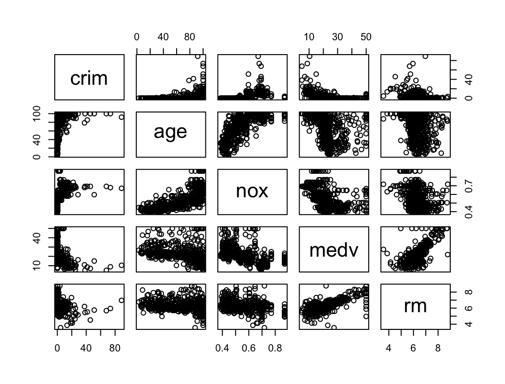

# Statistical Learning

1. For each of parts (a) through (d), indicate whether we would generally expect the performance of a flexible statistical learning method to be better or worse than an inflexible method. Justify your answer.
    
    (a) The sample size n is extremely large, and the number of predictors p is small.
    
    Lepiej, większa liczba danych pozwala na lepsze dopasowanie modelu.
    
    (b) The number of predictors p is extremely large, and the number of observations n is small.
    
    Gorzej, duża liczba predyktorów i mała liczba danych może spowodować przetrenowanie modelu.
    
    (c) The relationship between the predictors and response is highly non-linear.
    
    Flexible modele dają lepsze dopasowanie na nieliniowych zbiorach danych ponieważ mają więcej stopni swobody.
    
    (d) The variance of the error terms, i.e. $\sigma^2 = \text{Var}(\epsilon)$, is extremely high.
    
    Prawdopodobnie flexible model będzie przetrenowany przez dokładniejsze dopasowanie szumu w znaczeniu błędu niż inflexible model. Innymi słowy, punkty danych będą bardziej oddalone od funkcji $f$ (idealnej funkcji opisującej dane) jeżeli wariancja błedu jest duża. Może to świadczyć o tym, że $f$ jest liniowa i prostszy model lepiej wyestymuje $f$.

2. Explain whether each scenario is a classification or regression problem, and indicate whether we are most interested in inference or prediction. Finally, provide n and p.

    (a) We collect a set of data on the top 500 firms in the US. For each firm we record profit, number of employees, industry and the CEO salary. We are interested in understanding which factors affect CEO salary.
    
    * Regresja - odpowiedź jest ilościowa.
    * Inference - chcemy zrozumieć jak predyktory wpływają na zarobki CEO, nie chcemy robić predykcji.
    * n=500
    * p=profit, number of employees, industry.

    (b) We are considering launching a new product and wish to know whether it will be a success or a failure. We collect data on 20 similar products that were previously launched. For each product we have recorded whether it was a success or failure, price charged for the product, marketing budget, competition price, and ten other variables.
    
    * Klasyfikacja - odpowiedź (sukces lub porażka).
    * Predykcja - chcemy wiedzieć czy nowy produkt odniesie sukces.
    * n=20
    * p=price, marketing budget, competition price and 10 other variables.

    (c) We are interested in predicting the % change in the USD/Euro exchange rate in relation to the weekly changes in the world stock markets. Hence we collect weekly data for all of 2012. For each week we record the % change in the USD/Euro, the % change in the US market, the % change in the British market, and the % change in the German market.

    * Regresja - odpowiedź jest ilościowa (procent zmiany w kurcie USD/EUR).
    * Predykcja - napisane w zadaniu.
    * n=52
    * p=% change in US market, % change in UK market, % change in German market.

3. We now revisit the bias-variance decomposition.<br><br>(a) Provide a sketch of typical (squared) bias, variance, training error, test error, and Bayes (or irreducible) error curves, on a single plot, as we go from less flexible statistical learning methods towards more flexible approaches. The x-axis should represent the amount of flexibility in the method, and the y-axis should represent the values for each curve. There should be five curves. Make sure to label each one.

    

    (b) Explain why each of the five curves has the shape displayed in part (a).

    * Var(E) jest nieredukowalnym błędem stąd MSE będzie cały czas takie samo.
    * Training MSE maleje wraz ze wzrostem stopni swobody
    * Bias podobnie do Training MSE.
    * Variance rośnie wraz ze wzrostem stopni swobody.
    * Test MSE podobnie do Variance.

4. You will now think of some real-life applications for statistical learning.

    (a) Describe three real-life applications in which classification might be useful. Describe the response, as well as the predictors. Is the goal of each application inference or prediction? Explain your answer.

    Breast cancer prediction: Given a set of predictors such as a mammogram scan, age, family history, lifestyle and other variables, and a response of Yes(has cancer) and No(does not have cancer) – we can then train a model to predict whether a patient has breast cancer.

    Classifying species of plants: Given a set of images of a plant, a model can be trained that will classify that plant into one of the trained species. This is a multi-class classification problem. The response would be the species name and the predictors would be images of that species.
    
    Fraud detection: Classify whether a transaction is fraudulent, given data like the transaction amount location, purchased item or service, previous customer transactions etc. The response would be “Yes” or “No”, and our aim is to make a prediction.
    
    Stock price: Classify whether a stock will go up or down in price the next day given a set of financial data and news from the preceding week. The aim is to make a prediction.
    
    (b) Describe three real-life applications in which regression might be useful. Describe the response, as well as the predictors. Is the goal of each application inference or prediction? Explain your answer.
    
    House price factors: Given a set of predictors such as location, house features, median income for the area and so on and the house price as the response/target, we can train a model to infer the impact of those variables on house prices.

    Salary: Predict the salary of an individual given their education, work history, skillsets and other relevant data (age, sex, etc.). The response is the salary amount.

    Sales: Predict unit sales of a product given marketing data such as TV, Radio or Internet advert expenditure, and use it to infer the importance of each advertising method. The response is the unit sales of the product.

    Driving Insurance premium: Given a set of variables such as the drivers history, age, type of vehicle, expected yearly mileage and the premium as the response, we can train a model to predict the insurance premium for new customers.

    (c) Describe three real-life applications in which cluster analysis might be useful.

    Tissue classification: : Clustering can be used to separate different types of tissue in medical images. This can be useful in identifying groups of tissue that are not normal and need further study.

    Market research: Differentiate a group of people within a city into distinct market segments to increase marketing effectiveness or identify new opportunities. Given data such as incomes, location, age, sex, opinion polls and so on for a city, we can segment the city into different consumer areas.

    Image segmentation: Separate an image into different regions to make object recognition easier. For example, segmenting image frames from a video camera in a car into ‘other vehicles’, ‘humans’, ‘road signs’ and so on can help ADAS (Advanced driver-assistance systems) in vehicles make the correct decision.

    Gaming market segmentation: Given a set observations with variables such as age, location, income, sex, hours spent gaming, gaming devices used and so on. We could use cluster analysis to see if these observations fall into distinct groups. If there are distinct groupings, then it could be helpful with further study – say for example one grouping could represent casual gamers and the other hardcore gamers, and another one could be newer gamers (say people over the age 60).
    
5. What are the advantages and disadvantages of a very flexible (versus a less flexible) approach for regression or classification? Under what circumstances might a more flexible approach be preferred to a less flexible approach? When might a less flexible approach be preferred?

6. Describe the differences between a parametric and a non-parametric statistical learning approach. What are the advantages of a parametric approach to regression or classification (as opposed to a non-parametric approach)? What are its disadvantages?

    Flexible methods work well when the underlying function is non-linear. The predictions in general have a lower bias but can have a higher variance, as these models are more likely to overfit the data.
    
    Less flexible methods do not tend to overfit the data but can have a high bias when the underlying function is non-linear. They can also use fewer observations and parameters, particularly when it is assumed that the underlying function is linear. Flexible methods tend to require a larger number of observations and parameters, and can lead to overfitting (higher variance).

    Flexible methods (non-parametric methods) are preferable when we make no assumptions about the function to be estimated.Most real-life relationships are non-linear and so a non-parametric approach is better suited to modelling them. Flexible models by their nature are more complex and less interpretable than their linear counterparts, so even though their predictions might be more accurate, we may not be able to explain why it has made those predictions (a black box model).

    Less flexible methods (parametric) are useful if we assume or know that the underlying function is linear. As a linear relationship is assumed, the model needs to predict fewer parameters than a nonparametric method. Additionally, these models are more interpretable, and so will be preferred when we are interested in making inferences or the interpretability of the results.

7. The table below provides a training data set containing six observations, three predictors, and one qualitative response variable.

    | Obs. | X1  | X2  | X3  | Y     |
    | ---- | --- | --- | --- | ----- |
    | 1    | 0   | 3   | 0   | Red   |
    | 2    | 2   | 0   | 0   | Red   |
    | 3    | 0   | 1   | 3   | Red   |
    | 4    | 0   | 1   | 2   | Green |
    | 5    | −1  | 0   | 1   | Green |
    | 6    | 1   | 1   | 1   | Red   |

    Suppose we wish to use this data set to make a prediction for $Y$ when $X_1 = X_2 = X_3 = 0$ using K-nearest neighbors.
    
    (a) Compute the Euclidean distance between each observation and the test point, $X_1 = X_2 = X_3 = 0$.
    
    Odległość euklidesowa:

    $d(p,q) = \sqrt{(p_1-q_1)^2 + (p_2-q_2)^2 +(p_3-q_3)^2}$

    Wyniki:
    
    $𝑑(1, test) = 3$

    $𝑑(2, test) = 2$

    $𝑑(3, test) = 3.16$

    $𝑑(4, test) = 2.24$

    $𝑑(5, test) = 1.41$

    $𝑑(6, test) = 1.73$

    (b) What is our prediction with K = 1? Why?

    Green - pojedyncza najbliższa obserwacja jest zielona.
    
    (c) What is our prediction with K = 3? Why?

    Red - trzy najbliższe obserwacje to: green, red, red. Prawdopodobieństwo, że testowany punkt należy do red wynosi 2/3 a do green 1/3. Stąd predykcja to red.
    
    (d) If the Bayes decision boundary in this problem is highly non-linear, then would we expect the best value for K to be large or small? Why?

   W takim przypadku lepsza będzie niska liczba K. Mniejsza liczba K zwiększa dopasowanie modelu KNN a co za tym idzie granice decyzyjne będą nieliniowe.

8. This exercise relates to the `College` data set, which can be found in the file `College.csv` on the book website. It contains a number of variables for 777 different universities and colleges in the US. The variables are:
   * `Private` : Public/private indicator
   * `Apps` : Number of applications received
   * `Accept` : Number of applicants accepted
   * `Enroll` : Number of new students enrolled
   * `Top10perc` : New students from top 10 % of high school class
   * `Top25perc` : New students from top 25 % of high school class
   * `F.Undergrad` : Number of full-time undergraduates
   * `P.Undergrad` : Number of part-time undergraduates
   * `Outstate` : Out-of-state tuition
   * `Room.Board` : Room and board costs
   * `Books` : Estimated book costs
   * `Personal` : Estimated personal spending
   * `PhD` : Percent of faculty with Ph.D.’s
   * `Terminal` : Percent of faculty with terminal degree
   * `S.F.Ratio` : Student/faculty ratio
   * `perc.alumni` : Percent of alumni who donate
   * `Expend` : Instructional expenditure per student
   * `Grad.Rate` : Graduation rate

    Before reading the data into R, it can be viewed in Excel or a text editor.

    (a) Use the `read.csv()` function to read the data into R. Call the loaded data `college`. Make sure that you have the directory set to the correct location for the data.
    ```R
    > college <- read.csv("College.csv")
    ```

    (b) Look at the data using the `View()` function. You should notice that the first column is just the name of each university. We don’t really want R to treat this as data. However, it may be handy to have these names for later. Try the following commands:
    ```R
    > rownames (college) <- college[, 1]
    > View(college)
    ```
    You should see that there is now a `row.names` column with the name of each university recorded. This means that R has given each row a name corresponding to the appropriate university. R will not try to perform calculations on the row names. However, we still need to eliminate the first column in the data where the names are stored. Try
    ```R
    > college <- college[, -1]
    > View(college)
    ```
    Now you should see that the first data column is `Private`. Note that another column labeled `row.names` now appears before the `Private` column. However, this is not a data column but rather the name that R is giving to each row.

    (c) i. Use the `summary()` function to produce a numerical summary of the variables in the data set.
    ```R
    > college$Private <- as.factor(college$Private)
    > summary(college)

    Private               Apps           Accept          Enroll       Top10perc    
    No :212            Min.   :   81   Min.   :   72   Min.   :  35   Min.   : 1.00  
    Yes:565            1st Qu.:  776   1st Qu.:  604   1st Qu.: 242   1st Qu.:15.00  
                       Median : 1558   Median : 1110   Median : 434   Median :23.00  
                       Mean   : 3002   Mean   : 2019   Mean   : 780   Mean   :27.56  
                       3rd Qu.: 3624   3rd Qu.: 2424   3rd Qu.: 902   3rd Qu.:35.00  
                       Max.   :48094   Max.   :26330   Max.   :6392   Max.   :96.00

    Top25perc      F.Undergrad     P.Undergrad         Outstate       Room.Board  
    Min.   :  9.0   Min.   :  139   Min.   :    1.0   Min.   : 2340   Min.   :1780  
    1st Qu.: 41.0   1st Qu.:  992   1st Qu.:   95.0   1st Qu.: 7320   1st Qu.:3597  
    Median : 54.0   Median : 1707   Median :  353.0   Median : 9990   Median :4200  
    Mean   : 55.8   Mean   : 3700   Mean   :  855.3   Mean   :10441   Mean   :4358  
    3rd Qu.: 69.0   3rd Qu.: 4005   3rd Qu.:  967.0   3rd Qu.:12925   3rd Qu.:5050  
    Max.   :100.0   Max.   :31643   Max.   :21836.0   Max.   :21700   Max.   :8124

    Books           Personal         PhD            Terminal       S.F.Ratio    
    Min.   :  96.0   Min.   : 250   Min.   :  8.00   Min.   : 24.0   Min.   : 2.50  
    1st Qu.: 470.0   1st Qu.: 850   1st Qu.: 62.00   1st Qu.: 71.0   1st Qu.:11.50  
    Median : 500.0   Median :1200   Median : 75.00   Median : 82.0   Median :13.60  
    Mean   : 549.4   Mean   :1341   Mean   : 72.66   Mean   : 79.7   Mean   :14.09  
    3rd Qu.: 600.0   3rd Qu.:1700   3rd Qu.: 85.00   3rd Qu.: 92.0   3rd Qu.:16.50  
    Max.   :2340.0   Max.   :6800   Max.   :103.00   Max.   :100.0   Max.   :39.80

    perc.alumni        Expend        Grad.Rate     
    Min.   : 0.00   Min.   : 3186   Min.   : 10.00  
    1st Qu.:13.00   1st Qu.: 6751   1st Qu.: 53.00  
    Median :21.00   Median : 8377   Median : 65.00  
    Mean   :22.74   Mean   : 9660   Mean   : 65.46  
    3rd Qu.:31.00   3rd Qu.:10830   3rd Qu.: 78.00  
    Max.   :64.00   Max.   :56233   Max.   :118.00  
    ```

    ii. Use the `pairs()` function to produce a scatterplot matrix of the first ten columns or variables of the data. Recall that you can reference the first ten columns of a matrix A using `A[,1:10]`.

    ```R
    > pairs(college[,1:5])
    ```

    
    
    iii. Use the `plot()` function to produce side-by-side boxplots of `Outstate` versus `Private`.
    ```R
    plot(college$Private, college$Outstate)
    ```
    
    
    iv. Create a new qualitative variable, called `Elite`, by binning the `Top10perc` variable. We are going to divide universities into two groups based on whether or not the proportion of students coming from the top 10 % of their high school classes exceeds 50 %.
    ```R
    > Elite <- rep("No" , nrow(college))
    > Elite[college$ Top10perc > 50] <- "Yes"
    > Elite <- as.factor(Elite)
    > college <- data.frame(college , Elite)
    ```

    Use the `summary()` function to see how many elite universities there are. Now use the `plot()` function to produce side-by-side boxplots of `Outstate` versus `Elite`.

    ```R
    > summary(elite)

    Elite 
    No :699  
    Yes: 78

    > plot(college$Elite, college$Outstate, xlab="Elite", ylab="Outstate")
    ```
    
    
    v. Use the `hist()` function to produce some histograms with differing numbers of bins for a few of the quantitative variables. You may find the command `par(mfrow = c(2, 2))` useful: it will divide the print window into four regions so that four plots can be made simultaneously. Modifying the arguments to this function will divide the screen in other ways.
    ```R
    > par(mfrow=c(2,2))
    > hist(college$Apps, xlim=c(0,25000), xlab = "Applications", main = "Apps using default bin sizes")
    > hist(college$Apps, xlim=c(0,25000), breaks=25, xlab = "Applications", main = "Apps using smaller bin sizes")
    > hist(college$Top10perc, breaks=25, xlab = "Pct. new students from top 10% of H.S. class", main="Top10Perc")
    > hist(college$Outstate, xlab="Out-of-state tuition",ylab="Amount",main="Outstate")
    ```
    

    vi. Continue exploring the data, and provide a brief summary of what you discover.

9. This exercise involves the `Auto` data set studied in the lab. Make sure that the missing values have been removed from the data.
    ```R
    > auto <- read.table("Auto.data", header = T, na.strings = "?", stringsAsFactors = T)
    > auto <- na.omit(auto)
    ```

    (a) Which of the predictors are quantitative, and which are qualitative?

    * Jakościowe: name, origin.
    * Ilościowe : mpg, cylinders, displacement, horsepower,  weight, acceleration, year.

    (b) What is the range of each quantitative predictor? You can answer this using the `range()` function.

    ```R
    > sapply(auto[,1:7], range)
      
          mpg cylinders displacement horsepower weight acceleration year
    [1,]  9.0         3           68         46   1613          8.0   70
    [2,] 46.6         8          455        230   5140         24.8   82
    ```

    (c) What is the mean and standard deviation of each quantitative predictor?

    ```R
    > sapply(auto[,1:7], mean)

          mpg    cylinders displacement   horsepower       weight acceleration      year
    23.445918     5.471939   194.411990   104.469388  2977.584184    15.541327 75.979592

    > sapply(auto[,1:7], sd)

         mpg     cylinders displacement   horsepower       weight acceleration      year
    7.805007      1.705783   104.644004    38.491160   849.402560     2.758864  3.683737 
    ```

    (d) Now remove the 10th through 85th observations. What is the range, mean, and standard deviation of each predictor in the subset of the data that remains?

    ```R
    > auto_d <- auto[-c(10:84),]
    > sapply(auto_d[,1:7], range)

          mpg cylinders displacement horsepower weight acceleration year
    [1,] 11.0         3           68         46   1649          8.5   70
    [2,] 46.6         8          455        230   4997         24.8   82

    > sapply(auto_d[,1:7], mean)

          mpg    cylinders displacement   horsepower       weight acceleration         year 
    24.368454     5.381703   187.753943   100.955836  2939.643533    15.718297    77.132492

    > sapply(auto_d[,1:7], sd)

         mpg    cylinders displacement   horsepower       weight acceleration         year 
    7.880898     1.658135    99.939488    35.895567   812.649629     2.693813     3.110026 
    ```

    (e) Using the full data set, investigate the predictors graphically, using scatterplots or other tools of your choice. Create some plots highlighting the relationships among the predictors. Comment on your findings.

    

    * Na podstawie powyższych wykresów możemy stwierdzić, że istnieje zależność liniowa między niektórymi zmiennymi.
    * displacement rośnie wraz z horsepower lub z weight.
    * acceleration (wyrażone jako czas do 60 mil/h) maleje wraz ze wzrostem horsepower.

    (f) Suppose that we wish to predict gas mileage (mpg) on the basis of the other variables. Do your plots suggest that any of the other variables might be useful in predicting mpg? Justify your answer.

    * Wykresy sugerują, że występuje pewna zależność między mpg a innymi predyktorami.
    * mpg maleje wraz z displacement, horsepower, weight.
    * mpg rośnie wraz z year.

10. This exercise involves the Boston housing data set.

    (a) To begin, load in the `Boston` data set. The `Boston` data set is part of the `ISLR2` library.
    ```R
    > library(ISLR2)
    ```
    Now the data set is contained in the object Boston.
    ```R
    > Boston
    ```
    Read about the data set:
    ```R
    > ?Boston
    ```    
    How many rows are in this data set? How many columns? What do the rows and columns represent?

    Z opisu danych:
    * A data frame with 506 rows and 13 variables.
    * A data set containing housing values in 506 suburbs of Boston.

    (b) Make some pairwise scatterplots of the predictors (columns) in this data set. Describe your findings.

    ```R
    > pairs(~crim + age + nox + medv + rm, data = Boston)
    ```

    

    * Zależność liniowa między medv i rm.
    * Zależność liniowa między age i nox

    (c) Are any of the predictors associated with per capita crime rate? If so, explain the relationship.

    ```R
    > pairs(~crim + medv + dis + nox, data = Boston)
    ```

    

    Są pewne zależności ale nie wyglądają na silne.
    
    (d) Do any of the census tracts of Boston appear to have particularly high crime rates? Tax rates? Pupil-teacher ratios? Comment on the range of each predictor.

    ```R
    > sapply(Boston[,c("crim", "tax", "ptratio")], mean)

        crim        tax    ptratio 
    3.613524 408.237154  18.455534

    > sapply(Boston[,c("crim", "tax", "ptratio")], sd)

        crim        tax    ptratio 
    8.601545 168.537116   2.164946 

    > sapply(Boston[,c("crim", "tax", "ptratio")], range)

             crim tax ptratio
    [1,]  0.00632 187    12.6
    [2,] 88.97620 711    22.0

    > dim(Boston[which(Boston$crim > mean(Boston$crim) + 2*sd(Boston$crim)),])

    [1] 16 13

    > dim(Boston[which(Boston$tax > mean(Boston$tax) + 2*sd(Boston$tax)),])

    [1]  0 13

    > dim(Boston[which(Boston$tax < mean(Boston$tax) - 2*sd(Boston$tax)),])
    
    [1]  0 13

    > dim(Boston[which(Boston$ptratio > mean(Boston$ptratio) + 2*sd(Boston$ptratio)),])

    [1]  0 13

    > dim(Boston[which(Boston$ptratio < mean(Boston$ptratio) - 2*sd(Boston$ptratio)),])

    [1] 16 13
    ```

    * Średnia crim wynosi 3.61 a zakres to (0.01, 88.98) co oznacza, że istnieją rejony Bostonu ze znacznie odbiegającą (powyżej 3 sd) od średniej przestępczością. Powyżej dwóch sd odbiegaja 16 rejonów.
    * Podatki odbiegają od średniej w obie strony w podobny sposób. Można stwierdzić, że istnieją rejony z zaniżonymi i zawyżonymi podatkami ale żaden nie przekracza dwóch sd.
    * ptratio odbiega od średniej w obie strony, 16 rejonów ma zaniżony wskaźnik powyżej dwóch sd.

    (e) How many of the census tracts in this data set bound the Charles river?

    ```R
    > sum(Boston$chas==1)

    [1] 35
    ```
    
    (f) What is the median pupil-teacher ratio among the towns in this data set?

    ```R
    > median(Boston$ptratio)
    
    [1] 19.05
    ```
    
    (g) Which census tract of Boston has lowest median value of owner-occupied homes? What are the values of the other predictors for that census tract, and how do those values compare to the overall ranges for those predictors? Comment on your findings.

    ```R
    > which(Boston$medv == min(Boston$medv))

    [1] 399 406

    > Boston[399,]

             crim  zn indus chas   nox    rm   age     dis rad tax ptratio lstat medv
    399   38.3518   0  18.1    0 0.693 5.453   100  1.4896  24 666    20.2 30.59    5

    > Boston[406,]

            crim   zn indus chas   nox    rm   age     dis rad tax ptratio lstat medv
    406  67.9208    0  18.1    0 0.693 5.683   100  1.4254  24 666    20.2 22.98    5

    > sapply(Boston, range)

             crim  zn indus chas   nox    rm   age     dis rad tax ptratio lstat medv
    [1,]  0.00632   0  0.46    0 0.385 3.561   2.9  1.1296   1 187    12.6  1.73    5
    [2,] 88.97620 100 27.74    1 0.871 8.780 100.0 12.1265  24 711    22.0 37.97   50
    ```

    Są dwa rejony z najniższą medianą wartości domu. Współczynnik przestępczości jest w tych rejonach wysoki. Wiek domów też jest wysoki w obu przypadkach.
    
    (h) In this data set, how many of the census tracts average more than seven rooms per dwelling? More than eight rooms per dwelling? Comment on the census tracts that average more than eight rooms per dwelling.

    ```R
    > sum(Boston$rm > 7)

    [1] 64

    > sum(Boston$rm > 8)

    [1] 13

    > sapply(subset(Boston, rm > 8), range)

            crim zn indus chas    nox    rm  age    dis rad tax ptratio lstat medv
    [1,] 0.02009  0  2.68    0 0.4161 8.034  8.4 1.8010   2 224    13.0  2.47 21.9
    [2,] 3.47428 95 19.58    1 0.7180 8.780 93.9 8.9067  24 666    20.2  7.44 50.0
    ```