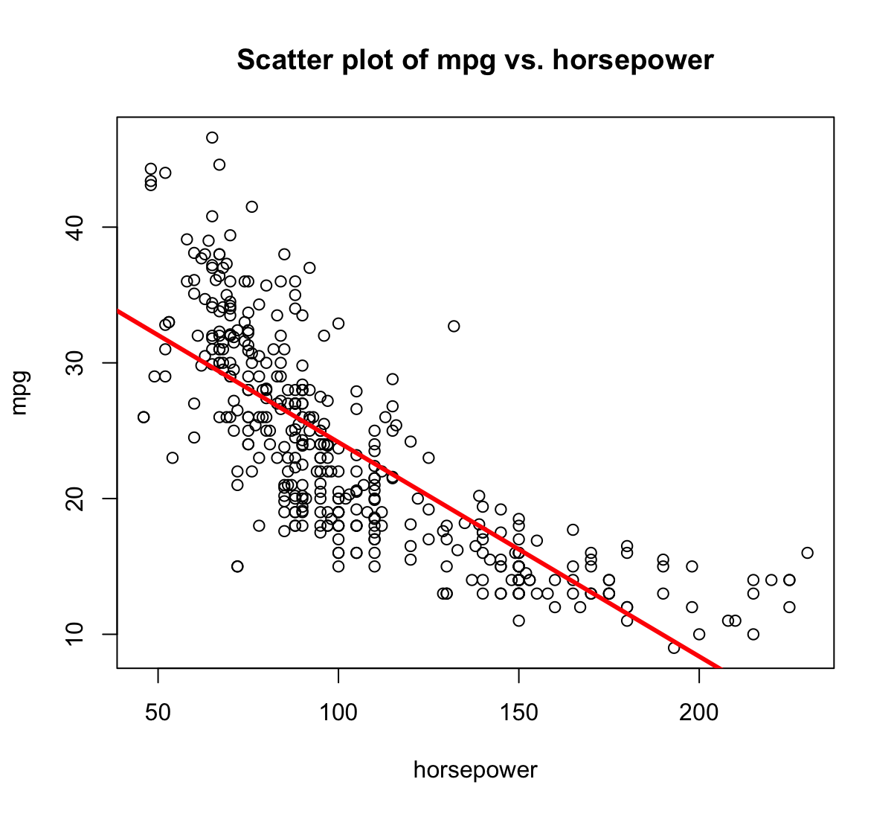
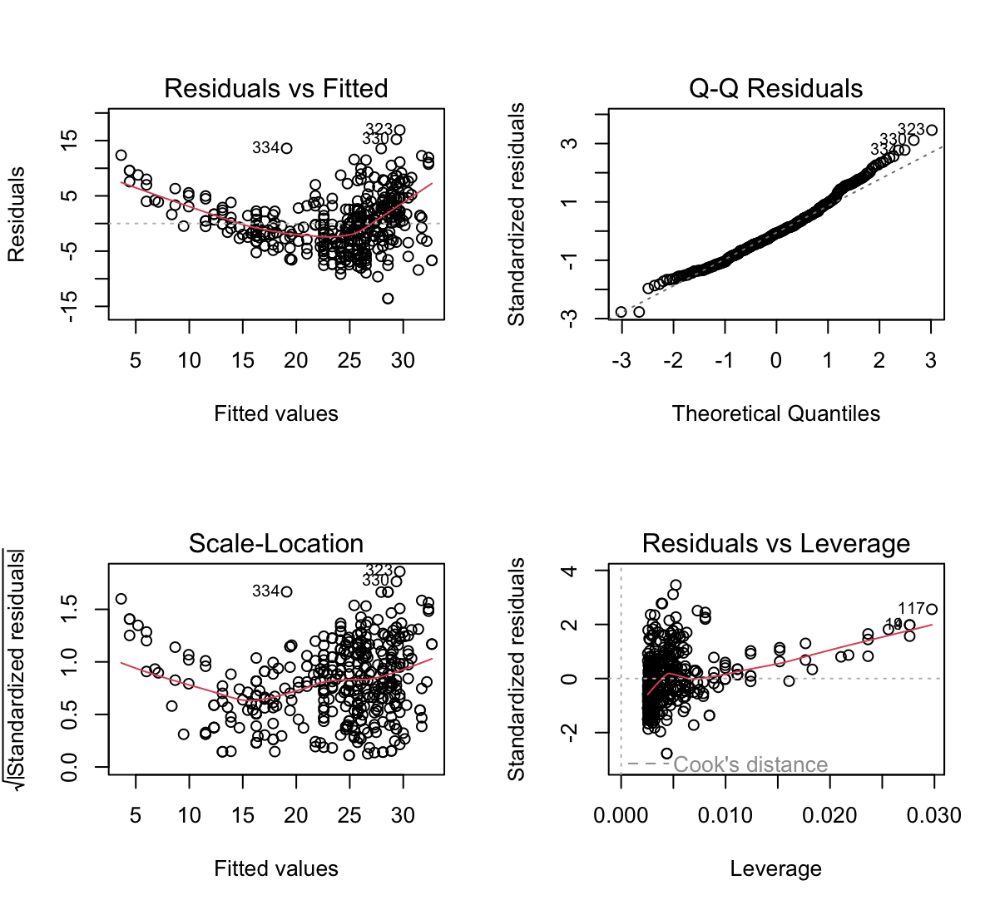

# Linear Regression

1. Describe the null hypotheses to which the p-values given in Table 3.4 correspond. Explain what conclusions you can draw based on these $p$-values. Your explanation should be phrased in terms of `sales`, `TV`, `radio`, and `newspaper`, rather than in terms of the coefficients of the linear model.

    Hipotezy zerowe dla tabeli 3.4:

    $(TV) H_0: \beta_0 = 0$

    $(Radio) H_0: \beta_1 = 0$

    $(Newspaper) H_0: \beta_2 = 0$
    
    $p$-values dla TV i Radio są małe, co oznacza, że hipotezy zerowe muszą być odrzucone. Pokazuje to, że zmienna objaśniana silnie zależy od wspomnianych dwóch zmiennych objaśniających. $p$-value dla Newspaper jest duże co oznacza, że $\beta_2=0$ czyli ta zmienna nie ma wpływu na zmienną objaśnianą.

2. Carefully explain the differences between the KNN classifier and KNN regression methods.

    KNN odnosi się do nieparametrycznych metod, które mogą zostać użyte do klasyfikacji lub regresji. 
    
    Klasyfikator KNN określa $K$ najbliższych punktów wokół obserwacji $x_0$ w celach klasyfikacji. Następnie estymuje prawdopodobieństwo tego, że $x_0$ należy do danej klasy na podstawie sąsiednich obserwacji. Klasyfikator KNN daje odpowiedź jakościową.

    Regresja KNN działa podobnie do klasyfikatora KNN jednak wyznaczana jest w tym przypadku ilościowa predykcja zależności $f(x_0)$.

3. Suppose we have a data set with five predictors, $X_1 = \text{GPA}$, $X_2 = \text{IQ}$, $X_3 = \text{Level}$ (1 for College and 0 for High School), $X_4 = $ Interaction between $\text{GPA}$ and $\text{IQ}$, and $X_5 =$ Interaction between $\text{GPA}$ and $\text{Level}$. The response is starting salary after graduation (in thousands
of dollars). Suppose we use least squares to fit the model, and get $\hat{β}_0 = 50$, $\hat{β}_1 = 20$, $\hat{β}_2 = 0.07$, $\hat{β}_3 = 35$, $\hat{β}_4 = 0.01$, $\hat{β}_5 =−10$.

    (a) Which answer is correct, and why?

    > Model z zadania wygląda następująco: 
    >
    > $Y = 50 + 20\cdot\text{GPA} + 0.07\cdot\text{IQ} + 35\cdot\text{Level} + 0.01\cdot\text{GPA}\cdot\text{IQ} - 10\cdot\text{GPA}\cdot\text{Level}$
    
    i. For a fixed value of $\text{IQ}$ and $\text{GPA}$, high school graduates earn more, on average, than college graduates.

    > Fałsz, gdy $\text{Level} = 0$ to zarobki w modelu będą niższe.

    ii. For a fixed value of $\text{IQ}$ and $\text{GPA}$, college graduates earn more, on average, than high school graduates.

    > Fałsz, w modelu jest czynnik $- 10\cdot\text{GPA}\cdot\text{Level}$ i dla odpowiednio wysokiego $\text{GPA}$ high school zarabia więcej od college.

    iii. For a fixed value of $\text{IQ}$ and $\text{GPA}$, high school graduates earn more, on average, than college graduates provided that the $\text{GPA}$ is high enough.

    > Prawda.
    
    iv. For a fixed value of $\text{IQ}$ and $\text{GPA}$, college graduates earn more, on average, than high school graduates provided that the GPA is high enough.

    > Fałsz.

    (b) Predict the salary of a college graduate with $\text{IQ}$ of 110 and a $\text{GPA}$ of 4.0.

    > 137.1

    (c) True or false: Since the coefficient for the $\text{GPA/IQ}$ interaction term is very small, there is very little evidence of an interaction effect. Justify your answer.

    > Fałsz, niski współczynnik nie oznacza braku dowodu na interakcję. Ostatecznie trzeba określić $p$-value i wtedy zdecydować.

4. I collect a set of data ($n = 100$ observations) containing a single predictor and a quantitative response. I then fit a linear regression model to the data, as well as a separate cubic regression, i.e. $Y = \beta_0 + \beta_1X + \beta_2X^2 + \beta_3X^3 + \epsilon$.
    
    (a) Suppose that the true relationship between $X$ and $Y$ is linear, i.e. $Y = \beta_0 + \beta_1X + \epsilon$. Consider the training residual sum of squares (RSS) for the linear regression, and also the training RSS for the cubic regression. Would we expect one to be lower than the other, would we expect them to be the same, or is there not enough information to tell? Justify your answer.

    > Dodanie kolejnego czynnika wielomianowego spowoduje bliższe dopasowanie do danych treningowych przez co RSS będzie mniejszy niż w przypadku prostej regresji liniowej.
    
    (b) Answer (a) using test rather than training RSS.

    > Prawdziwa zależność jest liniowa więc statystyka F powinna wynosić więcej niż 1. W przypadku modelu wielomianowego powinniśmy spodziewać się wartości bliskiej 1 co oznacza, że jeden z współczynników wynosi 0.
    
    (c) Suppose that the true relationship between $X$ and $Y$ is not linear, but we don’t know how far it is from linear. Consider the training RSS for the linear regression, and also the training RSS for the cubic regression. Would we expect one to be lower than the other, would we expect them to be the same, or is there not enough information to tell? Justify your answer.

    > Dodanie kolejnego czynnika wielomianowego spowoduje bliższe dopasowanie do danych treningowych przez co RSS będzie mniejszy niż w przypadku prostej regresji liniowej.
    
    (d) Answer (c) using test rather than training RSS.

    > Prawdopodobnie uzyskamy wartości statystyki F powyżej 1 co oznacza, że jeden z współczynników nie wynosi 0.

5. Consider the fitted values that result from performing linear regression without an intercept. In this setting, the $i$-th fitted value takes the form 

    $$\hat{y}_i=x_i\hat{\beta},$$

    where 
        
    $$\hat{\beta}=\left(\sum\limits_{i=1}^n x_i y_i \right) /  \left(\sum\limits_{i'=1}^n x_{i'}^2\right).$$

    Show that we can write

    $$\hat{y}_i = \sum\limits_{i'=1}^n a_{i'}y_{i'}$$

    What is $a_{i'}$?
    
    _Note: We interpret this result by saying that the fitted values from linear regression are linear combinations of the response values._

    $$
    \hat{y}_i = x_i\hat{\beta} = x_i \frac{\sum\limits_{i'=1}^n x_{i'} y_{i'}}{\sum\limits_{j=1}^n x_{j}^2} = \sum\limits_{i'=1}^n\frac{x_{i'} x_i}{\sum\limits_{j=1}^n x_{j}^2}y_{i'} = \sum\limits_{i'=1}^n a_{i'}y_{i'}
    $$

    $$a_{i'} = \frac{x_{i'} x_i}{\sum\limits_{j=1}^n x_{j}^2}$$

6. Using (3.4), argue that in the case of simple linear regression, the least squares line always passes through the point $(\bar{x},\bar{y})$.

    $$\hat{\beta}_1 = \frac{\sum_{i=1}^n(x_i-\bar{x})(y_i-\bar{y})}{\sum_{i=1}^n(x_i-\bar{x})^2}$$

    $$\hat{\beta}_0 = \bar{y} - \hat{\beta}_1\bar{x}$$

    $$\hat{y}_j = \hat{\beta}_0 + \hat{\beta}_1x_j$$

    gdy $x_j = \bar{x}$, to:

    $$\hat{y}_j = \bar{y} - \hat{\beta}_1\bar{x} + \hat{\beta}_1\bar{x} = \bar{y}$$

    Jeżeli $x_j = \bar{x}$ to linia regresji przechodzi przez punkt $(\bar{x}, \bar{y})$.

7. It is claimed in the text that in the case of simple linear regression of $Y$ onto $X$, the $R^2$ statistic (3.17) is equal to the square of the correlation between $X$ and $Y$ (3.18). Prove that this is the case. For
simplicity, you may assume that $\bar{x} = \bar{y} = 0$.

    $$R^2 = \frac{TSS-RSS}{TSS}$$

    $$RSS = \sum_{i=1}^n(y_i-\hat{y}_i)^2$$

    $$TSS = \sum_{i=1}^ny_i^2$$

    $$\hat{y}_i = \hat{\beta}_1x_i$$

    $$\hat{\beta}_1 = \frac{\sum_{i=1}^nx_iy_i}{\sum_{i=1}^nx_i^2}$$

    $$\begin{aligned}R^2 &= \frac{TSS-RSS}{TSS} = \frac{\sum_{i=1}^ny_i^2 - \sum_{i=1}^n(y_i-\hat{y}_i)^2}{\sum_{i=1}^ny_i^2} = \\
    &= \frac{\sum_{i=1}^ny_i^2 - \sum_{i=1}^n(y_i^2 - 2y_i\hat{y}_i +\hat{y}_i^2)}{\sum_{i=1}^ny_i^2} = \\
    &= \frac{2\sum_{i=1}^ny_i\hat{y}_i - \sum_{i=1}^n\hat{y}_i^2}{\sum_{i=1}^ny_i^2} = \\
    &= \frac{2\sum_{i=1}^ny_i\hat{\beta}_ix_i - \sum_{i=1}^n\hat{\beta}_i^2x_i^2}{\sum_{i=1}^ny_i^2} = \\      
    &= \frac{2\sum_{i=1}^ny_ix_i\frac{\sum_{i=1}^nx_iy_i}{\sum_{i=1}^nx_i^2} - \sum_{i=1}^nx_i^2 \left(\frac{\sum_{i=1}^nx_iy_i}{\sum_{i=1}^nx_i^2}\right)^2}{\sum_{i=1}^ny_i^2} = \\
    &= \frac{2\frac{\left(\sum_{i=1}^nx_iy_i\right)^2}{\sum_{i=1}^nx_i^2} - \frac{\left(\sum_{i=1}^nx_iy_i\right)^2}{\sum_{i=1}^nx_i^2}}{\sum_{i=1}^ny_i^2} = \\
    &= \frac{\frac{\left(\sum_{i=1}^nx_iy_i\right)^2}{\sum_{i=1}^nx_i^2}}{\sum_{i=1}^ny_i^2} = \\
    &= \frac{\left(\sum_{i=1}^nx_iy_i\right)^2}{\sum_{i=1}^nx_i^2\sum_{i=1}^ny_i^2} = \\ 
    &= Cor^2(X,Y)\end{aligned}$$

8. This question involves the use of simple linear regression on the `Auto` data set.
    
    (a) Use the `lm()` function to perform a simple linear regression with `mpg` as the response and `horsepower` as the predictor. Use the `summary()` function to print the results. Comment on the output.

    ```R
    > library(ISLR)
    > data(Auto)
    > mpg_pwr = lm(mpg ~ horsepower, data = Auto)
    > summary(mpg_pwr)

    Call:
    lm(formula = mpg ~ horsepower, data = Auto)

    Residuals:
        Min       1Q   Median       3Q      Max 
    -13.5710  -3.2592  -0.3435   2.7630  16.9240 

    Coefficients:
                Estimate Std. Error t value Pr(>|t|)    
    (Intercept) 39.935861   0.717499   55.66   <2e-16 ***
    horsepower  -0.157845   0.006446  -24.49   <2e-16 ***
    ---
    Signif. codes:  0 ‘***’ 0.001 ‘**’ 0.01 ‘*’ 0.05 ‘.’ 0.1 ‘ ’ 1

    Residual standard error: 4.906 on 390 degrees of freedom
    Multiple R-squared:  0.6059,	Adjusted R-squared:  0.6049 
    F-statistic: 599.7 on 1 and 390 DF,  p-value: < 2.2e-16
    ```

    For example:
    
    i. Is there a relationship between the predictor and the response?

    > Na podstawie $p$-value bliskiego zeru można stwierdzić, że istnieje zależność.
    
    ii. How strong is the relationship between the predictor and the response?

    > Statystyka $R^2$ wynosi 0.61 co oznacza, że 61% wariancji zmiennej `mpg` jest objaśniane przez model z `horsepower`, oznacza to, że ponad połowa zmienności jest objaśniana przez model.
    
    iii. Is the relationship between the predictor and the response positive or negative?

    > Zależność jest negatywna. Na każdy 1 koń mechaniczny, `mpg` spada o 0.158.
    
    iv. What is the predicted `mpg` associated with a `horsepower` of 98? What are the associated 95 % confidence and prediction intervals?

    ```R
    > predict(mpg_pwr, data.frame(horsepower=c(98)), interval='prediction')

        fit     lwr      upr
    1 24.46708 14.8094 34.12476
    ```

    ```R
    > predict(mpg_pwr, data.frame(horsepower=c(98)), interval='confidence')
    
        fit      lwr      upr
    1 24.46708 23.97308 24.96108
    ```

    (b) Plot the response and the predictor. Use the `abline()` function to display the least squares regression line.

    ```R
    > plot(mpg~horsepower,main= "Scatter plot of mpg vs. horsepower", data=Auto)
    > abline(mpg_pwr, lwd =3, col ="red")
    ```

    
    
    (c) Use the `plot()` function to produce diagnostic plots of the least squares regression fit. Comment on any problems you see with the fit.

    ```R
    > par(mfrow=c(2,2))
    > plot(mpg_pwr)
    ```

    

    * Residuals vs Fitted - widać pewną zależność w kształcie litery U co mówi o tym, że dane nie są liniowe.
    * Residuals v leverage - wskazuje na pewne obserwacje z dużym wpływem na model.
    * Scale-Location - wskazuje, że mogą występować pewne obserwacje odstające. Można je znaleźć używając komendy: 
    ```R
    > rstudent(mpg_pwr)[which(rstudent(mpg_pwr)>3)]

        323      330 
    3.508709 3.149671 
    ```


