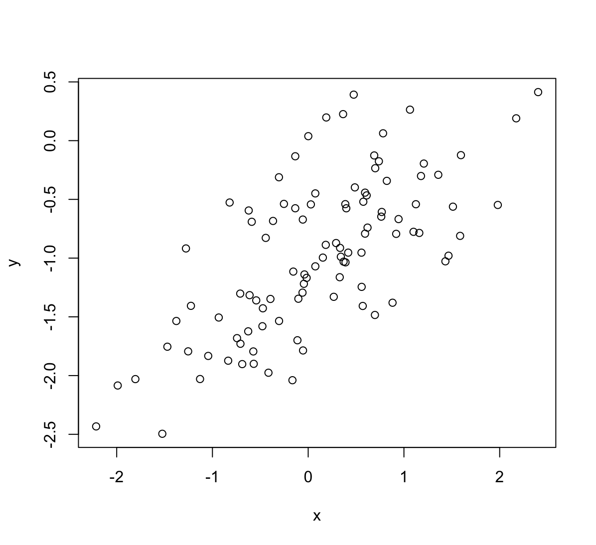
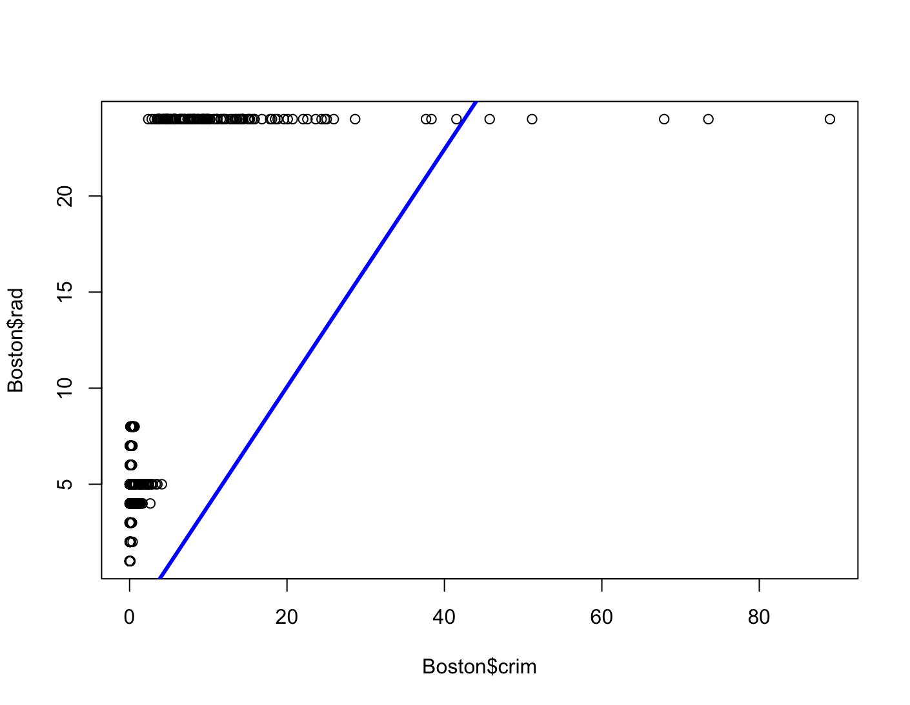

# Linear Regression

1. Describe the null hypotheses to which the p-values given in Table 3.4 correspond. Explain what conclusions you can draw based on these $p$-values. Your explanation should be phrased in terms of `sales`, `TV`, `radio`, and `newspaper`, rather than in terms of the coefficients of the linear model.

    Hipotezy zerowe dla tabeli 3.4:

    $(TV) H_0: \beta_1 = 0$

    $(Radio) H_0: \beta_2 = 0$

    $(Newspaper) H_0: \beta_3 = 0$
    
    $p$-values dla TV i Radio są małe, co oznacza, że hipotezy zerowe muszą być odrzucone. Pokazuje to, że zmienna objaśniana silnie zależy od wspomnianych dwóch zmiennych objaśniających. $p$-value dla Newspaper jest duże co oznacza, że $\beta_2=0$ czyli ta zmienna nie ma wpływu na zmienną objaśnianą.

2. Carefully explain the differences between the KNN classifier and KNN regression methods.

    KNN odnosi się do nieparametrycznych metod, które mogą zostać użyte do klasyfikacji lub regresji. 
    
    Klasyfikator KNN określa $K$ najbliższych punktów wokół obserwacji $x_0$ w celach klasyfikacji. Następnie estymuje prawdopodobieństwo tego, że $x_0$ należy do danej klasy na podstawie sąsiednich obserwacji. Klasyfikator KNN daje odpowiedź jakościową.

    Regresja KNN działa podobnie do klasyfikatora KNN jednak wyznaczana jest w tym przypadku ilościowa predykcja zależności $f(x_0)$.

3. Suppose we have a data set with five predictors, $X_1 = \text{GPA}$, $X_2 = \text{IQ}$, $X_3 = \text{Level}$ (1 for College and 0 for High School), $X_4 = $ Interaction between $\text{GPA}$ and $\text{IQ}$, and $X_5 =$ Interaction between $\text{GPA}$ and $\text{Level}$. The response is starting salary after graduation (in thousands
of dollars). Suppose we use least squares to fit the model, and get $\hat{β}_0 = 50$, $\hat{β}_1 = 20$, $\hat{β}_2 = 0.07$, $\hat{β}_3 = 35$, $\hat{β}_4 = 0.01$, $\hat{β}_5 =−10$.

    (a) Which answer is correct, and why?

    > Model z zadania wygląda następująco: 
    >
    > $Y = 50 + 20\cdot\text{GPA} + 0.07\cdot\text{IQ} + 35\cdot\text{Level} + 0.01\cdot\text{GPA}\cdot\text{IQ} - 10\cdot\text{GPA}\cdot\text{Level}$
    
    i. For a fixed value of $\text{IQ}$ and $\text{GPA}$, high school graduates earn more, on average, than college graduates.

    > Fałsz, gdy $\text{Level} = 0$ to zarobki w modelu będą niższe.

    ii. For a fixed value of $\text{IQ}$ and $\text{GPA}$, college graduates earn more, on average, than high school graduates.

    > Fałsz, w modelu jest czynnik $- 10\cdot\text{GPA}\cdot\text{Level}$ i dla odpowiednio wysokiego $\text{GPA}$ high school zarabia więcej od college.

    iii. For a fixed value of $\text{IQ}$ and $\text{GPA}$, high school graduates earn more, on average, than college graduates provided that the $\text{GPA}$ is high enough.

    > Prawda.
    
    iv. For a fixed value of $\text{IQ}$ and $\text{GPA}$, college graduates earn more, on average, than high school graduates provided that the GPA is high enough.

    > Fałsz.

    (b) Predict the salary of a college graduate with $\text{IQ}$ of 110 and a $\text{GPA}$ of 4.0.

    > 137.1

    (c) True or false: Since the coefficient for the $\text{GPA/IQ}$ interaction term is very small, there is very little evidence of an interaction effect. Justify your answer.

    > Fałsz, niski współczynnik nie oznacza braku dowodu na interakcję. Ostatecznie trzeba określić $p$-value i wtedy zdecydować.

4. I collect a set of data ($n = 100$ observations) containing a single predictor and a quantitative response. I then fit a linear regression model to the data, as well as a separate cubic regression, i.e. $Y = \beta_0 + \beta_1X + \beta_2X^2 + \beta_3X^3 + \epsilon$.
    
    (a) Suppose that the true relationship between $X$ and $Y$ is linear, i.e. $Y = \beta_0 + \beta_1X + \epsilon$. Consider the training residual sum of squares (RSS) for the linear regression, and also the training RSS for the cubic regression. Would we expect one to be lower than the other, would we expect them to be the same, or is there not enough information to tell? Justify your answer.

    > Dodanie kolejnego czynnika wielomianowego spowoduje bliższe dopasowanie do danych treningowych przez co RSS będzie mniejszy niż w przypadku prostej regresji liniowej.
    
    (b) Answer (a) using test rather than training RSS.

    > Prawdziwa zależność jest liniowa więc statystyka F powinna wynosić więcej niż 1. W przypadku modelu wielomianowego powinniśmy spodziewać się wartości bliskiej 1 co oznacza, że jeden z współczynników wynosi 0.
    
    (c) Suppose that the true relationship between $X$ and $Y$ is not linear, but we don’t know how far it is from linear. Consider the training RSS for the linear regression, and also the training RSS for the cubic regression. Would we expect one to be lower than the other, would we expect them to be the same, or is there not enough information to tell? Justify your answer.

    > Dodanie kolejnego czynnika wielomianowego spowoduje bliższe dopasowanie do danych treningowych przez co RSS będzie mniejszy niż w przypadku prostej regresji liniowej.
    
    (d) Answer (c) using test rather than training RSS.

    > Prawdopodobnie uzyskamy wartości statystyki F powyżej 1 co oznacza, że jeden z współczynników nie wynosi 0.

5. Consider the fitted values that result from performing linear regression without an intercept. In this setting, the $i$-th fitted value takes the form 

    $$\hat{y}_i=x_i\hat{\beta},$$

    where 
        
    $$\hat{\beta}=\left(\sum\limits_{i=1}^n x_i y_i \right) /  \left(\sum\limits_{i'=1}^n x_{i'}^2\right).$$

    Show that we can write

    $$\hat{y}_i = \sum\limits_{i'=1}^n a_{i'}y_{i'}$$

    What is $a_{i'}$?
    
    _Note: We interpret this result by saying that the fitted values from linear regression are linear combinations of the response values._

    $$
    \hat{y}_i = x_i\hat{\beta} = x_i \frac{\sum\limits_{i'=1}^n x_{i'} y_{i'}}{\sum\limits_{j=1}^n x_{j}^2} = \sum\limits_{i'=1}^n\frac{x_{i'} x_i}{\sum\limits_{j=1}^n x_{j}^2}y_{i'} = \sum\limits_{i'=1}^n a_{i'}y_{i'}
    $$

    $$a_{i'} = \frac{x_{i'} x_i}{\sum\limits_{j=1}^n x_{j}^2}$$

6. Using (3.4), argue that in the case of simple linear regression, the least squares line always passes through the point $(\bar{x},\bar{y})$.

    $$\hat{\beta}_1 = \frac{\sum_{i=1}^n(x_i-\bar{x})(y_i-\bar{y})}{\sum_{i=1}^n(x_i-\bar{x})^2}$$

    $$\hat{\beta}_0 = \bar{y} - \hat{\beta}_1\bar{x}$$

    $$\hat{y}_j = \hat{\beta}_0 + \hat{\beta}_1x_j$$

    gdy $x_j = \bar{x}$, to:

    $$\hat{y}_j = \bar{y} - \hat{\beta}_1\bar{x} + \hat{\beta}_1\bar{x} = \bar{y}$$

    Jeżeli $x_j = \bar{x}$ to linia regresji przechodzi przez punkt $(\bar{x}, \bar{y})$.

7. It is claimed in the text that in the case of simple linear regression of $Y$ onto $X$, the $R^2$ statistic (3.17) is equal to the square of the correlation between $X$ and $Y$ (3.18). Prove that this is the case. For
simplicity, you may assume that $\bar{x} = \bar{y} = 0$.

    $$R^2 = \frac{TSS-RSS}{TSS}$$

    $$RSS = \sum_{i=1}^n(y_i-\hat{y}_i)^2$$

    $$TSS = \sum_{i=1}^ny_i^2$$

    $$\hat{y}_i = \hat{\beta}_1x_i$$

    $$\hat{\beta}_1 = \frac{\sum_{i=1}^nx_iy_i}{\sum_{i=1}^nx_i^2}$$

    $$\begin{aligned}R^2 &= \frac{TSS-RSS}{TSS} = \frac{\sum_{i=1}^ny_i^2 - \sum_{i=1}^n(y_i-\hat{y}_i)^2}{\sum_{i=1}^ny_i^2} = \\
    &= \frac{\sum_{i=1}^ny_i^2 - \sum_{i=1}^n(y_i^2 - 2y_i\hat{y}_i +\hat{y}_i^2)}{\sum_{i=1}^ny_i^2} = \\
    &= \frac{2\sum_{i=1}^ny_i\hat{y}_i - \sum_{i=1}^n\hat{y}_i^2}{\sum_{i=1}^ny_i^2} = \\
    &= \frac{2\sum_{i=1}^ny_i\hat{\beta}_1x_i - \sum_{i=1}^n\hat{\beta}_1^2x_i^2}{\sum_{i=1}^ny_i^2} = \\      
    &= \frac{2\sum_{i=1}^ny_ix_i\frac{\sum_{i=1}^nx_iy_i}{\sum_{i=1}^nx_i^2} - \sum_{i=1}^nx_i^2 \left(\frac{\sum_{i=1}^nx_iy_i}{\sum_{i=1}^nx_i^2}\right)^2}{\sum_{i=1}^ny_i^2} = \\
    &= \frac{2\frac{\left(\sum_{i=1}^nx_iy_i\right)^2}{\sum_{i=1}^nx_i^2} - \frac{\left(\sum_{i=1}^nx_iy_i\right)^2}{\sum_{i=1}^nx_i^2}}{\sum_{i=1}^ny_i^2} = \\
    &= \frac{\frac{\left(\sum_{i=1}^nx_iy_i\right)^2}{\sum_{i=1}^nx_i^2}}{\sum_{i=1}^ny_i^2} = \\
    &= \frac{\left(\sum_{i=1}^nx_iy_i\right)^2}{\sum_{i=1}^nx_i^2\sum_{i=1}^ny_i^2} = \\ 
    &= Cor^2(X,Y)\end{aligned}$$

8. This question involves the use of simple linear regression on the `Auto` data set.
    
    (a) Use the `lm()` function to perform a simple linear regression with `mpg` as the response and `horsepower` as the predictor. Use the `summary()` function to print the results. Comment on the output.

    ```R
    library(ISLR)
    data(Auto)
    mpg_pwr = lm(mpg ~ horsepower, data = Auto)
    summary(mpg_pwr)
    ```
    ```R
    Call:
    lm(formula = mpg ~ horsepower, data = Auto)

    Residuals:
         Min       1Q   Median       3Q      Max 
    -13.5710  -3.2592  -0.3435   2.7630  16.9240 

    Coefficients:
                 Estimate Std. Error t value Pr(>|t|)    
    (Intercept) 39.935861   0.717499   55.66   <2e-16 ***
    horsepower  -0.157845   0.006446  -24.49   <2e-16 ***
    ---
    Signif. codes:  0 ‘***’ 0.001 ‘**’ 0.01 ‘*’ 0.05 ‘.’ 0.1 ‘ ’ 1

    Residual standard error: 4.906 on 390 degrees of freedom
    Multiple R-squared:  0.6059,	Adjusted R-squared:  0.6049 
    F-statistic: 599.7 on 1 and 390 DF,  p-value: < 2.2e-16
    ```

    For example:
    
    i. Is there a relationship between the predictor and the response?

    > Na podstawie $p$-value bliskiego zeru można stwierdzić, że istnieje zależność.
    
    ii. How strong is the relationship between the predictor and the response?

    > Statystyka $R^2$ wynosi 0.61 co oznacza, że 61% wariancji zmiennej `mpg` jest objaśniane przez model z `horsepower`, oznacza to, że ponad połowa zmienności jest objaśniana przez model.
    
    iii. Is the relationship between the predictor and the response positive or negative?

    > Zależność jest negatywna. Na każdy 1 koń mechaniczny, `mpg` spada o 0.158.
    
    iv. What is the predicted `mpg` associated with a `horsepower` of 98? What are the associated 95 % confidence and prediction intervals?

    ```R
    predict(mpg_pwr, data.frame(horsepower=c(98)), interval='prediction')
    ```

    ```R
           fit     lwr      upr
    1 24.46708 14.8094 34.12476
    ```

    ```R
    predict(mpg_pwr, data.frame(horsepower=c(98)), interval='confidence')
    ```

    ```R
           fit      lwr      upr
    1 24.46708 23.97308 24.96108
    ```

    (b) Plot the response and the predictor. Use the `abline()` function to display the least squares regression line.

    ```R
    plot(mpg~horsepower,main= "Scatter plot of mpg vs. horsepower", 
         data=Auto)
    abline(mpg_pwr, lwd =3, col ="red")
    ```

    
    
    (c) Use the `plot()` function to produce diagnostic plots of the least squares regression fit. Comment on any problems you see with the fit.

    ```R
    par(mfrow=c(2,2))
    plot(mpg_pwr)
    ```

    

    * Residuals vs Fitted - widać pewną zależność w kształcie litery U co mówi o tym, że dane nie są liniowe.
    * Residuals v leverage - wskazuje na pewne obserwacje z dużym wpływem na model.
    * Scale-Location - wskazuje, że mogą występować pewne obserwacje odstające. Można je znaleźć używając komendy:

    ```R
    rstudent(mpg_pwr)[which(rstudent(mpg_pwr)>3)]
    ```

    ```R
         323      330 
    3.508709 3.149671 
    ```

9. This question involves the use of multiple linear regression on the `Auto` data set.

    (a) Produce a scatterplot matrix which includes all of the variables in the data set.

    ```R
    library(ISLR)
    data(Auto)
    Auto <- Auto[,1:8] # usuwam kolumnę name z danych
    pairs(Auto)
    ```

    
    
    (b) Compute the matrix of correlations between the variables using the function `cor()`. You will need to exclude the `name` variable, which is qualitative.

    ```R
    cor(Auto)
    ```

    ```R
                        mpg  cylinders displacement horsepower     weight acceleration
    mpg           1.0000000 -0.7776175   -0.8051269 -0.7784268 -0.8322442    0.4233285
    cylinders    -0.7776175  1.0000000    0.9508233  0.8429834  0.8975273   -0.5046834
    displacement -0.8051269  0.9508233    1.0000000  0.8972570  0.9329944   -0.5438005
    horsepower   -0.7784268  0.8429834    0.8972570  1.0000000  0.8645377   -0.6891955
    weight       -0.8322442  0.8975273    0.9329944  0.8645377  1.0000000   -0.4168392
    acceleration  0.4233285 -0.5046834   -0.5438005 -0.6891955 -0.4168392    1.0000000
    year          0.5805410 -0.3456474   -0.3698552 -0.4163615 -0.3091199    0.2903161
    origin        0.5652088 -0.5689316   -0.6145351 -0.4551715 -0.5850054    0.2127458
                       year     origin
    mpg           0.5805410  0.5652088
    cylinders    -0.3456474 -0.5689316
    displacement -0.3698552 -0.6145351
    horsepower   -0.4163615 -0.4551715
    weight       -0.3091199 -0.5850054
    acceleration  0.2903161  0.2127458
    year          1.0000000  0.1815277
    origin        0.1815277  1.0000000
    ```
    
    (c) Use the `lm()` function to perform a multiple linear regression with `mpg` as the response and all other variables except `name` as the predictors. Use the `summary()` function to print the results. Comment on the output.

    ```R
    mpg_all = lm(mpg ~ .,data=Auto)
    summary(mpg_all)
    ```

    ```R
    Call:
    lm(formula = mpg ~ ., data = Auto)

    Residuals:
        Min      1Q  Median      3Q     Max 
    -9.5903 -2.1565 -0.1169  1.8690 13.0604 

    Coefficients:
                   Estimate Std. Error t value Pr(>|t|)    
    (Intercept)  -17.218435   4.644294  -3.707  0.00024 ***
    cylinders     -0.493376   0.323282  -1.526  0.12780    
    displacement   0.019896   0.007515   2.647  0.00844 ** 
    horsepower    -0.016951   0.013787  -1.230  0.21963    
    weight        -0.006474   0.000652  -9.929  < 2e-16 ***
    acceleration   0.080576   0.098845   0.815  0.41548    
    year           0.750773   0.050973  14.729  < 2e-16 ***
    origin         1.426141   0.278136   5.127 4.67e-07 ***
    ---
    Signif. codes:  0 ‘***’ 0.001 ‘**’ 0.01 ‘*’ 0.05 ‘.’ 0.1 ‘ ’ 1

    Residual standard error: 3.328 on 384 degrees of freedom
    Multiple R-squared:  0.8215,	Adjusted R-squared:  0.8182 
    F-statistic: 252.4 on 7 and 384 DF,  p-value: < 2.2e-16
    ```
    
    For instance:

    i. Is there a relationship between the predictors and the response?

    > Jest związek ponieważ $p$-value wynosi w przybliżeniu 0 w teście dla statystyki F wynoszącej 252.4.
    
    ii. Which predictors appear to have a statistically significant relationship to the response?

    > `displacement`, `weight`, `year`, `origin`, ponieważ ich $p$-value jest mniejsze od 0.05.
    
    iii. What does the coefficients for the `year` variable suggest?

    > Zwiększając rok o 1, `mpg` wzrośnie o 0.75 zakładając, że reszta zmiennych jest stała.
    
    (d) Use the `plot()` function to produce diagnostic plots of the linear regression fit. Comment on any problems you see with the fit. Do the residual plots suggest any unusually large outliers? Does the leverage plot identify any observations with unusually high leverage?

    ```R
    par(mfrow=c(2,2))
    plot(mpg_all)
    ```

    

    > * Residuals vs Fitted - widać pewną zależność w kształcie litery U co mówi o tym, że dane nie są liniowe.
    * Residuals v leverage - wskazuje, że obserwacja 14 ma duży wpływ na model.
    * Scale-Location - wskazuje, że mogą występować pewne obserwacje odstające. Można je znaleźć używając komendy:

    ```R
    rstudent(mpg_all)[which(rstudent(mpg_all)>3)]
    ```

    ```R
         245      323      326      327 
    3.390068 4.029537 3.494823 3.690246 
    ```
    
    (e) Use the `*` and `:` symbols to fit linear regression models with interaction effects. Do any interactions appear to be statistically significant?

    ```R
    mpg_interaction = lm(mpg ~ . + year:cylinders + acceleration:horsepower +
                         weight:displacement,data=Auto)
    summary(mpg_interaction)
    ```

    ```R
    Call:
    lm(formula = mpg ~ . + year:cylinders + acceleration:horsepower + 
       weight:displacement, data = Auto)

    Residuals:
        Min      1Q  Median      3Q     Max 
    -8.4059 -1.5831  0.0088  1.2438 12.8486 

    Coefficients:
                              Estimate Std. Error t value Pr(>|t|)    
    (Intercept)             -6.684e+01  1.153e+01  -5.796 1.43e-08 ***
    cylinders                1.078e+01  2.177e+00   4.953 1.10e-06 ***
    displacement            -7.013e-02  1.055e-02  -6.651 1.01e-10 ***
    horsepower               2.725e-02  2.447e-02   1.114  0.26618    
    weight                  -8.598e-03  8.379e-04 -10.262  < 2e-16 ***
    acceleration             5.021e-01  1.531e-01   3.281  0.00113 ** 
    year                     1.462e+00  1.473e-01   9.929  < 2e-16 ***
    origin                   5.099e-01  2.511e-01   2.031  0.04296 *  
    cylinders:year          -1.350e-01  2.799e-02  -4.824 2.04e-06 ***
    horsepower:acceleration -5.436e-03  1.732e-03  -3.138  0.00183 ** 
    displacement:weight      1.852e-05  2.291e-06   8.087 8.25e-15 ***
    ---
    Signif. codes:  0 ‘***’ 0.001 ‘**’ 0.01 ‘*’ 0.05 ‘.’ 0.1 ‘ ’ 1

    Residual standard error: 2.821 on 381 degrees of freedom
    Multiple R-squared:  0.8727,	Adjusted R-squared:  0.8694 
    F-statistic: 261.2 on 10 and 381 DF,  p-value: < 2.2e-16
    ```

    > Dodanie interakcji zwiększyło wskaźnik R^2 adjusted czyli model jest lepiej dopasowany. Interakcje są istotne ponieważ ich $p$-value jest mniejszy od 0.05.
    
    (f) Try a few different transformations of the variables, such as $\log(X)$, $\sqrt{X}$, $X^2$. Comment on your findings.

    ```R
    mpg_ope = lm(mpg ~ . + log(weight) + log(acceleration) +
                 sqrt(displacement) + I(cylinders^2), data=Auto)
    summary(mpg_ope)
    ```

    ```R
    Call:
    lm(formula = mpg ~ . + log(weight) + log(acceleration) + sqrt(displacement) + 
        I(cylinders^2), data = Auto)

    Residuals:
         Min       1Q   Median       3Q      Max 
    -10.0014  -1.6217  -0.1169   1.6178  12.5279 

    Coefficients:
                         Estimate Std. Error t value Pr(>|t|)    
    (Intercept)        293.415553  51.474048   5.700 2.40e-08 ***
    cylinders            0.960831   1.496776   0.642  0.52130    
    displacement         0.040087   0.032271   1.242  0.21493    
    horsepower          -0.042899   0.013118  -3.270  0.00117 ** 
    weight               0.007242   0.002314   3.130  0.00188 ** 
    acceleration         1.989149   0.469850   4.234 2.89e-05 ***
    year                 0.804299   0.045146  17.816  < 2e-16 ***
    origin               0.505488   0.270580   1.868  0.06251 .  
    log(weight)        -35.552480   7.175205  -4.955 1.09e-06 ***
    log(acceleration)  -33.141292   7.682303  -4.314 2.05e-05 ***
    sqrt(displacement)  -1.222754   0.987784  -1.238  0.21653    
    I(cylinders^2)      -0.094503   0.122199  -0.773  0.43979    
    ---
    Signif. codes:  0 ‘***’ 0.001 ‘**’ 0.01 ‘*’ 0.05 ‘.’ 0.1 ‘ ’ 1

    Residual standard error: 2.918 on 380 degrees of freedom
    Multiple R-squared:  0.8642,	Adjusted R-squared:  0.8603 
    F-statistic: 219.8 on 11 and 380 DF,  p-value: < 2.2e-16
    ```

    > Nastąpiła poprawa modelu względem bazowego patrząc na R^2 adjusted ale transformacje `sqrt(displacement)` i `cylinders^2` są zbędne ponieważ ich $p$-value wynosi powyżej 0.05.

10. This question should be answered using the `Carseats` data set.

    (a) Fit a multiple regression model to predict `Sales` using `Price`, `Urban`, and `US`.

    ```R
    library(ISLR)
    carseats_lm = lm(Sales~Price+Urban+US,data=Carseats)
    summary(carseats_lm)
    ```

    ```R
    Call:
    lm(formula = Sales ~ Price + Urban + US, data = Carseats)

    Residuals:
        Min      1Q  Median      3Q     Max 
    -6.9206 -1.6220 -0.0564  1.5786  7.0581 

    Coefficients:
                 Estimate Std. Error t value Pr(>|t|)    
    (Intercept) 13.043469   0.651012  20.036  < 2e-16 ***
    Price       -0.054459   0.005242 -10.389  < 2e-16 ***
    UrbanYes    -0.021916   0.271650  -0.081    0.936    
    USYes        1.200573   0.259042   4.635 4.86e-06 ***
    ---
    Signif. codes:  0 ‘***’ 0.001 ‘**’ 0.01 ‘*’ 0.05 ‘.’ 0.1 ‘ ’ 1

    Residual standard error: 2.472 on 396 degrees of freedom
    Multiple R-squared:  0.2393,	Adjusted R-squared:  0.2335 
    F-statistic: 41.52 on 3 and 396 DF,  p-value: < 2.2e-16
    ```
    
    (b) Provide an interpretation of each coefficient in the model. Be careful — some of the variables in the model are qualitative!

    > * Intercept - reprezentuje średnią sprzedaż gdy inne zmienne są zaniedbywalne.
    * Price - sprzedaż spada gdy cena rośnie.
    * UrbanYes - sprzedaż spada gdy sklep jest w mieście.
    * USYes - sprzedaż rośnie gdy sklep jest w USA.
    
    (c) Write out the model in equation form, being careful to handle the qualitative variables properly.

    ```R
    contrasts(Carseats$Urban)
    ```

    ```R
        Yes
    No    0
    Yes   1
    ```

    ```R
    contrasts(Carseats$US)
    ```

    ```R
        Yes
    No    0
    Yes   1
    ```

    > $$Sales = \begin{cases}
    13.04 - 0.05Price - 0.02 + 1.2 & \text{ gdy Urban = 1, US = 1} \\
    13.04 - 0.05Price - 0.02 & \text{ gdy Urban = 1, US = 0} \\
    13.04 - 0.05Price + 1.2 & \text{ gdy Urban = 0, US = 1} \\
    13.04 - 0.05Price & \text{ gdy Urban = 0, US = 0} \\
    \end{cases}$$
    
    (d) For which of the predictors can you reject the null hypothesis $H_0: \beta_j = 0$?

    ```R
    carseats_all = lm(Sales~.,data=Carseats)
    summary(carseats_all)
    ```

    ```R
    Call:
    lm(formula = Sales ~ ., data = Carseats)

    Residuals:
        Min      1Q  Median      3Q     Max 
    -2.8692 -0.6908  0.0211  0.6636  3.4115 

    Coefficients:
                      Estimate Std. Error t value Pr(>|t|)    
    (Intercept)      5.6606231  0.6034487   9.380  < 2e-16 ***
    CompPrice        0.0928153  0.0041477  22.378  < 2e-16 ***
    Income           0.0158028  0.0018451   8.565 2.58e-16 ***
    Advertising      0.1230951  0.0111237  11.066  < 2e-16 ***
    Population       0.0002079  0.0003705   0.561    0.575    
    Price           -0.0953579  0.0026711 -35.700  < 2e-16 ***
    ShelveLocGood    4.8501827  0.1531100  31.678  < 2e-16 ***
    ShelveLocMedium  1.9567148  0.1261056  15.516  < 2e-16 ***
    Age             -0.0460452  0.0031817 -14.472  < 2e-16 ***
    Education       -0.0211018  0.0197205  -1.070    0.285    
    UrbanYes         0.1228864  0.1129761   1.088    0.277    
    USYes           -0.1840928  0.1498423  -1.229    0.220    
    ---
    Signif. codes:  0 ‘***’ 0.001 ‘**’ 0.01 ‘*’ 0.05 ‘.’ 0.1 ‘ ’ 1

    Residual standard error: 1.019 on 388 degrees of freedom
    Multiple R-squared:  0.8734,	Adjusted R-squared:  0.8698 
    F-statistic: 243.4 on 11 and 388 DF,  p-value: < 2.2e-16
    ```
    
    > `CompPrice`, `Income`, `Advertising`, `Price`, `ShelveLocGood`, `ShelveLocMedium`, `Age`, opierając się na $p$-value > 0.05

    (e) On the basis of your response to the previous question, fit a smaller model that only uses the predictors for which there is evidence of association with the outcome.

    ```R
    carseats_lm2 = lm(Sales~.-Education-Urban-US-Population,data=Carseats)
    summary(carseats_lm2)
    ```

    ```R
    Call:
    lm(formula = Sales ~ . - Education - Urban - US - Population, 
        data = Carseats)

    Residuals:
        Min      1Q  Median      3Q     Max 
    -2.7728 -0.6954  0.0282  0.6732  3.3292 

    Coefficients:
                     Estimate Std. Error t value Pr(>|t|)    
    (Intercept)      5.475226   0.505005   10.84   <2e-16 ***
    CompPrice        0.092571   0.004123   22.45   <2e-16 ***
    Income           0.015785   0.001838    8.59   <2e-16 ***
    Advertising      0.115903   0.007724   15.01   <2e-16 ***
    Price           -0.095319   0.002670  -35.70   <2e-16 ***
    ShelveLocGood    4.835675   0.152499   31.71   <2e-16 ***
    ShelveLocMedium  1.951993   0.125375   15.57   <2e-16 ***
    Age             -0.046128   0.003177  -14.52   <2e-16 ***
    ---
    Signif. codes:  0 ‘***’ 0.001 ‘**’ 0.01 ‘*’ 0.05 ‘.’ 0.1 ‘ ’ 1

    Residual standard error: 1.019 on 392 degrees of freedom
    Multiple R-squared:  0.872,	Adjusted R-squared:  0.8697 
    F-statistic: 381.4 on 7 and 392 DF,  p-value: < 2.2e-16
    ```
    
    (f) How well do the models in (a) and (e) fit the data?

    > Statystyka $R^2$ adjusted wzrosła znacząco z 0.23 w (a) do 0.86 w (e). F-statistic również zwiększyło się. Oznacza to, że nowy model jest lepszy.
    
    (g) Using the model from (e), obtain 95 % confidence intervals for the coefficient(s).
    
    ```R
    confint(carseats_lm2)
    ```

    ```R
                          2.5 %      97.5 %
    (Intercept)      4.48236820  6.46808427
    CompPrice        0.08446498  0.10067795
    Income           0.01217210  0.01939784
    Advertising      0.10071856  0.13108825
    Price           -0.10056844 -0.09006946
    ShelveLocGood    4.53585700  5.13549250
    ShelveLocMedium  1.70550103  2.19848429
    Age             -0.05237301 -0.03988204
    ```
    
    (h) Is there evidence of outliers or high leverage observations in the model from (e)?

    ```R
    par(mfrow=c(2,2))
    plot(carseats_lm2)
    ```

    

    > * Residuals v leverage - wskazuje, że jakaś obserwacja ma duży wpływ na model.

    ```R
    hatvalues(carseats_lm2)[order(hatvalues(carseats_lm2), decreasing = T)][1]
    ```

    ```R
           311 
    0.06154635
    ```

    > * Scale-Location - wskazuje, że mogą występować pewne obserwacje odstające.

    ```R
    rstudent(carseats_lm2)[which(rstudent(carseats_lm2)>3)]
    ```

    ```R
        358 
    3.34075 
    ```

11. In this problem we will investigate the t-statistic for the null hypothesis $H_0 : \beta = 0$ in simple linear regression without an intercept. To begin, we generate a predictor `x` and a response `y` as follows.

    ```R
    set.seed(1)
    x <- rnorm(100)
    y <- 2 * x + rnorm(100)
    ```

    (a) Perform a simple linear regression of `y` onto `x`, _without_ an intercept. Report the coefficient estimate $\hat{\beta}$, the standard error of this coefficient estimate, and the $t$-statistic and $p$-value associated with the null hypothesis $H_0 : \beta = 0$. Comment on these results. (You can perform regression without an intercept using the command `lm(y~x+0)`.)

    ```R
    set.seed(1)
    x <- rnorm(100)
    y <- 2 * x + rnorm(100)
    lm.fit <- lm(y~x+0)
    summary(lm.fit)
    ```

    ```R
    Call:
    lm(formula = y ~ x + 0)

    Residuals:
        Min      1Q  Median      3Q     Max 
    -1.9154 -0.6472 -0.1771  0.5056  2.3109 

    Coefficients:
      Estimate Std. Error t value Pr(>|t|)    
    x   1.9939     0.1065   18.73   <2e-16 ***
    ---
    Signif. codes:  0 ‘***’ 0.001 ‘**’ 0.01 ‘*’ 0.05 ‘.’ 0.1 ‘ ’ 1

    Residual standard error: 0.9586 on 99 degrees of freedom
    Multiple R-squared:  0.7798,	Adjusted R-squared:  0.7776 
    F-statistic: 350.7 on 1 and 99 DF,  p-value: < 2.2e-16
    ```
    
    (b) Now perform a simple linear regression of `x` onto `y` _without_ an intercept, and report the coefficient estimate, its standard error, and the corresponding $t$-statistic and $p$-values associated with the null hypothesis $H_0 : \beta = 0$. Comment on these results.

    ```R
    lm.fit2 = lm(x~y+0)
    summary(lm.fit2)
    ```

    ```R
    Call:
    lm(formula = x ~ y + 0)

    Residuals:
        Min      1Q  Median      3Q     Max 
    -0.8699 -0.2368  0.1030  0.2858  0.8938 

    Coefficients:
      Estimate Std. Error t value Pr(>|t|)    
    y  0.39111    0.02089   18.73   <2e-16 ***
    ---
    Signif. codes:  0 ‘***’ 0.001 ‘**’ 0.01 ‘*’ 0.05 ‘.’ 0.1 ‘ ’ 1

    Residual standard error: 0.4246 on 99 degrees of freedom
    Multiple R-squared:  0.7798,	Adjusted R-squared:  0.7776 
    F-statistic: 350.7 on 1 and 99 DF,  p-value: < 2.2e-16
    ```
    
    (c) What is the relationship between the results obtained in (a) and (b)?
    
    > W modelu zostały zamienione osie więc statystyki testowe mają takie same wartości podobnie jak R-squared i Adjusted R-squared.

    (d) For the regression of Y onto X without an intercept, the $t$-statistic for $H_0 : \beta = 0$ takes the form $\hat{\beta}/SE(\hat{\beta})$, where $\hat{\beta}$ is given by (3.38), and where

    $$SE(\hat{\beta}) = \sqrt{\frac{\sum_{i=1}^n (y_i - x_i\hat{\beta})^2}{(n-1)\sum_{i'=1}^n x_{i'}^2}}$$
    
    (These formulas are slightly different from those given in Sections 3.1.1 and 3.1.2, since here we are performing regression without an intercept.) Show algebraically, and confirm numerically in `R`, that the $t$-statistic can be written as

    > $$\frac{(\sqrt{n-1})\sum_{i=1}^n x_iy_i}{\sqrt{\left(\sum_{i=1}^n x_i^2\right)\left(\sum_{i'=1}^n y_{i'}^2\right) - \left(\sum_{i'=1}^n x_{i'}y_{i'}\right)^2}}$$
    >
    > $$\begin{aligned}t^2 &= \frac{\hat{\beta}^2}{SE^2(\hat{\beta})} = \frac{(n-1)\sum_{i'=1}^n x_{i'}^2\hat{\beta}^2}{\sum_{i=1}^n (y_i - x_i\hat{\beta})^2} = \\
    &= \frac{(n-1)\sum_{i'=1}^n x_{i'}^2\hat{\beta}^2}{\sum_{i=1}^n (y_i^2 - 2y_ix_i\hat{\beta} + x_i^2\hat{\beta}^2)} = \\
    &= \frac{(n-1)\sum_{i'=1}^n x_{i'}^2\hat{\beta}^2}{\sum_{i=1}^ny_i^2 - 2\sum_{i=1}^ny_ix_i\hat{\beta} + \sum_{i=1}^nx_i^2\hat{\beta}^2} = \\
    &= \frac{(n-1)\sum_{i'=1}^n x_{i'}^2\frac{\left(\sum_{i=1}^nx_iy_i \right)^2}{\left(\sum_{i'=1}^nx_{i'}^2 \right)^2}}{\sum_{i=1}^ny_i^2 - 2\sum_{i=1}^ny_ix_i\frac{\sum_{i=1}^nx_iy_i}{\sum_{i'=1}^nx_{i'}^2} + \sum_{i=1}^nx_i^2\frac{\left(\sum_{i=1}^nx_iy_i \right)^2}{\left(\sum_{i'=1}^nx_{i'}^2 \right)^2}} = \\
    &= \frac{(n-1)\frac{\left(\sum_{i=1}^nx_iy_i \right)^2}{\sum_{i'=1}^nx_{i'}^2}}{\frac{\sum_{i'=1}^nx_{i'}^2\sum_{i=1}^ny_i^2}{\sum_{i'=1}^nx_{i'}^2} - 2\frac{\left(\sum_{i=1}^nx_iy_i\right)^2}{\sum_{i'=1}^nx_{i'}^2} + \frac{\left(\sum_{i=1}^nx_iy_i \right)^2}{\sum_{i'=1}^nx_{i'}^2}} = \\
    &= \frac{(n-1)\frac{\left(\sum_{i=1}^nx_iy_i \right)^2}{\sum_{i'=1}^nx_{i'}^2}}{\frac{\sum_{i'=1}^nx_{i'}^2\sum_{i=1}^ny_i^2}{\sum_{i'=1}^nx_{i'}^2} - \frac{\left(\sum_{i=1}^nx_iy_i\right)^2}{\sum_{i'=1}^nx_{i'}^2}} = \\
    &= \frac{(n-1)\left(\sum_{i=1}^nx_iy_i \right)^2}{\sum_{i'=1}^nx_{i'}^2\sum_{i=1}^ny_i^2 - \left(\sum_{i=1}^nx_iy_i\right)^2}\end{aligned}$$
    >
    > $$t = \frac{(\sqrt{n-1})\sum_{i=1}^n x_iy_i}{\sqrt{\left(\sum_{i'=1}^n x_{i'}^2\right)\left(\sum_{i=1}^n y_{i}^2\right) - \left(\sum_{i=1}^n x_{i}y_{i'}\right)^2}}$$

    ```R
    numerator = sqrt(length(x)-1)*sum(x*y)
    denumerator = sqrt(sum(x^2)*sum(y^2) - sum(x*y)^2)
    t_statistic = numerator/denumerator
    t_statistic
    ```

    ```R
    [1] 18.72593
    ```

    > Wyszło tyle co w modelu.

    (e) Using the results from (d), argue that the $t$-statistic for the regression of `y` onto `x` is the same as the $t$-statistic for the regression of `x` onto `y`.

    > Widać od razu, że zamiana `x` z `y` da ten sam wzór końcowy.
    
    (f) In `R`, show that when regression is performed _with_ an intercept, the $t$-statistic for $H_0 : \beta_1 = 0$ is the same for the regression of `y` onto `x` as it is for the regression of `x` onto `y`.

    ```R
    lm.fit3 = lm(y~x)
    summary(lm.fit3)$coefficients[2,3]
    ```

    ```R
    [1] 18.5556
    ```

    ```R
    lm.fit4 = lm(x~y)
    summary(lm.fit4)$coefficients[2,3]
    ```

    ```R
    [1] 18.5556
    ```

12. This problem involves simple linear regression without an intercept.

    (a) Recall that the coefficient estimate $\hat{\beta}$ for the linear regression of $Y$ onto $X$ without an intercept is given by (3.38). Under what circumstance is the coefficient estimate for the regression of $X$ onto $Y$ the same as the coefficient estimate for the regression of $Y$ onto $X$?

    > $$\hat{\beta}_x = \frac{\sum_{i=1}^nx_iy_i}{\sum_{i=1}^nx_i^2}$$
    >
    > $$\hat{\beta}_y = \frac{\sum_{i=1}^nx_iy_i}{\sum_{i=1}^ny_i^2}$$
    >
    > $$\hat{\beta}_x = \hat{\beta}_y, \text{ gdy: } \sum_{i=1}^nx_i^2 = \sum_{i=1}^ny_i^2$$
    
    (b) Generate an example in `R` with $n = 100$ observations in which the coefficient estimate for the regression of $X$ onto $Y$ is different from the coefficient estimate for the regression of $Y$ onto $X$.

    ```R
    set.seed(1)
    x <- rnorm(100)
    y <- 2 * x + rnorm(100)
    ```
    
    (c) Generate an example in `R` with $n = 100$ observations in which the coefficient estimate for the regression of $X$ onto $Y$ is the same as the coefficient estimate for the regression of $Y$ onto $X$.

    ```R
    set.seed(1)
    x <- rnorm(100)
    y <- sample(x) # sample miesza liczby z x, lepiej widać,
                   # że wystarczy, że suma obserwacji jest 
                   # równa żeby dostać ten sam współczynnik
    ```

13. In this exercise you will create some simulated data and will fit simple linear regression models to it. Make sure to use `set.seed(1)` prior to starting part (a) to ensure consistent results.

    (a) Using the `rnorm()` function, create a vector, `x`, containing 100 observations drawn from a $N(0,1)$ distribution. This represents a feature, $X$.

    ```R
    set.seed(1)
    x <- rnorm(100, mean=0, sd=1)
    ```

    (b) Using the `rnorm()` function, create a vector, `eps`, containing 100 observations drawn from a $N(0,0.25)$ distribution—a normal distribution with mean zero and variance 0.25 .
    
    ```R
    eps <- rnorm(100, mean=0, sd=0.5)
    ```

    (c) Using `x` and `eps`, generate a vector `y` according to the model

    $$
    Y=-1+0.5 X+\epsilon
    $$

    What is the length of the vector `y`? What are the values of $\beta_0$ and $\beta_1$ in this linear model?

    ```R
    y = -1 + (0.5 * x) + eps
    ```

    > Długość wektora to 100. $\beta_0 = -1$, $\beta_1 = 0.5$

    (d) Create a scatterplot displaying the relationship between `x` and `y`. Comment on what you observe.

    

    > Widać pewną liniową zależność.

    (e) Fit a least squares linear model to predict `y` using `x`. Comment on the model obtained. How do $\hat{\beta}_0$ and $\hat{\beta}_1$ compare to $\beta_0$ and $\beta_1$?

    ```R
    lm.fit <- lm(y~x)
    summary(lm.fit)
    ```

    ```R
    Call:
    lm(formula = y ~ x)

    Residuals:
         Min       1Q   Median       3Q      Max 
    -0.93842 -0.30688 -0.06975  0.26970  1.17309 

    Coefficients:
                Estimate Std. Error t value Pr(>|t|)    
    (Intercept) -1.01885    0.04849 -21.010  < 2e-16 ***
    x            0.49947    0.05386   9.273 4.58e-15 ***
    ---
    Signif. codes:  0 ‘***’ 0.001 ‘**’ 0.01 ‘*’ 0.05 ‘.’ 0.1 ‘ ’ 1

    Residual standard error: 0.4814 on 98 degrees of freedom
    Multiple R-squared:  0.4674,	Adjusted R-squared:  0.4619 
    F-statistic: 85.99 on 1 and 98 DF,  p-value: 4.583e-15
    ```

    > $\hat{\beta}_0$, $\hat{\beta}_1$ porównując do  $\beta_0$, $\beta_1$ mają nieco inną wartość co jest spowodowane czynnikiem błędu `eps`, który występuje w danych.

    (f) Display the least squares line on the scatterplot obtained in (d). Draw the population regression line on the plot, in a different color. Use the `legend()` command to create an appropriate legend.

    ```R
    abline(lm.fit, lwd=1, col ="blue")
    abline(a=-1, b=0.5, lwd=1, col="red")
    legend('bottomright', legend=c('Least Squares Line', 'Population Line'),
           col=c('blue','red'), lty = c(1, 1))
    ```

    

    (g) Now fit a polynomial regression model that predicts `y` using `x` and $x^2$. Is there evidence that the quadratic term improves the model fit? Explain your answer.

    ```R
    lm.fit2 = lm(y~x+I(x^2))
    summary(lm.fit2)
    ```

    ```R
    Call:
    lm(formula = y ~ x + I(x^2))

    Residuals:
         Min       1Q   Median       3Q      Max 
    -0.98252 -0.31270 -0.06441  0.29014  1.13500 

    Coefficients:
                Estimate Std. Error t value Pr(>|t|)    
    (Intercept) -0.97164    0.05883 -16.517  < 2e-16 ***
    x            0.50858    0.05399   9.420  2.4e-15 ***
    I(x^2)      -0.05946    0.04238  -1.403    0.164    
    ---
    Signif. codes:  0 ‘***’ 0.001 ‘**’ 0.01 ‘*’ 0.05 ‘.’ 0.1 ‘ ’ 1

    Residual standard error: 0.479 on 97 degrees of freedom
    Multiple R-squared:  0.4779,	Adjusted R-squared:  0.4672 
    F-statistic:  44.4 on 2 and 97 DF,  p-value: 2.038e-14
    ```

    > Brak poprawy, statystyka F ma mniejszą wartość, $p$-value prze członie kwadratowym jest większe od 0.05 co oznacza, że nie jest to potrzebne w modelu.

    (h) Repeat (a)-(f) after modifying the data generation process in such a way that there is _less_ noise in the data. The model $Y=-1+0.5 X+\epsilon$ should remain the same. You can do this by decreasing the variance of the normal distribution used to generate the error term $\epsilon$ in (b). Describe your results.

    ```R
    set.seed(1)
    x <- rnorm(100, mean=0, sd=1)
    eps <- rnorm(100, mean=0, sd=0.1)
    y = -1 +(0.5*x) + eps
    lm.fit3 <- lm(y~x)
    summary(lm.fit3)
    ```

    ```R
    Call:
    lm(formula = y ~ x)

    Residuals:
         Min       1Q   Median       3Q      Max 
    -0.18768 -0.06138 -0.01395  0.05394  0.23462 

    Coefficients:
                 Estimate Std. Error t value Pr(>|t|)    
    (Intercept) -1.003769   0.009699  -103.5   <2e-16 ***
    x            0.499894   0.010773    46.4   <2e-16 ***
    ---
    Signif. codes:  0 ‘***’ 0.001 ‘**’ 0.01 ‘*’ 0.05 ‘.’ 0.1 ‘ ’ 1

    Residual standard error: 0.09628 on 98 degrees of freedom
    Multiple R-squared:  0.9565,	Adjusted R-squared:  0.956 
    F-statistic:  2153 on 1 and 98 DF,  p-value: < 2.2e-16
    ```

    ```R
    plot(x, y)
    abline(lm.fit3, lwd=1, col ="blue")
    abline(a=-1, b=0.5, lwd=1, col="red")
    legend('bottomright', legend=c('Least Squares Line', 'Population Line'),
           col=c('blue','red'), lty = c(1, 1))
    ```

    

    > Punkt są mniej rozrzucone dzięki czemu model regresji jest lepiej dopasowany.

    (i) Repeat (a)-(f) after modifying the data generation process in such a way that there is _more_ noise in the data. The model $Y=-1+0.5 X+\epsilon$ should remain the same. You can do this by increasing the variance of the normal distribution used to generate the error term $\epsilon$ in (b). Describe your results.

    ```R
    set.seed(1)
    x <- rnorm(100, mean=0, sd=1)
    eps <- rnorm(100, mean=0, sd=1)
    y = -1 +(0.5*x) + eps
    lm.fit4 <- lm(y~x)
    summary(lm.fit4)
    ```

    ```R
    Call:
    lm(formula = y ~ x)

    Residuals:
        Min      1Q  Median      3Q     Max 
    -1.8768 -0.6138 -0.1395  0.5394  2.3462 

    Coefficients:
                Estimate Std. Error t value Pr(>|t|)    
    (Intercept) -1.03769    0.09699 -10.699  < 2e-16 ***
    x            0.49894    0.10773   4.632 1.12e-05 ***
    ---
    Signif. codes:  0 ‘***’ 0.001 ‘**’ 0.01 ‘*’ 0.05 ‘.’ 0.1 ‘ ’ 1

    Residual standard error: 0.9628 on 98 degrees of freedom
    Multiple R-squared:  0.1796,	Adjusted R-squared:  0.1712 
    F-statistic: 21.45 on 1 and 98 DF,  p-value: 1.117e-05
    ```

    ```R
    plot(x, y)
    abline(lm.fit4, lwd=1, col ="blue")
    abline(a=-1, b=0.5, lwd=1, col="red")
    legend('bottomright', legend=c('Least Squares Line', 'Population Line'),
           col=c('blue','red'), lty = c(1, 1))
    ```

    

    > Punkt są bardziej rozrzucone przez co model regresji jest gorzej dopasowany.

    (j) What are the confidence intervals for $\beta_0$ and $\beta_1$ based on the original data set, the noisier data set, and the less noisy data set? Comment on your results.

    ```R
    confint(lm.fit)
    ```

    ```R
                     2.5 %     97.5 %
    (Intercept) -1.1150804 -0.9226122
    x            0.3925794  0.6063602
    ```

    ```R
    confint(lm.fit3)
    ```

    ```R
                     2.5 %     97.5 %
    (Intercept) -1.0230161 -0.9845224
    x            0.4785159  0.5212720
    ```

    ```R
    confint(lm.fit4)
    ```

    ```R
                     2.5 %     97.5 %
    (Intercept) -1.2301607 -0.8452245
    x            0.2851588  0.7127204
    ```

    > Oczywistością jest, że przedziały są węższe w lepiej dopasowanym modelu.

14. This problem focuses on the collinearity problem.

    (a) Perform the following commands in `R`:

    ```R
    set.seed(1)
    x1 <- runif(100)
    x2 <- 0.5 * x1 + rnorm(100) / 10
    y <- 2 + 2 * x1 + 0.3 * x2 + rnorm(100)
    ```

    The last line corresponds to creating a linear model in which `y` is a function of `x1` and `x2`. Write out the form of the linear model. What are the regression coefficients?

    > $$Y = 2 + 2x_1 + 0.3x_2 + \epsilon, \text{ gdzie } \epsilon ~ N(0,1)$$

    > $$\beta_0 = 2, \beta_1 = 2, \beta_2 = 0.3$$

    (b) What is the correlation between `x1` and `x2`? Create a scatterplot displaying the relationship between the variables.

    ```R
    cor(x1, x2)
    ```

    ```R
    [1] 0.8351212
    ```

    ```R
    plot(x1, x2)
    ```

    

    (c) Using this data, fit a least squares regression to predict `y` using `x1` and `x2`. Describe the results obtained. What are $\hat{\beta}_0, \hat{\beta}_1$, and $\hat{\beta}_2$? How do these relate to the true $\beta_0, \beta_1$, and $\beta_2$? Can you reject the null hypothesis $H_0 : \beta_1=0$ ? How about the null hypothesis $H_0 : \beta_2=0$?

    ```R
    lm.fit <- lm(y~x1+x2)
    summary(lm.fit)
    ```

    ```R
    Call:
    lm(formula = y ~ x1 + x2)

    Residuals:
        Min      1Q  Median      3Q     Max 
    -2.8311 -0.7273 -0.0537  0.6338  2.3359 

    Coefficients:
                Estimate Std. Error t value Pr(>|t|)    
    (Intercept)   2.1305     0.2319   9.188 7.61e-15 ***
    x1            1.4396     0.7212   1.996   0.0487 *  
    x2            1.0097     1.1337   0.891   0.3754    
    ---
    Signif. codes:  0 ‘***’ 0.001 ‘**’ 0.01 ‘*’ 0.05 ‘.’ 0.1 ‘ ’ 1

    Residual standard error: 1.056 on 97 degrees of freedom
    Multiple R-squared:  0.2088,	Adjusted R-squared:  0.1925 
    F-statistic:  12.8 on 2 and 97 DF,  p-value: 1.164e-05
    ```

    > $\hat{\beta}_0 = 2.13, \hat{\beta}_1 = 1.43, \hat{\beta}_2 = 1.01$, współczynniki z dopasowania regresji odbiegają od tych z modelu linowego. $p$-value dla $\hat{\beta}_2$ jest większe od 0.05 więc ta zmienna nie powinna być w modelu regresji.

    (d) Now fit a least squares regression to predict `y` using only `x1`. Comment on your results. Can you reject the null hypothesis $H_0 : \beta_1=0$?

    ```R
    lm.fit2 <- lm(y~x1)
    summary(lm.fit2)
    ```

    ```R
    Call:
    lm(formula = y ~ x1)

    Residuals:
         Min       1Q   Median       3Q      Max 
    -2.89495 -0.66874 -0.07785  0.59221  2.45560 

    Coefficients:
                Estimate Std. Error t value Pr(>|t|)    
    (Intercept)   2.1124     0.2307   9.155 8.27e-15 ***
    x1            1.9759     0.3963   4.986 2.66e-06 ***
    ---
    Signif. codes:  0 ‘***’ 0.001 ‘**’ 0.01 ‘*’ 0.05 ‘.’ 0.1 ‘ ’ 1

    Residual standard error: 1.055 on 98 degrees of freedom
    Multiple R-squared:  0.2024,	Adjusted R-squared:  0.1942 
    F-statistic: 24.86 on 1 and 98 DF,  p-value: 2.661e-06
    ```

    > * Można odrzucić hipotezę ponieważ $p$-value jest bliskie zera
    > * Statystyka $R^2$ jest podobna do poprzedniego przypadku ale statystyka F jest teraz większa.
 
    (e) Now fit a least squares regression to predict `y` using only `x2`. Comment on your results. Can you reject the null hypothesis $H_0 : \beta_1=0$?

    ```R
    lm.fit3 <- lm(y~x2)
    summary(lm.fit3)
    ```

    ```R
    Call:
    lm(formula = y ~ x2)

    Residuals:
         Min       1Q   Median       3Q      Max 
    -2.62687 -0.75156 -0.03598  0.72383  2.44890 

    Coefficients:
                Estimate Std. Error t value Pr(>|t|)    
    (Intercept)   2.3899     0.1949   12.26  < 2e-16 ***
    x2            2.8996     0.6330    4.58 1.37e-05 ***
    ---
    Signif. codes:  0 ‘***’ 0.001 ‘**’ 0.01 ‘*’ 0.05 ‘.’ 0.1 ‘ ’ 1

    Residual standard error: 1.072 on 98 degrees of freedom
    Multiple R-squared:  0.1763,	Adjusted R-squared:  0.1679 
    F-statistic: 20.98 on 1 and 98 DF,  p-value: 1.366e-05
    ```

    > * Można odrzucić hipotezę ponieważ $p$-value jest bliskie zera
    > * Statystyka $R^2$ jest niższa niż w poprzednich przypadkach. Statystyka F jest teraz pomiędzy.

    (f) Do the results obtained in (c)-(e) contradict each other? Explain your answer.

    Nie, wyniki w modelach (c)-(e) nie przeczą sobie i mogą być wyjaśnione na podstawie kolinearności. Kiedy dwie zmienne w modelu są ze sobą związane liniowo wpływ jednej z nich na zmienną objaśnianą może być zaburzony przez drugą ze zmiennych. Kolinearność zwiększa również błąd standardowy, z modeli wynika, że błąd `x1+x2` jest większy niż błąd dla `x` lub `x2`.

    (g) Now suppose we obtain one additional observation, which was unfortunately mismeasured.

    ```R
    x1 <- c(x1, 0.1)
    x2 <- c(x2, 0.8)
    y <- c(y, 6)
    ```

    Re-fit the linear models from (c) to (e) using this new data. What effect does this new observation have on the each of the models? In each model, is this observation an outlier? A high-leverage point? Both? Explain your answers.

    ```R
    par(mfrow=c(2,2))
    lm.fit <- lm(y~x1+x2)
    plot(lm.fit)
    rstudent(lm.fit)[which(rstudent(lm.fit)>3)]
    ```

    ```R
    named numeric(0)
    ```

    ```R
    hatvalues(lm.fit)[order(hatvalues(lm.fit), decreasing = T)][1]
    ```

    ```R
          101 
    0.4147284 
    ```

    

    > W tym modelu nowy punkt (101) jest punktem wpływowym ale nie jest obserwacją odstającą.

    ```R
    lm.fit2 <- lm(y~x1)
    plot(lm.fit2)
    rstudent(lm.fit2)[which(rstudent(lm.fit2)>3)]
    ```

    ```R
         101 
    3.438405
    ```

    ```R
    hatvalues(lm.fit2)[order(hatvalues(lm.fit2), decreasing = T)][1]
    ```

    ```R
            27 
    0.04437352
    ```

    

    > W tym modelu nowy punkt (101) jest punktem odstającym ale nie jest punktem wpływowym. Punkt 27 jest wpływowy.

    ```R
    lm.fit3 <- lm(y~x2)
    plot(lm.fit3)
    rstudent(lm.fit3)[which(rstudent(lm.fit3)>3)]
    ```

    ```R
    named numeric(0)
    ```

    ```R
    hatvalues(lm.fit3)[order(hatvalues(lm.fit3), decreasing = T)][1]
    ```

    ```R
          101 
    0.1013106
    ```

    > W tym modelu nowy punkt (101) jest punktem wpływowym ale nie jest obserwacją odstającą.

15. This problem involves the `Boston` data set, which we saw in the lab for this chapter. We will now try to predict per capita crime rate using the other variables in this data set. In other words, per capita crime rate is the response, and the other variables are the predictors.
    
    (a) For each predictor, fit a simple linear regression model to predict the response. Describe your results. In which of the models is there a statistically significant association between the predictor and the response? Create some plots to back up your assertions.

    ```R
    library(MASS)
    head(Boston)
    ```

    ```R
         crim zn indus chas   nox    rm  age    dis rad tax ptratio  black lstat medv
    1 0.00632 18  2.31    0 0.538 6.575 65.2 4.0900   1 296    15.3 396.90  4.98 24.0
    2 0.02731  0  7.07    0 0.469 6.421 78.9 4.9671   2 242    17.8 396.90  9.14 21.6
    3 0.02729  0  7.07    0 0.469 7.185 61.1 4.9671   2 242    17.8 392.83  4.03 34.7
    4 0.03237  0  2.18    0 0.458 6.998 45.8 6.0622   3 222    18.7 394.63  2.94 33.4
    5 0.06905  0  2.18    0 0.458 7.147 54.2 6.0622   3 222    18.7 396.90  5.33 36.2
    6 0.02985  0  2.18    0 0.458 6.430 58.7 6.0622   3 222    18.7 394.12  5.21 28.7
    ```

    ```R
    columns = colnames(Boston)
    columns = columns[-1] # usunięcie zmiennej crim

    p_values = c()
    r_squared = c()
    for (x in columns) {
      lm = lm(paste("crim", "~", x), data=Boston)
      p_values = c(p_values, summary(lm)$coefficients[2,4])
      r_squared = c(r_squared, summary(lm)$r.squared)
    }
    
    results = data.frame(row.names = columns)
    results$p_values = p_values
    results$r_squared = r_squared
    print(results)
    ```

    ```R
                p_values   r_squared
    zn      5.506472e-06 0.040187908
    indus   1.450349e-21 0.165310070
    chas    2.094345e-01 0.003123869
    nox     3.751739e-23 0.177217182
    rm      6.346703e-07 0.048069117
    age     2.854869e-16 0.124421452
    dis     8.519949e-19 0.144149375
    rad     2.693844e-56 0.391256687
    tax     2.357127e-47 0.339614243
    ptratio 2.942922e-11 0.084068439
    black   2.487274e-19 0.148274239
    lstat   2.654277e-27 0.207590933
    medv    1.173987e-19 0.150780469
    ```

    ```R
    print(results[results$p_values > 0.05, ])
    ```

    ```R
          p_values   r_squared
    chas 0.2094345 0.003123869
    ```

    > Tylko dla zmiennej `chas` $p$-value jest powyżej 0.05 dlatego na tej podstawie nie można zbudować modelu liniowego.
    >
    > Wszystkie modele są słabo dopasowane o czym mówią niskie wartości statystyki $R^2$.

    ```R
    lm.fit = lm(crim~rad, data=Boston)
    plot(Boston$crim, Boston$rad)
    abline(lm.fit, col="blue", lwd=3)
    ```

    

    > Dla najlepiej dopasowanego modelu dostajemy bezsensowną linię. Patrząc na wykresy `crim` od innych zmiennych nie widać zależności liniowej w żadnym modelu.

    (b) Fit a multiple regression model to predict the response using all of the predictors. Describe your results. For which predictors can we reject the null hypothesis $H_0 : \beta_j=0$?

    ```R
    lm.fit2 = lm(crim ~ ., data=Boston)
    summary(lm.fit2)
    ```

    ```R
    Call:
    lm(formula = crim ~ ., data = Boston)

    Residuals:
    Min     1Q Median     3Q    Max 
    -9.924 -2.120 -0.353  1.019 75.051 

    Coefficients:
                  Estimate Std. Error t value Pr(>|t|)    
    (Intercept)  17.033228   7.234903   2.354 0.018949 *  
    zn            0.044855   0.018734   2.394 0.017025 *  
    indus        -0.063855   0.083407  -0.766 0.444294    
    chas         -0.749134   1.180147  -0.635 0.525867    
    nox         -10.313535   5.275536  -1.955 0.051152 .  
    rm            0.430131   0.612830   0.702 0.483089    
    age           0.001452   0.017925   0.081 0.935488    
    dis          -0.987176   0.281817  -3.503 0.000502 ***
    rad           0.588209   0.088049   6.680 6.46e-11 ***
    tax          -0.003780   0.005156  -0.733 0.463793    
    ptratio      -0.271081   0.186450  -1.454 0.146611    
    black        -0.007538   0.003673  -2.052 0.040702 *  
    lstat         0.126211   0.075725   1.667 0.096208 .  
    medv         -0.198887   0.060516  -3.287 0.001087 ** 
    ---
    Signif. codes:  0 ‘***’ 0.001 ‘**’ 0.01 ‘*’ 0.05 ‘.’ 0.1 ‘ ’ 1

    Residual standard error: 6.439 on 492 degrees of freedom
    Multiple R-squared:  0.454,	Adjusted R-squared:  0.4396 
    F-statistic: 31.47 on 13 and 492 DF,  p-value: < 2.2e-16
    ```

    > `indus`, `chas`, `nox`, `rm`, `age`, `tax`, `ptratio`, `lstat` ponieważ $p$-value jest większe od 0.05
    
    (c) How do your results from (a) compare to your results from (b)? Create a plot displaying the univariate regression coefficients from (a) on the $x$-axis, and the multiple regression coefficients from (b) on the $y$-axis. That is, each predictor is displayed as a single point in the plot. Its coefficient in a simple linear regression model is shown on the $x$-axis, and its coefficient estimate in the multiple linear regression model is shown on the $y$-axis.

    ```R
    simple_coefs = c()
    multip_coefs = c()
    for (x in columns) {
      lm = lm(paste("crim", "~", x), data=Boston)
      simple_coefs = c(simple_coefs, summary(lm)$coefficients[2,1])
      multip_coefs = c(multip_coefs, summary(lm.fit2)$coefficients[-1,1][x])
    }
    plot(simple_coefs, multip_coefs, xlab="Simple regression coeffs", 
         ylab="Multiple regression coeffs")
    ```
    
    

    (d) Is there evidence of non-linear association between any of the predictors and the response? To answer this question, for each predictor $X$, fit a model of the form

    $$Y=\beta_0+\beta_1 X+\beta_2 X^2+\beta_3 X^3+\epsilon$$

    ```R
    columns2 = columns[-3] # usunięcie zmiennej char bo powodowała error:
                           # Error in poly(chas, 3) : 'degree' must be less 
                           # than number of unique points
    x1_p_values = c()
    x2_p_values = c()
    x3_p_values = c()
    for (x in columns2) {
      lm = lm(paste("crim", "~", "poly(", x, ", 3)"), data=Boston)
      x1_p_values = c(x1_p_values, summary(lm)$coefficients[2,4])
      x2_p_values = c(x2_p_values, summary(lm)$coefficients[3,4])
      x3_p_values = c(x3_p_values, summary(lm)$coefficients[4,4])
    }

    results = data.frame(row.names = columns2)
    results$x1_p_values = x1_p_values
    results$x2_p_values = x2_p_values
    results$x3_p_values = x3_p_values
    print(results)
    ```

    ```R
             x1_p_values  x2_p_values  x3_p_values
    zn      4.697806e-06 4.420507e-03 2.295386e-01
    indus   8.854243e-24 1.086057e-03 1.196405e-12
    nox     2.457491e-26 7.736755e-05 6.961110e-16
    rm      5.128048e-07 1.508545e-03 5.085751e-01
    age     4.878803e-17 2.291156e-06 6.679915e-03
    dis     1.253249e-21 7.869767e-14 1.088832e-08
    rad     1.053211e-56 9.120558e-03 4.823138e-01
    tax     6.976314e-49 3.665348e-06 2.438507e-01
    ptratio 1.565484e-11 2.405468e-03 6.300514e-03
    black   2.730082e-19 4.566044e-01 5.436172e-01
    lstat   1.678072e-27 3.780418e-02 1.298906e-01
    medv    4.930818e-27 2.928577e-35 1.046510e-12

    ```R
    print(results[results$x3_p_vlues < 0.05, ])
    ```
    
    ```R
              x1_p_vlues   x2_p_vlues   x3_p_vlues
    indus   8.854243e-24 1.086057e-03 1.196405e-12
    nox     2.457491e-26 7.736755e-05 6.961110e-16
    age     4.878803e-17 2.291156e-06 6.679915e-03
    dis     1.253249e-21 7.869767e-14 1.088832e-08
    ptratio 1.565484e-11 2.405468e-03 6.300514e-03
    medv    4.930818e-27 2.928577e-35 1.046510e-12
    ```

    > Dla niektórych modeli zmienna $X^3$ jest statystycznie istotna więc istnieje dowód na to, że dane nie są liniowo zależne.