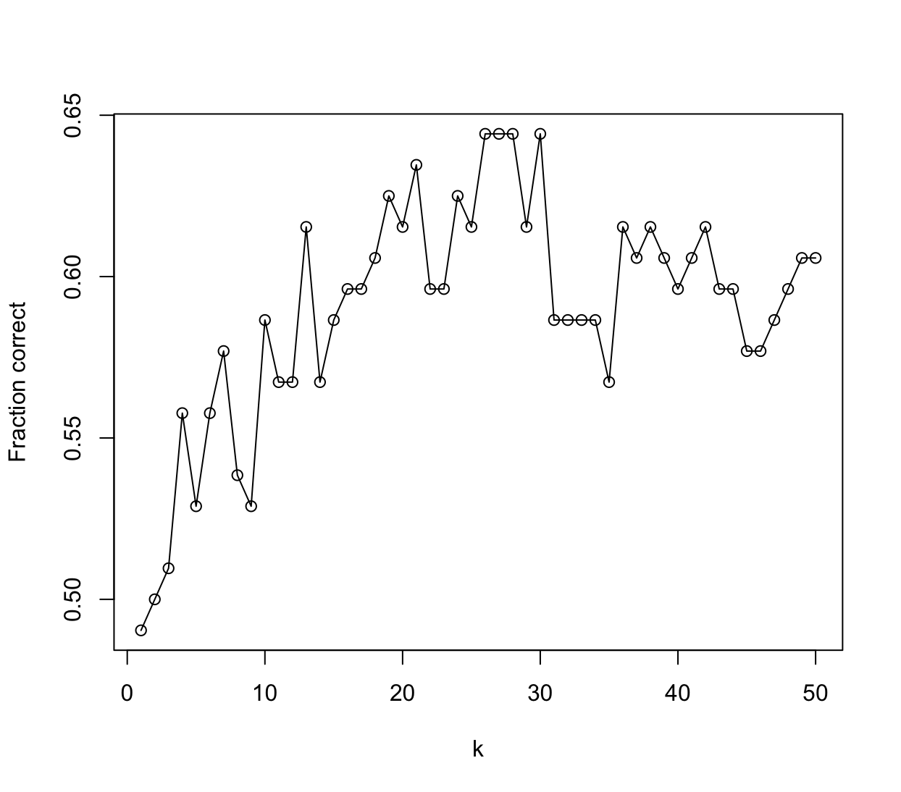

# Classification

1. Using a little bit of algebra, prove that (4.2) is equivalent to (4.3). In other words, the logistic function representation and logit representation for the logistic regression model are equivalent.

    $$p(X)=\frac{e^{\beta_0+\beta_1 X}}{1+e^{\beta_0+\beta_1 X}}$$

    $$p(X) + p(X)e^{\beta_0+\beta_1 X}=e^{\beta_0+\beta_1 X}$$

    $$p(X) =e^{\beta_0+\beta_1 X} - p(X)e^{\beta_0+\beta_1 X}$$

    $$p(X) =e^{\beta_0+\beta_1 X}(1-p(X))$$

    $$\frac{p(X)}{1-p(X)} =e^{\beta_0+\beta_1 X}$$

2. It was stated in the text that classifying an observation to the class for which (4.17) is largest is equivalent to classifying an observation to the class for which (4.18) is largest. Prove that this is the case. In other words, under the assumption that the observations in the kth class are drawn from a $N (\mu_k , \sigma^2)$ distribution, the Bayes classifier assigns an observation to the class for which the discriminant function is maximized.

    $$p_k(x)=\frac{\pi_k \frac{1}{\sqrt{2 \pi} \sigma} \exp \left(-\frac{1}{2 \sigma^2}\left(x-\mu_k\right)^2\right)}{\sum_{l=1}^K \pi_l \frac{1}{\sqrt{2 \pi} \sigma} \exp \left(-\frac{1}{2 \sigma^2}\left(x-\mu_l\right)^2\right)}$$

    $$p_k(x)=\frac{\pi_k \frac{1}{\sqrt{2 \pi} \sigma} \exp \left(-\frac{1}{2 \sigma^2}\left(x^2-2x\mu_k + \mu_k^2\right)\right)}{\sum_{l=1}^K \pi_l \frac{1}{\sqrt{2 \pi} \sigma} \exp \left(-\frac{1}{2 \sigma^2}\left(x-\mu_l\right)^2\right)}$$

    $$p_k(x)=\frac{\frac{1}{\sqrt{2 \pi} \sigma} \exp \left(-\frac{x^2}{2 \sigma^2}\right)}{\sum_{l=1}^K \pi_l \frac{1}{\sqrt{2 \pi} \sigma} \exp \left(-\frac{1}{2 \sigma^2}\left(x-\mu_l\right)^2\right)} \cdot \pi_k \exp \left(\frac{x\mu_k}{\sigma^2}-\frac{\mu_k^2}{2\sigma^2}\right)$$

    Czynnik niezależny od $k$:

    $$c=\frac{\frac{1}{\sqrt{2 \pi} \sigma} \exp \left(-\frac{x^2}{2 \sigma^2}\right)}{\sum_{l=1}^K \pi_l \frac{1}{\sqrt{2 \pi} \sigma} \exp \left(-\frac{1}{2 \sigma^2}\left(x-\mu_l\right)^2\right)}$$

    $$p_k(x)=c \pi_k \exp \left(\frac{x\mu_k}{\sigma^2}-\frac{\mu_k^2}{2\sigma^2}\right)$$

    Logarytmowanie:

    $$\ln[p_k(x)]=\ln(c) +  \ln(\pi_k) + \frac{x\mu_k}{\sigma^2} - \frac{\mu_k^2}{2\sigma^2}$$

    Ostatecznie:

    $$\delta_k(x)=x\frac{\mu_k}{\sigma^2} - \frac{\mu_k^2}{2\sigma^2} + \ln(\pi_k)$$

3. This problem relates to the QDA model, in which the observations within each class are drawn from a normal distribution with a class specific mean vector and a class specific covariance matrix. We consider the simple case where $p = 1$; i.e. there is only one feature.

    Suppose that we have $K$ classes, and that if an observation belongs to the $k$th class then $X$ comes from a one-dimensional normal distribution, $X ∼ N(\mu_k, \sigma_k^2)$. Recall that the density function for the one-dimensional normal distribution is given in (4.16). Prove that in this case, the Bayes classifier is not linear. Argue that it is in fact quadratic.

    _Hint: For this problem, you should follow the arguments laid out in Section 4.4.1, but without making the assumption that $\sigma^2_1 =\ldots= \sigma_K^2$._

    $$p_k(x)=\frac{\pi_k \frac{1}{\sqrt{2 \pi} \sigma_k} \exp \left(-\frac{1}{2 \sigma_k^2}\left(x^2-2x\mu_k + \mu_k^2\right)\right)}{\sum_{l=1}^K \pi_l \frac{1}{\sqrt{2 \pi} \sigma_l} \exp \left(-\frac{1}{2 \sigma_l^2}\left(x-\mu_l\right)^2\right)}$$

    Czynnik niezależny od $k$:

    $$c=\frac{\frac{1}{\sqrt{2 \pi}}}{\sum_{l=1}^K \pi_l \frac{1}{\sqrt{2 \pi} \sigma_l} \exp \left(-\frac{1}{2 \sigma_l^2}\left(x-\mu_l\right)^2\right)}$$

    $$p_k(x)=c \frac{\pi_k}{\sigma_k} \exp \left(-\frac{1}{2 \sigma_k^2}\left(x^2-2x\mu_k + \mu_k^2\right)\right)$$

    $$p_k(x)=c \frac{\pi_k}{\sigma_k} \exp \left(-\frac{x^2}{2 \sigma_k^2} +\frac{x\mu_k^2}{\sigma_k^2}  -\frac{\mu_k^2}{2 \sigma_k^2}\right)$$

    Logarytmowanie:

    $$\ln[p_k(x)]=\ln(c) +  \ln\left(\frac{\pi_k}{\sigma_k}\right) - \frac{x^2}{2 \sigma_k^2} + \frac{x\mu_k^2}{\sigma_k^2}  -\frac{\mu_k^2}{2 \sigma_k^2}$$

    Ostatecznie dostajemy funkcję kwadratową.

4. When the number of features $p$ is large, there tends to be a deterioration in the performance of KNN and other local approaches that perform prediction using only observations that are near the test observation for which a prediction must be made. This phenomenon is known as the curse of dimensionality, and it ties into the fact that non-parametric approaches often perform poorly when $p$ is large. We will now investigate this curse.

    > Bez zbędnego utrudniania nie rozważam przypadków kiedy $x$ wpada w przedział $[0, 0.05] \cup [0.95, 1]$ i trzymam się tego w każdym podpunkcie z tego zadania.

    (a) Suppose that we have a set of observations, each with measurements on $p = 1$ feature, $X$. We assume that $X$ is uniformly (evenly) distributed on $[0, 1]$. Associated with each observation is a response value. Suppose that we wish to predict a test observation’s response using only observations that are within 10% of the range of $X$ closest to that test observation. For instance, in order to predict the response for a test observation with $X = 0.6$, we will use observations in the range $[0.55, 0.65]$. On average, what fraction of the available observations will we use to make the prediction?

    > Średnio używane jest 10% obserwacji.

    (b) Now suppose that we have a set of observations, each with measurements on $p = 2$ features, $X_1$ and $X_2$. We assume that $(X_1, X_2)$ are uniformly distributed on $[0, 1] \times [0, 1]$. We wish to predict a test observation’s response using only observations that are within 10 % of the range of $X_1$ and within 10% of the range of $X_2$ closest to that test observation. For instance, in order to predict the response for a test observation with $X_1 = 0.6$ and $X_2 = 0.35$, we will use observations in the range $[0.55, 0.65]$ for $X_1$ and in the range $[0.3, 0.4]$ for $X_2$. On average, what fraction of the available observations will we use to make the prediction?

    > Używamy $10\% \cdot 10\% = 1\%$ dostępnych obserwacji.

    (c) Now suppose that we have a set of observations on $p = 100$ features. Again the observations are uniformly distributed on each feature, and again each feature ranges in value from 0 to 1. We wish to predict a test observation’s response using observations within the 10% of each feature’s range that is closest to that test observation. What fraction of the available observations will we use to make the prediction?

    > Używamy $10\%^{100} \approx 0\%$ dostępnych obserwacji.

    (d) Using your answers to parts (a)–(c), argue that a drawback of KNN when $p$ is large is that there are very few training observations “near” any given test observation.

    > Widać, że wraz z kolejnym dodanym predykatorem spada ilość danych używanych do klasyfikacji w tempie wykładniczym.

    (e) Now suppose that we wish to make a prediction for a test observation by creating a $p$-dimensional hypercube centered around the test observation that contains, on average, 10% of the training observations. For $p = 1, 2$, and $100$, what is the length of each side of the hypercube? Comment on your answer.

    _Note: A hypercube is a generalization of a cube to an arbitrary number of dimensions. When $p = 1$, a hypercube is simply a line segment, when $p = 2$ it is a square, and when $p = 100$ it is a $100$-dimensional cube._

    > Kiedy $p=1$ to długość boku kostki wynosi $0.1$.
    >
    > Kiedy $p=2$ to długość boku kostki spełnia równanie $a^2 = 0.1$ a stąd $a = 0.1^{\frac{1}{2}} \approx 0.32$
    >
    > Kiedy $p=100$ to długość boku kostki wynosi $a = 0.1^{\frac{1}{100}} \approx 0.98$
    >
    > Widać, że wraz ze wzrostem $p$ długość boku kostki dąży do 1 czyli do 100% dostępnych danych.

5. We now examine the differences between LDA and QDA.

    (a) If the Bayes decision boundary is linear, do we expect LDA or QDA to perform better on the training set? On the test set?

    > QDA jest bardziej elastycznym modelem i zawsze będzie lepiej się sprawdzał na danych treningowych. LDA w tym przypadku będzie lepiej sprawdzał się na danych testowych.

    (b) If the Bayes decision boundary is non-linear, do we expect LDA or QDA to perform better on the training set? On the test set?

    > W obu przypadkach lepszy będzie model QDA.

    (c) In general, as the sample size $n$ increases, do we expect the test prediction accuracy of QDA relative to LDA to improve, decline, or be unchanged? Why?

    > Ogólnie model QDA sprawdza się lepiej od modelu LDA kiedy rozmiar próby jest większy.
    
    (d) True or False: Even if the Bayes decision boundary for a given problem is linear, we will probably achieve a superior test error rate using QDA rather than LDA because QDA is flexible enough to model a linear decision boundary. Justify your answer.

    > False. Model QDA może zostać przetrenowany przez to, że jest bardziej elastyczny dlatego może sprawować się dobrze na danych treningowych ale źle na danych testowych.

6. Suppose we collect data for a group of students in a statistics class with variables $X_1=$ hours studied, $X_2=$ undergrad GPA, and $Y=$ receive an A. We fit a logistic regression and produce estimated coefficient, $\hat{\beta}_0=-6, \hat{\beta}_1=0.05, \hat{\beta}_2=1$.

    (a) Estimate the probability that a student who studies for 40 h and has an undergrad GPA of 3.5 gets an A in the class.

    > Model logistyczny:
    >
    > $$p(X)=\frac{e^{\hat{\beta}_0+\hat{\beta}_1 X_1 + \hat{\beta}_2X_2}}{1+e^{\hat{\beta}_0+\hat{\beta}_1 X_1 + \hat{\beta}_2X_2}}$$
    >
    > $$p(X)=\frac{e^{-6+0.05\cdot40+1\cdot3.5}}{1+e^{-6+0.05\cdot40+1\cdot3.5}} = \frac{e^{-0.5}}{1+e^{-0.5}} \approx 0.38$$

    (b) How many hours would the student in part (a) need to study to have a 50% chance of getting an A in the class?

    > Model można zapisać w postaci:
    >
    > $$\ln\left(\frac{p(X)}{1-p(X)}\right) =\hat{\beta}_0+\hat{\beta}_1 X_1 + \hat{\beta}_2X_2$$
    >
    > $$\ln\left(\frac{0.5}{1-0.5}\right) =-6+0.05 X_1 + 1\cdot 3.5$$
    >
    >$$X_1 = 50$$

7. Suppose that we wish to predict whether a given stock will issue a dividend this year ("Yes" or "No") based on $X$, last year's percent profit. We examine a large number of companies and discover that the mean value of $X$ for companies that issued a dividend was $\bar{X}=10$, while the mean for those that didn't was $\bar{X}=0$. In addition, the variance of $X$ for these two sets of companies was $\hat{\sigma}^2=36$. Finally, $80 \%$ of companies issued dividends. Assuming that $X$ follows a normal distribution, predict the probability that a company will issue a dividend this year given that its percentage profit was $X=4$ last year.

    _Hint: Recall that the density function for a normal random variable is $f(x)=\frac{1}{\sqrt{2 \pi \sigma^2}} e^{-(x-\mu)^2 / 2 \sigma^2}$. You will need to use Bayes' theorem._

    Korzystając z twierdzenia Bayesa dostajemy:

    $$p_k(x)=\frac{\pi_k \frac{1}{\sqrt{2 \pi} \sigma} \exp \left(-\frac{1}{2 \sigma^2}\left(x-\mu_k\right)^2\right)}{\sum_{l=1}^K \pi_l \frac{1}{\sqrt{2 \pi} \sigma} \exp \left(-\frac{1}{2 \sigma^2}\left(x-\mu_l\right)^2\right)}$$

    W przypadku z zadania:

    $$p_{yes}(4)=\frac{\pi_{yes} \exp \left(-\frac{1}{2 \sigma^2}\left(x-\mu_{yes}\right)^2\right)}{\sum_{l\in[yes, no]}^K \pi_l \exp \left(-\frac{1}{2 \sigma^2}\left(x-\mu_l\right)^2\right)}$$

    $$\pi_{yes} = 0.8$$

    $$\pi_{no} = 0.2$$

    $$p_{yes}(4)=\frac{0.8 \exp \left(-\frac{1}{2 \cdot 36}\left(4-10\right)^2\right)}{0.8 \exp \left(-\frac{1}{2 \cdot 36}\left(4-10\right)^2\right) + 0.2 \exp \left(-\frac{1}{2 \cdot 36}\left(4-0\right)^2\right)}$$

    $$p_{yes}(4)=\frac{0.8 \exp \left(-0.5\right)}{0.8 \exp \left(-0.5\right) + 0.2 \exp \left(-\frac{2}{9}\right)}$$

    $$p_{yes}(4)\approx 0.75$$

8. Suppose that we take a data set, divide it into equally-sized training and test sets, and then try out two different classification procedures. First we use logistic regression and get an error rate of 20% on the
training data and 30% on the test data. Next we use 1-nearest neighbors (i.e. $K = 1$) and get an average error rate (averaged over both test and training data sets) of 18%. Based on these results, which method should we prefer to use for classification of new observations? Why?

    KNN z $K=1$ będzie dopasowany do danych treningowych idealnie tzn. błąd będzie wynosił 0. Oznacza to, że błąd na zbiorze testowym będzie wynosił średnio 36%. Wyboru modelu dokonujemy na podstawie zbioru testowego na którym mniejszy błąd ma regresja logistyczna (30%) i ten model powinien zostać wybrany.

9. This problem has to do with odds.
    
    (a) On average, what fraction of people with an odds of 0.37 of defaulting on their credit card payment will in fact default?

    Odds jest zdefiniowany jako: $p(x)/(1-p(x))$.

    $$0.37 = \frac{p(x)}{1 - p(x)}$$

    $$p(x) = 0.27$$
    
    (b) Suppose that an individual has a 16% chance of defaulting on her credit card payment. What are the odds that she will default?

    $$odds = \frac{0.16}{1 - 0.16} = 0.19$$

10. Equation 4.32 derived an expression for $\log \left(\frac{\text{Pr}(Y=k \mid X=x)}{\text{Pr}(Y=K \mid X=x)}\right)$ in the setting where $p>1$, so that the mean for the $k$th class, $\mu_k$, is a $p$-dimensional vector, and the shared covariance $\boldsymbol{\Sigma}$ is a $p \times p$ matrix. However, in the setting with $p=1$, (4.32) takes a simpler form, since the means $\mu_1, \ldots, \mu_K$ and the variance $\sigma^2$ are scalars. In this simpler setting, repeat the calculation in (4.32), and provide expressions for $a_k$ and $b_{k j}$ in terms of $\pi_k, \pi_K, \mu_k, \mu_K$, and $\sigma^2$.

    $$\log\left(\frac{\text{Pr}(Y=k|X=x)}{\text{Pr}(Y=K|X=x)}\right) = \log\left(\frac{\pi_k f_k(x)}{\pi_K f_K(x)}\right) =$$
    
    $$ = \log\left(\frac{\pi_k \exp(-1/2((x-\mu_k)/\sigma)^2)}{\pi_K \exp(-1/2((x-\mu_K)/\sigma)^2)}\right) =$$

    $$ = \log\left(\frac{\pi_k}{\pi_K}\right) - \frac{1}{2} \left(\frac{x-\mu_k}{\sigma}\right)^2 + \frac{1}{2} \left(\frac{x-\mu_K}{\sigma}\right)^2 =$$

    $$ = \log\left(\frac{\pi_k}{\pi_K}\right) - \frac{1}{2\sigma^2} (x-\mu_k)^2 + \frac{1}{2\sigma^2} (x-\mu_K)^2 = $$

    $$ = \log\left(\frac{\pi_k}{\pi_K}\right) - \frac{1}{2\sigma^2} \left((x-\mu_k)^2 - (x-\mu_K)^2\right) = $$
    
    $$ = \log\left(\frac{\pi_k}{\pi_K}\right) - \frac{1}{2\sigma^2} \left(x^2-2x\mu_k+\mu_k^2 - x^2 + 2x\mu_K - \mu_K^2\right) = $$

    $$ = \log\left(\frac{\pi_k}{\pi_K}\right) - \frac{1}{2\sigma^2} \left(2x(\mu_K - \mu_k) + \mu_k^2 -\mu_K^2\right) = $$
 
    $$ = \log\left(\frac{\pi_k}{\pi_K}\right) - \frac{\mu_k^2 -\mu_K^2}{2\sigma^2} + x\frac{(\mu_k - \mu_K)}{\sigma^2} = $$

    $$ = a_k + b_kx$$

11. Work out the detailed forms of $a_k, b_{k j}$, and $b_{kjl}$ in (4.33). Your answer should involve $\pi_k, \pi_K, \mu_k, \mu_K, \boldsymbol{\Sigma}_k$, and $\boldsymbol{\Sigma}_K$.

    $$\log\left(\frac{\text{Pr}(Y=k|X=x)}{\text{Pr}(Y=K|X=x)}\right) = \log\left(\frac{\pi_k f_k(x)}{\pi_K f_K(x)}\right) =$$
    
    $$ = \log\left(\frac{\pi_k \exp(-\frac{1}{2}(x-\mu_k)^T\boldsymbol{\Sigma}_k^{-1}(x-\mu_k))}{\pi_K \exp(-\frac{1}{2}(x-\mu_K)^T\boldsymbol{\Sigma}_K^{-1}(x-\mu_K))}\right) =$$

    $$ = \log\left(\frac{\pi_k}{\pi_K}\right) -\frac{1}{2}(x-\mu_k)^T\boldsymbol{\Sigma}_k^{-1}(x-\mu_k) + \frac{1}{2}(x-\mu_K)^T\boldsymbol{\Sigma}_K^{-1}(x-\mu_K) =$$

    $$ = \log\left(\frac{\pi_k}{\pi_K}\right) -\frac{1}{2}(x^T-\mu_k^T)\boldsymbol{\Sigma}_k^{-1}(x-\mu_k) + \frac{1}{2}(x^T-\mu_K^T)\boldsymbol{\Sigma}_K^{-1}(x-\mu_K) = $$

    $$ = \log\left(\frac{\pi_k}{\pi_K}\right) - \frac{1}{2}[x^T \boldsymbol{\Sigma}_k^{-1}(x-\mu_k)-\mu_k^T\boldsymbol{\Sigma}_k^{-1}(x-\mu_k)] $$
    
    $$ + \frac{1}{2}[x^T \boldsymbol{\Sigma}_K^{-1}(x-\mu_K)-\mu_K^T\boldsymbol{\Sigma}_K^{-1}(x-\mu_K)] =$$

    $$ = \log\left(\frac{\pi_k}{\pi_K}\right) - \frac{1}{2}[x^T \boldsymbol{\Sigma}_k^{-1}x- x^T \boldsymbol{\Sigma}_k^{-1}\mu_k-\mu_k^T\boldsymbol{\Sigma}_k^{-1}x+\mu_k^T\boldsymbol{\Sigma}_k^{-1}\mu_k] + $$
    
    $$ + \frac{1}{2}[x^T \boldsymbol{\Sigma}_K^{-1}x- x^T \boldsymbol{\Sigma}_K^{-1}\mu_K-\mu_K^T\boldsymbol{\Sigma}_K^{-1}x+\mu_K^T\boldsymbol{\Sigma}_K^{-1}\mu_K] =$$

    $$ = \log\left(\frac{\pi_k}{\pi_K}\right) - \frac{1}{2}[x^T \boldsymbol{\Sigma}_k^{-1}x + \mu_k^T\boldsymbol{\Sigma}_k^{-1}\mu_k - x^T \boldsymbol{\Sigma}_k^{-1}\mu_k-x^T \boldsymbol{\Sigma}_k^{-1}\mu_k] + $$
    
    $$ + \frac{1}{2}[x^T \boldsymbol{\Sigma}_K^{-1}x + \mu_K^T\boldsymbol{\Sigma}_K^{-1}\mu_K - x^T \boldsymbol{\Sigma}_K^{-1}\mu_K-x^T \boldsymbol{\Sigma}_K^{-1}\mu_K] = $$

    $$ = \log\left(\frac{\pi_k}{\pi_K}\right) - \frac{1}{2}[x^T \boldsymbol{\Sigma}_k^{-1}x + \mu_k^T\boldsymbol{\Sigma}_k^{-1}\mu_k] + x^T \boldsymbol{\Sigma}_k^{-1}\mu_k$$
    
    $$ + \frac{1}{2}[x^T \boldsymbol{\Sigma}_K^{-1}x + \mu_K^T\boldsymbol{\Sigma}_K^{-1}\mu_K] - x^T \boldsymbol{\Sigma}_K^{-1}\mu_K = $$

    $$ = \log\left(\frac{\pi_k}{\pi_K}\right) - \frac{1}{2}\mu_k^T\boldsymbol{\Sigma}_k^{-1}\mu_k + \frac{1}{2} \mu_K^T\boldsymbol{\Sigma}_K^{-1}\mu_K + $$

    $$ + x^T \boldsymbol{\Sigma}_k^{-1}\mu_k - x^T \boldsymbol{\Sigma}_K^{-1}\mu_K - $$
    
    $$ -\frac{1}{2} x^T \boldsymbol{\Sigma}_k^{-1}x + \frac{1}{2}x^T \boldsymbol{\Sigma}_K^{-1}x   = $$

    $$ = \log\left(\frac{\pi_k}{\pi_K}\right) - \frac{1}{2}\mu_k^T\boldsymbol{\Sigma}_k^{-1}\mu_k + \frac{1}{2} \mu_K^T\boldsymbol{\Sigma}_K^{-1}\mu_K + $$

    $$ + x^T (\boldsymbol{\Sigma}_k^{-1}\mu_k - \boldsymbol{\Sigma}_K^{-1}\mu_K) + $$
    
    $$ + x^T \frac{1}{2}(\boldsymbol{\Sigma}_K^{-1} + \boldsymbol{\Sigma}_k^{-1})x   = $$

    $$= a_k + \sum\limits_{j=1}^pb_{kj}x_j + \sum\limits_{j=1}^p\sum\limits_{l=1}^p c_{kjl}x_jx_l$$

    gdzie:

    $a_k = \log\left(\frac{\pi_k}{\pi_K}\right) - \frac{1}{2}\mu_k^T\boldsymbol{\Sigma}_k^{-1}\mu_k + \frac{1}{2} \mu_K^T\boldsymbol{\Sigma}_K^{-1}\mu_K$

    $b_{kj}$ jest $j$-tym elementem wektora $\boldsymbol{\Sigma}_k^{-1}\mu_k - \boldsymbol{\Sigma}_K^{-1}\mu_K$

    $c_{kjl}$ jest elementem macierzy $\frac{1}{2}(\boldsymbol{\Sigma}_K^{-1} + \boldsymbol{\Sigma}_k^{-1})$ z $j$-tego wiersza i $l$-tej kolumny

12. Suppose that you wish to classify an observation $X \in \mathbb{R}$ into `apples` and `oranges`. You fit a logistic regression model and find that

    $$
    \widehat{\operatorname{Pr}}(Y=\text { orange } \mid X=x)=\frac{\exp \left(\hat{\beta}_0+\hat{\beta}_1 x\right)}{1+\exp \left(\hat{\beta}_0+\hat{\beta}_1 x\right)} .
    $$


    Your friend fits a logistic regression model to the same data using the _softmax_ formulation in (4.13), and finds that

    $$
    \begin{aligned}
    & \widehat{\operatorname{Pr}}(Y=\text { orange } \mid X=x)= \\
    & = \frac{\exp \left(\hat{\alpha}_{\text {orange} 0}+\hat{\alpha}_{\text {orange} 1} x\right)}{\exp \left(\hat{\alpha}_{\text {orange} 0}+\hat{\alpha}_{\text {orange} 1} x\right)+\exp \left(\hat{\alpha}_{\text {apple} 0}+\hat{\alpha}_{\text {apple} 1} x\right)} .
    \end{aligned}
    $$

    (a) What is the log odds of `orange` versus `apple` in your model?


    > $$\log\left(\frac{\widehat{\operatorname{Pr}}(Y=\text { orange } \mid X=x)}{1-\widehat{\operatorname{Pr}}(Y=\text { orange } \mid X=x)}\right) = \hat\beta_0 + \hat\beta_1x$$

    (b) What is the log odds of `orange` versus `apple` in your friend's model?

    > $$
    \begin{aligned}
    & \log\left(\frac{\widehat{\operatorname{Pr}}(Y=\text { orange } \mid X=x)}{\widehat{\operatorname{Pr}}(Y=\text { apple } \mid X=x)}\right) = \\
    & = (\hat\alpha_{orange0} - \hat\alpha_{apple0}) + (\hat\alpha_{orange1} - \hat\alpha_{apple1})x
    \end{aligned}
    $$

    (c) Suppose that in your model, $\hat{\beta}_0=2$ and $\hat{\beta}_1=-1$. What are the coefficient estimates in your friend's model? Be as specific as possible.

    > Można tylko stwierdzić, że $\hat\alpha_{orange0} - \hat\alpha_{apple0} = 2$ i $\hat\alpha_{orange1} - \hat\alpha_{apple1} = -1$
    >
    > Dokładnych wartości parametrów nie jesteśmy w stanie określić.

    (d) Now suppose that you and your friend fit the same two models on a different data set. This time, your friend gets the coefficient estimates $\hat{\alpha}_{\text {orange} 0}=1.2$, $\hat{\alpha}_{\text {orange} 1}=-2$, $\hat{\alpha}_{\text {apple} 0}=3$, $\hat{\alpha}_{\text {apple} 1}= 0.6$. What are the coefficient estimates in your model?

    > $\hat{\beta}_0 = 1.2 - 3 = -1.8$
    >
    > $\hat{\beta}_1 = -2 - 0.6 = -2.6$

    (e) Finally, suppose you apply both models from (d) to a data set with 2 000 test observations. What fraction of the time do you expect the predicted class labels from your model to agree with those from your friend’s model? Explain your answer.

    > Modele są takie same tylko z różną parametryzacją więc wyniki powinny być identyczne.

13. This question should be answered using the `Weekly` data set, which is part of the `ISLR2` package. This data is similar in nature to the `Smarket` data from this chapter’s lab, except that it contains 1,089 weekly returns for 21 years, from the beginning of 1990 to the end of 2010.

    (a) Produce some numerical and graphical summaries of the `Weekly` data. Do there appear to be any patterns?

    ```R
    library(ISLR)
    summary(Weekly)
    ```

    ```R
         Year           Lag1               Lag2               Lag3               Lag4         
    Min.   :1990   Min.   :-18.1950   Min.   :-18.1950   Min.   :-18.1950   Min.   :-18.1950  
    1st Qu.:1995   1st Qu.: -1.1540   1st Qu.: -1.1540   1st Qu.: -1.1580   1st Qu.: -1.1580  
    Median :2000   Median :  0.2410   Median :  0.2410   Median :  0.2410   Median :  0.2380  
    Mean   :2000   Mean   :  0.1506   Mean   :  0.1511   Mean   :  0.1472   Mean   :  0.1458  
    3rd Qu.:2005   3rd Qu.:  1.4050   3rd Qu.:  1.4090   3rd Qu.:  1.4090   3rd Qu.:  1.4090  
    Max.   :2010   Max.   : 12.0260   Max.   : 12.0260   Max.   : 12.0260   Max.   : 12.0260  
        Lag5              Volume            Today          Direction 
    Min.   :-18.1950   Min.   :0.08747   Min.   :-18.1950   Down:484  
    1st Qu.: -1.1660   1st Qu.:0.33202   1st Qu.: -1.1540   Up  :605  
    Median :  0.2340   Median :1.00268   Median :  0.2410             
    Mean   :  0.1399   Mean   :1.57462   Mean   :  0.1499             
    3rd Qu.:  1.4050   3rd Qu.:2.05373   3rd Qu.:  1.4050             
    Max.   : 12.0260   Max.   :9.32821   Max.   : 12.0260
    ```

    ```R
    pairs(Weekly[,1:8])
    ```

    

    ```R
    cor(Weekly[,1:8])
    ```

    ```R
                  Year         Lag1        Lag2        Lag3         Lag4
    Year    1.00000000 -0.032289274 -0.03339001 -0.03000649 -0.031127923
    Lag1   -0.03228927  1.000000000 -0.07485305  0.05863568 -0.071273876
    Lag2   -0.03339001 -0.074853051  1.00000000 -0.07572091  0.058381535
    Lag3   -0.03000649  0.058635682 -0.07572091  1.00000000 -0.075395865
    Lag4   -0.03112792 -0.071273876  0.05838153 -0.07539587  1.000000000
    Lag5   -0.03051910 -0.008183096 -0.07249948  0.06065717 -0.075675027
    Volume  0.84194162 -0.064951313 -0.08551314 -0.06928771 -0.061074617
    Today  -0.03245989 -0.075031842  0.05916672 -0.07124364 -0.007825873
                   Lag5      Volume        Today
    Year   -0.030519101  0.84194162 -0.032459894
    Lag1   -0.008183096 -0.06495131 -0.075031842
    Lag2   -0.072499482 -0.08551314  0.059166717
    Lag3    0.060657175 -0.06928771 -0.071243639
    Lag4   -0.075675027 -0.06107462 -0.007825873
    Lag5    1.000000000 -0.05851741  0.011012698
    Volume -0.058517414  1.00000000 -0.033077783
    Today   0.011012698 -0.03307778  1.000000000
    ```

    > `Volume` jest silnie dodatnio skorelowane z `Year`, reszta zmiennych jest bardzo słabo z sobą skorelowana, nie widać tutaj żadnych zależności.

    (b) Use the full data set to perform a logistic regression with `Direction` as the response and the five lag variables plus `Volume` as predictors. Use the summary function to print the results. Do any of the predictors appear to be statistically significant? If so, which ones?

    ```R
    fit.log <- glm(Direction ~ . - Year - Today, data = Weekly,
                   family = binomial)
    summary(fit.log)
    ```

    ```R
    Call:
    glm(formula = Direction ~ . - Year - Today, family = binomial, 
        data = Weekly)

    Coefficients:
                Estimate Std. Error z value Pr(>|z|)   
    (Intercept)  0.26686    0.08593   3.106   0.0019 **
    Lag1        -0.04127    0.02641  -1.563   0.1181   
    Lag2         0.05844    0.02686   2.175   0.0296 * 
    Lag3        -0.01606    0.02666  -0.602   0.5469   
    Lag4        -0.02779    0.02646  -1.050   0.2937   
    Lag5        -0.01447    0.02638  -0.549   0.5833   
    Volume      -0.02274    0.03690  -0.616   0.5377   
    ---
    Signif. codes:  0 ‘***’ 0.001 ‘**’ 0.01 ‘*’ 0.05 ‘.’ 0.1 ‘ ’ 1

    (Dispersion parameter for binomial family taken to be 1)

        Null deviance: 1496.2  on 1088  degrees of freedom
    Residual deviance: 1486.4  on 1082  degrees of freedom
    AIC: 1500.4

    Number of Fisher Scoring iterations: 4
    ```

    > Tylko `Lag2` jest istotne statystycznie o czym mówi p-value < 0.05.

    (c) Compute the confusion matrix and overall fraction of correct predictions. Explain what the confusion matrix is telling you about the types of mistakes made by logistic regression.

    ```R
    fit.log.probs <- predict(fit.log, type = "response")
    attach(Weekly)
    contrasts(Direction)
    ```

    ```R
        Up
    Down  0
    Up    1
    ```

    ```R
    fit.log.pred <- rep("Down", 1089)
    fit.log.pred[fit.log.probs > .5] = "Up"
    table(fit.log.pred, Direction)
    ```

    ```R
                Direction
    fit.log.pred Down  Up
            Down   54  48
            Up    430 557

    > (54 + 557) / 1089

    [1] 0.5610652

    > 557 / (430 + 557)

    [1] 0.5643364

    > 54 / (54 + 48)

    [1] 0.5294118
    ```

    > Elementy na przekątnej macierzy wskazują poprawne predykcje, elementy poza przekątną wskazują niepoprawne predykcje. W tym przypadku model ogólnie wykonał poprawnie 56.11% predykcji. Bardziej szczegółowo wykonał poprawnie 56.43% predykcji `Up` i 52.94% predykcji `Down`.

    (d) Now fit the logistic regression model using a training data period from 1990 to 2008, with `Lag2` as the only predictor. Compute the confusion matrix and the overall fraction of correct predictions for the held out data (that is, the data from 2009 and 2010).

    ```R
    train <- (Year < 2009)
    fit.log_2 <- glm(Direction ~ Lag2, data = Weekly[train,],
                     family = binomial)
    fit.log_2.probs <- predict(fit.log_2, Weekly[!train,], 
                               type = "response")
    dim(Weekly[!train,])
    ```

    ```R
    [1] 104   9
    ```

    ```R
    fit.log_2.pred <- rep("Down", 104)
    fit.log_2.pred[fit.log_2.probs > .5] = "Up"
    t <- table(fit.log_2.pred, Weekly[!train, ]$Direction)
    t
    ```

    ```R     
    fit.log_2.pred Down Up
            Down    9  5
            Up     34 56
    ```

    ```R
    sum(diag(t)) / sum(t)
    ```

    ```R
    [1] 0.625
    ```
    
    (e) Repeat (d) using LDA.

    ```R
    library(MASS)
    fit.lda <- lda(Direction ~ Lag2, data = Weekly[train,])
    fit.lda.pred <- predict(fit.lda, Weekly[!train,], type = "response")$class
    t <- table(fit.lda.pred, Weekly[!train, ]$Direction)
    t
    ```

    ```R      
    fit.lda.pred Down Up
            Down    9  5
            Up     34 56
    ```

    ```R
    sum(diag(t)) / sum(t)
    ```

    ```R
    [1] 0.625
    ```
    
    (f) Repeat (d) using QDA.

    ```R
    fit.qda <- qda(Direction ~ Lag2, data = Weekly[train,])
    fit.qda.pred <- predict(fit.qda, Weekly[!train,], type = "response")$class
    t <- table(fit.qda.pred, Weekly[!train, ]$Direction)
    t
    ```

    ```R           
    fit.qda.pred Down Up
            Down    0  0
            Up     43 61
    ```

    ```R
    sum(diag(t)) / sum(t)
    ```

    ```R
    [1] 0.5865385
    ```
    
    (g) Repeat (d) using KNN with $K = 1$.

    ```R
    library(class)
    fit <- knn(
        Weekly[train, "Lag2", drop = FALSE],
        Weekly[!train, "Lag2", drop = FALSE],
        Weekly$Direction[train]
        )
    t <- table(fit, Weekly[!train, ]$Direction)
    t
    ```

    ```R
    fit    Down Up
    Down   21 30
    Up     22 31
    ```

    ```R
    sum(diag(t)) / sum(t)
    ```

    ```R
    [1] 0.5
    ```

    (h) Repeat (d) using naive Bayes.

    ```R
    library(e1071)
    fit.bayes <- naiveBayes(Direction ~ Lag2, data = Weekly[train, ])
    pred <- predict(fit.bayes, Weekly[!train, ], type = "class")
    t <- table(pred, Weekly[!train, ]$Direction)
    t
    ```

    ```R 
    pred   Down Up
    Down      0  0
    Up       43 61
    ```

    ```R
    sum(diag(t)) / sum(t)
    ```

    ```R
    [1] 0.5865385
    ```

    (i) Which of these methods appears to provide the best results on this data?

    > Najlepiej działają: regresja logistyczna i LDA. Obie metody klasyfikują najpoprawniej.
    
    (j) Experiment with different combinations of predictors, including possible transformations and interactions, for each of the methods. Report the variables, method, and associated confusion matrix that appears to provide the best results on the held out data. Note that you should also experiment with values for $K$ in the KNN classifier.

    ```R
    # LDA
    fit.lda <- lda(Direction ~ Lag2 + Volume + Lag2:Volume, data = Weekly[train,])
    fit.lda.pred <- predict(fit.lda, Weekly[!train,], type = "response")$class
    t <- table(fit.lda.pred, Weekly[!train, ]$Direction)
    sum(diag(t)) / sum(t)
    ```

    ```R
    [1] 0.5384615
    ```

    ```R
    # QDA
    fit.qda <- qda(Direction ~ Lag2 + Volume + Lag2:Volume, data = Weekly[train,])
    fit.qda.pred <- predict(fit.qda, Weekly[!train,], type = "response")$class
    t <- table(fit.qda.pred, Weekly[!train, ]$Direction)
    sum(diag(t)) / sum(t)
    ```

    ```R
    [1] 0.4711538
    ```

    ```R
    # Naive Bayes - funkcja nie przyjmuje interakcji
    fit <- naiveBayes(Direction ~ Lag2 + Volume, data = Weekly[train, ])
    pred <- predict(fit, Weekly[!train, ], type = "class")
    t <- table(pred, Weekly[!train, ]$Direction)
    sum(diag(t)) / sum(t)
    ```

    ```R
    [1] 0.4519231
    ```

    ```R
    # KNN
    set.seed(1)
    res <- sapply(1:50, function(k) {
    fit <- knn(
        Weekly[train, 2:4, drop = FALSE],
        Weekly[!train, 2:4, drop = FALSE],
        Weekly$Direction[train],
        k = k
    )
    t <- table(fit, Weekly[!train, ]$Direction)
    sum(diag(t)) / sum(t)
    })

    plot(1:50, res, type = "o", xlab = "k", ylab = "Fraction correct")
    ```

    

14. In this problem, you will develop a model to predict whether a given car gets high or low gas mileage based on the `Auto` data set.

    (a) Create a binary variable, `mpg01`, that contains a 1 if `mpg` contains a value above its median, and a 0 if `mpg` contains a value below its median. You can compute the median using the `median()` function. Note you may find it helpful to use the `data.frame()` function to create a single data set containing both `mpg01` and the other `Auto` variables.

    ```R
    library(ISLR2)
    mpg01_ind <- data.frame("mpg01" = Auto$mpg > median(Auto$mpg))
    Auto_2 <- cbind(Auto[, c(-1, -9)], data.frame("mpg01" = mpg01_ind))
    ```

    (b) Explore the data graphically in order to investigate the association between `mpg01` and the other features. Which of the other features seem most likely to be useful in predicting `mpg01`? Scatterplots and boxplots may be useful tools to answer this question. Describe your findings.

    ```R
    pairs(Auto_2)
    cor(Auto_2)
    ```

    ```R
                  cylinders displacement horsepower     weight acceleration
    cylinders     1.0000000    0.9508233  0.8429834  0.8975273   -0.5046834
    displacement  0.9508233    1.0000000  0.8972570  0.9329944   -0.5438005
    horsepower    0.8429834    0.8972570  1.0000000  0.8645377   -0.6891955
    weight        0.8975273    0.9329944  0.8645377  1.0000000   -0.4168392
    acceleration -0.5046834   -0.5438005 -0.6891955 -0.4168392    1.0000000
    year         -0.3456474   -0.3698552 -0.4163615 -0.3091199    0.2903161
    origin       -0.5689316   -0.6145351 -0.4551715 -0.5850054    0.2127458
    mpg01        -0.7591939   -0.7534766 -0.6670526 -0.7577566    0.3468215
                       year     origin      mpg01
    cylinders    -0.3456474 -0.5689316 -0.7591939
    displacement -0.3698552 -0.6145351 -0.7534766
    horsepower   -0.4163615 -0.4551715 -0.6670526
    weight       -0.3091199 -0.5850054 -0.7577566
    acceleration  0.2903161  0.2127458  0.3468215
    year          1.0000000  0.1815277  0.4299042
    origin        0.1815277  1.0000000  0.5136984
    mpg01         0.4299042  0.5136984  1.0000000
    ```

    

    > Istnieje silna korelacja między zmienną `mpg01` i zmiennymi: `cylinders`, `displacement`, `weight`. 

    (c) Split the data into a training set and a test set.

    ```R
    set.seed(1)
    train <- sample(Auto_2$mpg01, nrow(Auto_2) * 2 / 3)
    ```

    (d) Perform LDA on the training data in order to predict `mpg01` using the variables that seemed most associated with `mpg01` in (b). What is the test error of the model obtained?

    ```R
    library(MASS)
    attach(Auto_2)
    fit.lda <- lda(mpg01 ~ cylinders + displacement + weight,
                   data = Auto_2[train,])
    fit.lda.pred <- predict(fit.lda, Auto_2[!train,], type = "response")$class
    t <- table(fit.lda.pred, Auto_2[!train, ]$mpg01)
    1 - sum(diag(t)) / sum(t)
    ```

    ```R
    [1] 0.09895833
    ```

    (e) Perform QDA on the training data in order to predict `mpg01` using the variables that seemed most associated with `mpg01` in (b). What is the test error of the model obtained?

    ```R
    fit.qda <- qda(mpg01 ~ cylinders + displacement + weight,
                   data = Auto_2[train,])
    fit.qda.pred <- predict(fit.qda, Auto_2[!train,], type = "response")$class
    t <- table(fit.qda.pred, Auto_2[!train, ]$mpg01)
    1 - sum(diag(t)) / sum(t)
    ```

    ```R
    [1] 0.08854167
    ```

    (f) Perform logistic regression on the training data in order to predict `mpg01` using the variables that seemed most associated with `mpg01` in (b). What is the test error of the model obtained?

    ```R
    fit.log <- glm(mpg01 ~ cylinders + displacement + weight, 
                   data = Auto_2[train, ], family = binomial)
    fit.log.pred <- predict(fit.log, Auto_2[!train, ], type = "response") > 0.5
    t <- table(fit.log.pred, Auto_2[!train, ]$mpg01)
    1 - sum(diag(t)) / sum(t)
    ```

    ```R
    [1] 0.1041667
    ```
    
    (g) Perform naive Bayes on the training data in order to predict `mpg01` using the variables that seemed most associated with `mpg01` in (b). What is the test error of the model obtained?

    ```R
    library(e1071)
    fit.bayes <- naiveBayes(mpg01 ~ cylinders + displacement + weight,
                            data = Auto_2[train, ])
    fit.bayes.pred <- predict(fit.bayes, Auto_2[!train, ], type = "class")
    t <- table(fit.bayes.pred, Auto_2[!train, ]$mpg01)
    1- sum(diag(t)) / sum(t)
    ```

    ```R
    [1] 0.08333333
    ```
    
    (h) Perform KNN on the training data, with several values of $K$, in order to predict `mpg01`. Use only the variables that seemed most associated with `mpg01` in (b). What test errors do you obtain? Which value of $K$ seems to perform the best on this data set?

    ```R
    library(class)
    set.seed(1)
    res <- sapply(1:50, function(k) {
    fit <- knn(
        Auto_2[train, 2:4, drop = FALSE],
        Auto_2[!train, 2:4, drop = FALSE],
        Auto_2$mpg01[train],
        k = k
    )
    t <- table(fit, Auto_2[!train, ]$mpg01)
    1 - sum(diag(t)) / sum(t)
    })

    plot(1:50, res, type = "o", xlab = "k", ylab = "Fraction incorrect")
    ```

    

15. This problem involves writing functions.

    (a) Write a function, `Power()`, that prints out the result of raising 2 to the 3rd power. In other words, your function should compute $2^3$ and print out the results.

    _Hint: Recall that `x^a` raises `x` to the power `a`. Use the `print()` function to output the result._

    ```R
    Power <- function() print(2^3)
    ```

    (b) Create a new function, `Power2()`, that allows you to pass _any_ two numbers, `x` and `a`, and prints out the value of `x^a`. You can do this by beginning your function with the line

    ```R
    > Power2 <- function(x, a) {
    ```

    You should be able to call your function by entering, for instance,
    
    ```R
    > Power2(3, 8)
    ```
    
    on the command line. This should output the value of $3^8$, namely, 6,561.

    ```R
    Power2 <- function(x, a) {
      print(x^a)
    }
    Power2(3,8)
    ```

    ```R
    [1] 6561
    ```

    (c) Using the `Power2()` function that you just wrote, compute $10^3$, $8^{17}$, and $131^3$.

    ```R
    > Power2(10,3)
    [1] 1000
    > Power2(8,17)
    [1] 2.2518e+15
    > Power2(131,3)
    [1] 2248091
    ```

    (d) Now create a new function, `Power3()`, that actually _returns_ the result `x^a` as an `R` object, rather than simply printing it to the screen. That is, if you store the value `x^a` in an object called `result` within your function, then you can simply `return()` this result, using the following line:

    ```R
    return(result)
    ```

    The line above should be the last line in your function, before the `}` symbol.

    ```R
    Power3 <- function(x, a) {
      result <- x^a
      return(result)
    }
    ```

    (e) Now using the `Power3()` function, create a plot of $f (x) = x^2$. The $x$-axis should display a range of integers from 1 to 10, and the $y$-axis should display $x^2$. Label the axes appropriately, and use an appropriate title for the figure. Consider displaying either the $x$-axis, the $y$-axis, or both on the log-scale. You can do this by using `log = "x"`, `log = "y"`, or `log = "xy"` as arguments to the `plot()` function.

    ```R
    plot(1:10, Power3(1:10, 2),
         xlab = "x",
         ylab = expression(paste("x"^"2")),
         log = "xy"
    )
    ```

    (f) Create a function, `PlotPower()`, that allows you to create a plot of `x` against `x^a` for a fixed `a` and for a range of values of `x`. For instance, if you call

    ```R
    > PlotPower(1:10 , 3)
    ```

    then a plot should be created with an $x$-axis taking on values $1$, $2$, . . . ,$10$, and a $y$-axis taking on values $1^3$, $2^3$, . . . ,$10^3$.

    ```R
    PlotPower <- function(x, a) {
      plot(x, Power3(x, a),
           xlab = "x",
           ylab = substitute("x"^a, list(a = a)),
           log = "xy"
      )
    }
    ```

16. Using the `Boston` data set, fit classification models in order to predict whether a given census tract has a crime rate above or below the median. Explore logistic regression, LDA, naive Bayes, and KNN models using various subsets of the predictors. Describe your findings.

    _Hint: You will have to create the response variable yourself, using the variables that are contained in the `Boston` data set._

    ```R
    library(ISLR2)
    library(MASS)
    library(e1071)
    library(class)
    attach(Boston)
    hcrim_ind <- data.frame("hcrim" = Boston$crim > median(Boston$crim))
    Boston_2 <- cbind(Boston[, -1], data.frame("hcrim" = hcrim_ind))

    set.seed(1)
    train <- sample(Boston_2$hcrim, nrow(Boston_2) * 2 / 3)

    cor(Boston_2)

    # Logistic Regression

    fit.log <- glm(hcrim ~ ., data = Boston_2[train, ], family = binomial)
    fit.log.pred <- predict(fit.log, Boston_2[!train, ], type = "response") > 0.5
    t <- table(fit.log.pred, Boston_2[!train, ]$hcrim)
    sum(diag(t)) / sum(t)
    ```

    ```R
    [1] 0.9007634
    ```

    ```R
    summary(fit.log)
    ```

    ```R
    Call:
    glm(formula = hcrim ~ ., family = binomial, data = Boston_2[train, 
        ])

    Coefficients:
                Estimate Std. Error z value Pr(>|z|)    
    (Intercept) -11.241360  13.196360  -0.852  0.39430    
    zn           -0.132952   0.065654  -2.025  0.04286 *  
    indus        -0.063790   0.081037  -0.787  0.43118    
    chas          0.738854   1.099682   0.672  0.50166    
    nox          49.969089  12.052130   4.146 3.38e-05 ***
    rm           -1.027092   1.328245  -0.773  0.43936    
    age           0.038082   0.020456   1.862  0.06265 .  
    dis           0.676314   0.415199   1.629  0.10334    
    rad           0.727380   0.242918   2.994  0.00275 ** 
    tax          -0.004902   0.005278  -0.929  0.35304    
    ptratio       0.580104   0.251369   2.308  0.02101 *  
    black        -0.082943   0.031055  -2.671  0.00756 ** 
    lstat        -0.016402   0.085840  -0.191  0.84847    
    medv          0.259412   0.132911   1.952  0.05097 .  
    ---
    Signif. codes:  0 ‘***’ 0.001 ‘**’ 0.01 ‘*’ 0.05 ‘.’ 0.1 ‘ ’ 1

    (Dispersion parameter for binomial family taken to be 1)

        Null deviance: 338.19  on 243  degrees of freedom
    Residual deviance:  88.76  on 230  degrees of freedom
    AIC: 116.76

    Number of Fisher Scoring iterations: 9
    ```

    > Usunę zmienne dla których $p$-value jest za wysokie

    ```R
    fit.log <- glm(hcrim ~ zn + nox + age + rad + ptratio + black + medv, data = Boston_2[train, ], family = binomial)
    fit.log.pred <- predict(fit.log, Boston_2[!train, ], type = "response") > 0.5
    t <- table(fit.log.pred, Boston_2[!train, ]$hcrim)
    sum(diag(t)) / sum(t)
    ```

    ```R
    [1] 0.8664122
    ```

    ```R
    summary(fit.log)
    ```

    ```R
    Call:
    glm(formula = hcrim ~ zn + nox + age + rad + ptratio + black + 
        medv, family = binomial, data = Boston_2[train, ])

    Coefficients:
                Estimate Std. Error z value Pr(>|z|)    
    (Intercept) -4.92352   10.16471  -0.484 0.628121    
    zn          -0.08096    0.04544  -1.782 0.074786 .  
    nox         27.90504    6.49764   4.295 1.75e-05 ***
    age          0.01496    0.01282   1.168 0.242916    
    rad          0.64605    0.18003   3.589 0.000332 ***
    ptratio      0.42044    0.19446   2.162 0.030606 *  
    black       -0.06563    0.02463  -2.665 0.007701 ** 
    medv         0.14621    0.05588   2.616 0.008892 ** 
    ---
    Signif. codes:  0 ‘***’ 0.001 ‘**’ 0.01 ‘*’ 0.05 ‘.’ 0.1 ‘ ’ 1

    (Dispersion parameter for binomial family taken to be 1)

        Null deviance: 338.190  on 243  degrees of freedom
    Residual deviance:  97.204  on 236  degrees of freedom
    AIC: 113.2

    Number of Fisher Scoring iterations: 9
    ```

    > Jeszcze raz to samo

    ```R
    fit.log <- glm(hcrim ~ zn + nox + rad + ptratio + black + medv, data = Boston_2[train, ], family = binomial)
    fit.log.pred <- predict(fit.log, Boston_2[!train, ], type = "response") > 0.5
    t <- table(fit.log.pred, Boston_2[!train, ]$hcrim)
    sum(diag(t)) / sum(t)
    ```

    ```R
    [1] 0.8740458
    ```

    > Jak na razie model zawierający wszystkie zmienne jest najlepszy, zostawię w modelu zmienne, które mają najwyższą korelację.

    ```R
    cor(Boston_2)
    ```

    ```R
                     zn       indus         chas         nox          rm         age
    zn       1.00000000 -0.53382819 -0.042696719 -0.51660371  0.31199059 -0.56953734
    indus   -0.53382819  1.00000000  0.062938027  0.76365145 -0.39167585  0.64477851
    chas    -0.04269672  0.06293803  1.000000000  0.09120281  0.09125123  0.08651777
    nox     -0.51660371  0.76365145  0.091202807  1.00000000 -0.30218819  0.73147010
    rm       0.31199059 -0.39167585  0.091251225 -0.30218819  1.00000000 -0.24026493
    age     -0.56953734  0.64477851  0.086517774  0.73147010 -0.24026493  1.00000000
    dis      0.66440822 -0.70802699 -0.099175780 -0.76923011  0.20524621 -0.74788054
    rad     -0.31194783  0.59512927 -0.007368241  0.61144056 -0.20984667  0.45602245
    tax     -0.31456332  0.72076018 -0.035586518  0.66802320 -0.29204783  0.50645559
    ptratio -0.39167855  0.38324756 -0.121515174  0.18893268 -0.35550149  0.26151501
    black    0.17552032 -0.35697654  0.048788485 -0.38005064  0.12806864 -0.27353398
    lstat   -0.41299457  0.60379972 -0.053929298  0.59087892 -0.61380827  0.60233853
    medv     0.36044534 -0.48372516  0.175260177 -0.42732077  0.69535995 -0.37695457
    hcrim   -0.43615103  0.60326017  0.070096774  0.72323480 -0.15637178  0.61393992
                    dis          rad         tax    ptratio       black      lstat
    zn       0.66440822 -0.311947826 -0.31456332 -0.3916785  0.17552032 -0.4129946
    indus   -0.70802699  0.595129275  0.72076018  0.3832476 -0.35697654  0.6037997
    chas    -0.09917578 -0.007368241 -0.03558652 -0.1215152  0.04878848 -0.0539293
    nox     -0.76923011  0.611440563  0.66802320  0.1889327 -0.38005064  0.5908789
    rm       0.20524621 -0.209846668 -0.29204783 -0.3555015  0.12806864 -0.6138083
    age     -0.74788054  0.456022452  0.50645559  0.2615150 -0.27353398  0.6023385
    dis      1.00000000 -0.494587930 -0.53443158 -0.2324705  0.29151167 -0.4969958
    rad     -0.49458793  1.000000000  0.91022819  0.4647412 -0.44441282  0.4886763
    tax     -0.53443158  0.910228189  1.00000000  0.4608530 -0.44180801  0.5439934
    ptratio -0.23247054  0.464741179  0.46085304  1.0000000 -0.17738330  0.3740443
    black    0.29151167 -0.444412816 -0.44180801 -0.1773833  1.00000000 -0.3660869
    lstat   -0.49699583  0.488676335  0.54399341  0.3740443 -0.36608690  1.0000000
    medv     0.24992873 -0.381626231 -0.46853593 -0.5077867  0.33346082 -0.7376627
    hcrim   -0.61634164  0.619786249  0.60874128  0.2535684 -0.35121093  0.4532627
                medv       hcrim
    zn       0.3604453 -0.43615103
    indus   -0.4837252  0.60326017
    chas     0.1752602  0.07009677
    nox     -0.4273208  0.72323480
    rm       0.6953599 -0.15637178
    age     -0.3769546  0.61393992
    dis      0.2499287 -0.61634164
    rad     -0.3816262  0.61978625
    tax     -0.4685359  0.60874128
    ptratio -0.5077867  0.25356836
    black    0.3334608 -0.35121093
    lstat   -0.7376627  0.45326273
    medv     1.0000000 -0.26301673
    hcrim   -0.2630167  1.00000000
    ```

    ```R
    fit.log <- glm(hcrim ~ nox + rad, data = Boston_2[train, ], family = binomial)
    fit.log.pred <- predict(fit.log, Boston_2[!train, ], type = "response") > 0.5
    t <- table(fit.log.pred, Boston_2[!train, ]$hcrim)
    sum(diag(t)) / sum(t)
    ```

    ```R
    [1] 0.8587786
    ```

    > Brak poprawy względem modelu zawierającego wszystkie zmienne.

    ```R
    # LDA

    fit.lda <- lda(hcrim ~ ., data = Boston_2[train,])
    fit.lda.pred <- predict(fit.lda, Boston_2[!train,], type = "response")$class
    t <- table(fit.lda.pred, Boston_2[!train, ]$hcrim)
    sum(diag(t)) / sum(t)
    ```

    ```R
    [1] 0.851145
    ```

    ```R
    # Naive Bayes

    fit.bayes <- naiveBayes(hcrim ~ ., data = Boston_2[train, ])
    fit.bayes.pred <- predict(fit.bayes, Boston_2[!train, ], type = "class")
    t <- table(fit.bayes.pred, Boston_2[!train, ]$hcrim)
    sum(diag(t)) / sum(t)
    ```

    ```R
    [1] 0.8358779
    ```

    ```R
    # KNN

    set.seed(1)
    res <- sapply(1:50, function(k) {
    fit <- knn(
        Boston_2[train, 2:4, drop = FALSE],
        Boston_2[!train, 2:4, drop = FALSE],
        Boston_2$hcrim[train],
        k = k
    )
    t <- table(fit, Boston_2[!train, ]$hcrim)
    sum(diag(t)) / sum(t)
    })

    which.max(res)
    res[which.max(res)]
    ```

    ```R
    [1] 1
    [1] 0.9618321
    ```

    > Ostatecznie najlepiej klasyfikuje model KNN z $K=1$.