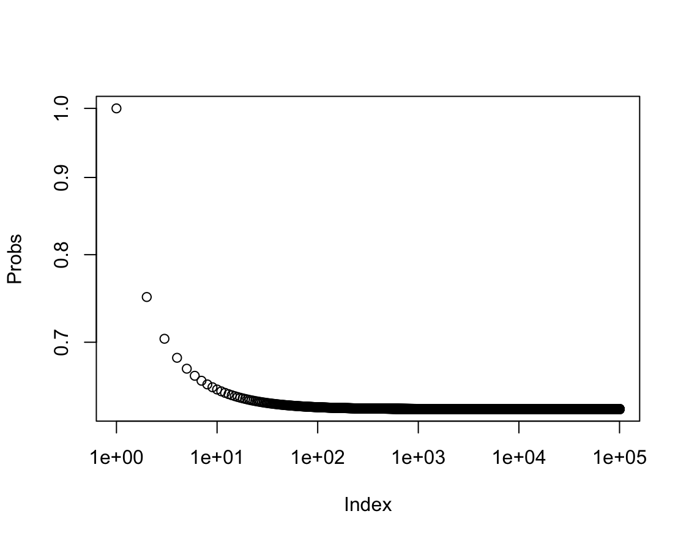
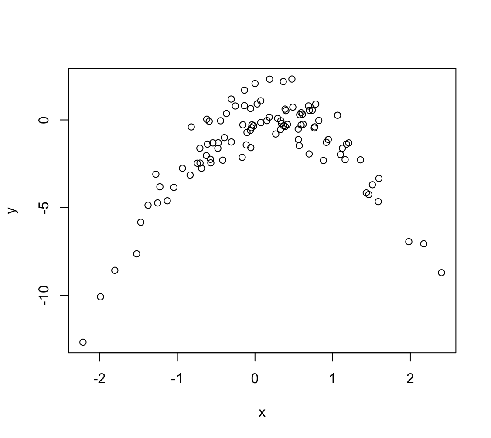

# Resampling Methods

1. Using basic statistical properties of the variance, as well as single variable calculus, derive (5.6). In other words, prove that α given by (5.6) does indeed minimize $Var(\alpha X + (1 − \alpha)Y)$.

    $$f(X) = Var(\alpha X + (1 − \alpha)Y) = $$
    
    $$= \alpha^2 Var(X) + (1-\alpha)^2 Var(Y) + 2\alpha(1-\alpha)Cov(X,Y) =$$

    $$= \alpha^2 \sigma_X^2 + (1-\alpha)^2 \sigma_Y^2 + 2\alpha(1-\alpha)\sigma_{XY}$$

    Obliczam pochodną po $\alpha$:

    $$f'(X)= 2 \alpha \sigma_X^2 - 2(1-\alpha) \sigma_Y^2 + 2(1-2\alpha)\sigma_{XY} =$$

    $$= 2 \alpha \sigma_X^2 - 2\sigma_Y^2 + 2\alpha\sigma_Y^2 + 2\sigma_{XY} - 4\alpha\sigma_{XY}$$

    Przyrównuję do zera:

    $$2 \alpha \sigma_X^2 + 2\alpha\sigma_Y^2 - 4\alpha\sigma_{XY} = 2\sigma_Y^2 - 2\sigma_{XY} /:2$$

    $$\alpha \sigma_X^2 + \alpha\sigma_Y^2 - 2\alpha\sigma_{XY} = \sigma_Y^2 - \sigma_{XY}$$

    $$\alpha (\sigma_X^2 + \sigma_Y^2 - 2\sigma_{XY}) = \sigma_Y^2 - \sigma_{XY}$$

    $$\alpha = \frac{\sigma_Y^2 - \sigma_{XY}}{\sigma_X^2 + \sigma_Y^2 - 2\sigma_{XY}}$$

2. We will now derive the probability that a given observation is part of a bootstrap sample. Suppose that we obtain a bootstrap sample from a set of $n$ observations.

    > Bootstrap to losowanie ze zwracaniem i będę korzystał z tej informacji w kolejnych podpunktach.
    
    (a) What is the probability that the first bootstrap observation is _not_ the $j$th observation from the original sample? Justify your answer.

    > $A$ - zdarzenie polegające na nie wylosowaniu $j$-tej obserwacji w pierwszym losowaniu.
    >
    > Prawdopodobieństwo wylosowania $j$-tej obserwacji w pierwszym losowaniu wynosi $1/n$ czyli korzystając ze zdarzenia przeciwnego: 
    >
    > $P(A) = 1-\frac{1}{n}$

    (b) What is the probability that the second bootstrap observation is _not_ the $j$th observation from the original sample?

    > $B$ - zdarzenie polegające na nie wylosowaniu $j$-tej obserwacji w drugim losowaniu.
    >
    > Prawdopodobieństwo wylosowania $j$-tej obserwacji w drugim losowaniu wynosi $1/n$ czyli korzystając ze zdarzenia przeciwnego: 
    >
    > $P(B) = 1-\frac{1}{n}$

    (c) Argue that the probability that the $j$th observation is _not_ in the bootstrap sample is $(1− 1/n)^n$.

    > $C$ - zdarzenie polegające na nie wylosowaniu $j$-tej w ogóle.
    >
    > Tutaj mamy prawdopodobieństwo, że $j$-ta obserwacja nie zostanie wylosowana w pierwszym losowaniu ani w drugim ani w trzecim itd.:
    >
    > $P(C) = (1-1/n)\cdot(1-1/n)\cdot...\cdot(1-1/n) = (1− 1/n)^n$

    (d) When $n = 5$, what is the probability that the $j$th observation is in the bootstrap sample?

    ```R
    prob <- function(n) {
      return(1-(1-1/n)^n)
    }

    prob(5)
    ```

    ```R
    [1] 0.67232
    ```

    (e) When $n = 100$, what is the probability that the $j$th observation is in the bootstrap sample?

    ```R
    prob(100)
    ```

    ```R
    [1] 0.6339677
    ```
    
    (f) When $n = 10000$, what is the probability that the $j$th observation is in the bootstrap sample?

    ```R
    prob(10000)
    ```

    ```R
    [1] 0.632139
    ```
    
    (g) Create a plot that displays, for each integer value of $n$ from $1$ to $100000$, the probability that the $j$th observation is in the bootstrap sample. Comment on what you observe.

    ```R
    plot(1:100000, prob(1:100000), xlab = "Index", ylab = "Probs", log = "xy")
    ```

    

    > Prawdopodobieństwo dąży do wartości 0.63.
    >
    > $\lim\limits_{n \to \infty} 1 - (1-\frac{1}{n})^n = 1-e^{-1} \approx 0.63$

    (h) We will now investigate numerically the probability that a bootstrap sample of size $n = 100$ contains the $j$th observation. Here $j = 4$. We repeatedly create bootstrap samples, and each time we record whether or not the fourth observation is contained in the bootstrap sample.

    ```R
    > store <- rep(NA , 10000)
    > for(i in 1:10000) {
        store[i] <- sum(sample (1:100 , rep=TRUE) == 4) > 0
    }
    > mean(store)
    ```

    Comment on the results obtained.

    ```R
    [1] 0.6339
    ```

    > Zgodnie z oczekiwaniem prawdopodobieństwo jest bliskie 0.63.

3. We now review $k$-fold cross-validation.
    
    (a) Explain how $k$-fold cross-validation is implemented.

    > W walidacji $k$-fold zbiór danych treningowych jest losowo dzielony na $k$ grup o jednakowym rozmiarze. Pierwsza grupa jest traktowana jako zbiór testowy, model jest dopasowywany do pozostałych $k-1$ grup, są to zbiory treningowe. MSE jest obliczane używając zbioru testowego. Procedura jest powtarzana $k$ razy, za każdym podejściem zbiór testowy i zbiory treningowe są inne. Ostatecznie obliczany jest średni MSE i jest to wynik końcowy procedury.

    (b) What are the advantages and disadvantages of $k$-fold cross-validation relative to:
    
    i. The validation set approach?

    > W tym przypadku trenujemy model na małej porcji danych, ponieważ musimy podzielić dane na zbiór treningowy i testowy. Może to powodować zawyżenie test error rate. Metoda jest też czuła na to które dane znajdą się w zbiorze treningowym i testowym. Zaletą jest niski koszt obliczeniowy dzięki czemu zyskujemy na szybkości.
    
    ii. LOOCV?

    > W tym przypadku trenujemy model na $n-1$ obserwacjach, kolejne modele są jednak trenowane na bardzo podobnych zbiorach bo za każdym razem usuwamy tylko jedną obserwację. W rezultacie LOOCV może mieć wysoką wariancję, kolejną wadą jest też wysoki koszt obliczeniowy.

4. Suppose that we use some statistical learning method to make a prediction for the response $Y$ for a particular value of the predictor $X$. Carefully describe how we might estimate the standard deviation of our prediction.

    Możemy w tym celu użyć metody bootstrap. Procedura polegna na wielokrotnym próbkowaniu zbioru danych i trenowaniu modelu. Na podstawie dopasowanych modeli możemy za każdym razem obliczyć odchylenie standardowe. Końcowym rezultatem będzie uśrednione odchylenie standardowe.

5. In Chapter 4, we used logistic regression to predict the probability of `default` using `income` and `balance` on the `Default` data set. We will now estimate the test error of this logistic regression model using the validation set approach. Do not forget to set a random seed before beginning your analysis.
    
    (a) Fit a logistic regression model that uses `income` and `balance` to predict `default`.

    ```R
    library(ISLR2)
    attach(Default)

    fit.log <- glm(default ~ income + balance, data = Default,
                   family = binomial)
    fit.log.pred <- predict(fit.log, Default, type = "response") > 0.5
    t <- table(fit.log.pred, Default$default)
    sum(diag(t)) / sum(t)
    ```

    ```R
    [1] 0.9737
    ```
    
    (b) Using the validation set approach, estimate the test error of this model. In order to do this, you must perform the following steps:
    
    i. Split the sample set into a training set and a validation set.
    
    ii. Fit a multiple logistic regression model using only the training observations.
    
    iii. Obtain a prediction of default status for each individual in the validation set by computing the posterior probability of default for that individual, and classifying the individual to the `default` category if the posterior probability is greater than 0.5.
    
    iv. Compute the validation set error, which is the fraction of the observations in the validation set that are misclassified.

    ```R
    set.seed(1)
    train <- sample(nrow(Default), nrow(Default) / 2)

    fit.log <- glm(default ~ income + balance, data = Default[train, ],
                   family = binomial)
    fit.log.pred <- predict(fit.log, Default[-train, ], type = "response") > 0.5
    t <- table(fit.log.pred, Default[-train, ]$default)
    sum(diag(t)) / sum(t)
    ```

    ```R
    [1] 0.9746
    ```
    
    (c) Repeat the process in (b) three times, using three different splits of the observations into a training set and a validation set. Comment on the results obtained.

    ```R
    set.seed(12)
    train <- sample(nrow(Default), nrow(Default) / 2)

    fit.log <- glm(default ~ income + balance, data = Default[train, ],
                   family = binomial)
    fit.log.pred <- predict(fit.log, Default[-train, ], type = "response") > 0.5
    t <- table(fit.log.pred, Default[-train, ]$default)
    sum(diag(t)) / sum(t)
    ```

    ```R
    [1] 0.973
    ```

    ```R
    set.seed(123)
    train <- sample(nrow(Default), nrow(Default) / 2)

    fit.log <- glm(default ~ income + balance, data = Default[train, ],
                   family = binomial)
    fit.log.pred <- predict(fit.log, Default[-train, ], type = "response") > 0.5
    t <- table(fit.log.pred, Default[-train, ]$default)
    sum(diag(t)) / sum(t)
    ```

    ```R
    [1] 0.9724
    ```

    ```R
    set.seed(1234)
    train <- sample(nrow(Default), nrow(Default) / 2)

    fit.log <- glm(default ~ income + balance, data = Default[train, ],
                   family = binomial)
    fit.log.pred <- predict(fit.log, Default[-train, ], type = "response") > 0.5
    t <- table(fit.log.pred, Default[-train, ]$default)
    sum(diag(t)) / sum(t)
    ```

    ```R
    [1] 0.9748
    ```

    > Wynik za każdym razem się zmienia bo zależy od wyboru zbioru treningowego i testowego.
    
    (d) Now consider a logistic regression model that predicts the probability of `default` using `income`, `balance`, and a dummy variable for `student`. Estimate the test error for this model using the validation set approach. Comment on whether or not including a dummy variable for `student` leads to a reduction in the test error rate.

    ```R
    set.seed(1)
    train <- sample(nrow(Default), nrow(Default) / 2)

    fit.log <- glm(default ~ income + balance + student, data = Default[train, ],
                   family = binomial)
    fit.log.pred <- predict(fit.log, Default[-train, ], type = "response") > 0.5
    t <- table(fit.log.pred, Default[-train, ]$default)
    sum(diag(t)) / sum(t)
    ```

    ```R
    [1] 0.974
    ```

    > Można powtórzyć dopasowanie kilka razy dla różnych ziaren ale wprowadzenie dodatkowej zmiennej do modelu nie powoduje widocznej poprawy.

6. We continue to consider the use of a logistic regression model to predict the probability of `default` using `income` and `balance` on the `Default` data set. In particular, we will now compute estimates for the standard errors of the `income` and `balance` logistic regression coefficients in two different ways: (1) using the bootstrap, and (2) using the standard formula for computing the standard errors in the `glm()` function. Do not forget to set a random seed before beginning your analysis.

    (a) Using the `summary()` and `glm()` functions, determine the estimated standard errors for the coefficients associated with `income` and `balance` in a multiple logistic regression model that uses both predictors.

    ```R
    fit.log <- glm(default ~ income + balance, data = Default, family = "binomial")
    summary(fit.log)
    ```

    ```R
    Call:
    glm(formula = default ~ income + balance, family = "binomial", 
        data = Default)

    Coefficients:
                  Estimate Std. Error z value Pr(>|z|)    
    (Intercept) -1.154e+01  4.348e-01 -26.545  < 2e-16 ***
    income       2.081e-05  4.985e-06   4.174 2.99e-05 ***
    balance      5.647e-03  2.274e-04  24.836  < 2e-16 ***
    ---
    Signif. codes:  0 ‘***’ 0.001 ‘**’ 0.01 ‘*’ 0.05 ‘.’ 0.1 ‘ ’ 1

    (Dispersion parameter for binomial family taken to be 1)

        Null deviance: 2920.6  on 9999  degrees of freedom
    Residual deviance: 1579.0  on 9997  degrees of freedom
    AIC: 1585

    Number of Fisher Scoring iterations: 8
    ```
    
    (b) Write a function, `boot.fn()`, that takes as input the `Default` data set as well as an index of the observations, and that outputs the coefficient estimates for `income` and `balance` in the multiple logistic regression model.

    ```R
    boot.fn <- function(data, index)
      coef(
        glm(default ~ income + balance, data = data[index, ], family = "binomial")
      )
    ```

    (c) Use the `boot()` function together with your `boot.fn()` function to estimate the standard errors of the logistic regression coefficients for `income` and `balance`.

    ```R
    library(boot)
    set.seed(1)
    boot(Default, boot.fn, 1000)
    ```

    ```R
    ORDINARY NONPARAMETRIC BOOTSTRAP


    Call:
    boot(data = Default, statistic = boot.fn, R = 1000)


    Bootstrap Statistics :
            original        bias     std. error
    t1* -1.154047e+01 -3.945460e-02 4.344722e-01
    t2*  2.080898e-05  1.680317e-07 4.866284e-06
    t3*  5.647103e-03  1.855765e-05 2.298949e-04
    ```
    
    (d) Comment on the estimated standard errors obtained using the `glm()` function and using your bootstrap function.

    >  Odchylenia standardowe w obu metodach są podobne $4.985\cdot10^{6}$ - $4.866284\cdot10^{6}$ dla `income`. $2.274\cdot10^{4}$ - $2.298949\cdot10^{4}$ dla `balance`. Dla jednej zmiennej bootstrap daje mniejszy błąd a dla drugiej większy więc w tym przypadku lepiej użyć tradycyjnej metody.

7. In Sections 5.3.2 and 5.3.3, we saw that the `cv.glm()` function can be used in order to compute the LOOCV test error estimate. Alternatively, one could compute those quantities using just the `glm()` and `predict.glm()` functions, and a for loop. You will now take this approach in order to compute the LOOCV error for a simple logistic regression model on the `Weekly` data set. Recall that in the context of classification problems, the LOOCV error is given in (5.4).

    (a) Fit a logistic regression model that predicts `Direction` using `Lag1` and `Lag2`.

    ```R
    library(ISLR2)
    fit.log <- glm(Direction ~ Lag1 + Lag2, data = Weekly, family = "binomial")
    fit.log.pred <- predict(fit.log, Weekly, type = "response") > 0.5
    t <- table(fit.log.pred, Weekly$Direction)
    sum(diag(t)) / sum(t)
    ```

    ```R
    [1] 0.5555556
    ```
    
    (b) Fit a logistic regression model that predicts `Direction` using `Lag1` and `Lag2` _using all but the first observation._

    ```R
    fit.log <- glm(Direction ~ Lag1 + Lag2, data = Weekly[-1, ], family = "binomial")
    fit.log.pred <- predict(fit.log, Weekly[-1, ], type = "response") > 0.5
    t <- table(fit.log.pred, Weekly[-1, ]$Direction)
    sum(diag(t)) / sum(t)
    ```

    ```R
    [1] 0.5569853
    ```
    
    (c) Use the model from (b) to predict the `direction` of the first observation. You can do this by predicting that the first observation will go up if $P($`Direction = "Up"`$\mid$`Lag1`, `Lag2`$) > 0.5$. Was this observation correctly classified?

    ```R
    pred <- predict(fit.log, Weekly[1,], type="response")
    if(pred > 0.5) "Up" else "Down"
    ```

    ```R
    [1] "Up"
    ```

    ```R
    Weekly$Direction[1]
    ```

    ```R
    [1] Down
    ```

    > Obserwacja nie została zakwalifikowana poprawnie.

    (d) Write a for loop from $i = 1$ to $i = n$, where $n$ is the number of observations in the data set, that performs each of the following steps:
    
    i. Fit a logistic regression model using all but the $i$th observation to predict `Direction` using `Lag1` and `Lag2`.
    
    ii. Compute the posterior probability of the market moving up for the $i$th observation.
    
    iii. Use the posterior probability for the $i$th observation in order to predict whether or not the market moves up.
    
    iv. Determine whether or not an error was made in predicting the `direction` for the $i$th observation. If an error was made, then indicate this as a $1$, and otherwise indicate it as a $0$.

    ```R
    err <- numeric(nrow(Weekly))
    for (i in 1:nrow(Weekly)) {
      fit.log <- glm(Direction ~ Lag1 + Lag2, data = Weekly[-i, ], family = "binomial")
      p <- predict(fit.log, Weekly[i, ], type="response") > 0.5
      err[i] <- ifelse(p, "Down", "Up") == Weekly$Direction[i]
    }
    ```
    
    (e) Take the average of the $n$ numbers obtained in (d)iv in order to obtain the LOOCV estimate for the test error. Comment on the results.

    ```R
    mean(err)
    ```
    
    ```R
    [1] 0.4499541
    ```

    > Model klasyfikuje obserwacje poprawnie w 55% przypadków, nieznacznie lepiej od zgadywania.

8. We will now perform cross-validation on a simulated data set.
    
    (a) Generate a simulated data set as follows:

    ```R
    > set.seed(1)
    > x <- rnorm(100)
    > y <- x - 2 * x^2 + rnorm(100)
    ```

    In this data set, what is $n$ and what is $p$? Write out the model used to generate the data in equation form.

    > $n = 100$ - liczebność próbki
    >
    > $p = 2$ - liczba zmiennych objaśniających
    >
    > $Y = -2X^2+ X + \epsilon$
    
    (b) Create a scatterplot of $X$ against $Y$. Comment on what you find.
    
    

    > Zależność nie jest liniowa, jest kwadratowa.

    (c) Set a random seed, and then compute the LOOCV errors that result from fitting the following four models using least squares:

    i. $Y = \beta_0 + \beta_1X + \epsilon$
    
    ii. $Y = \beta_0 + \beta_1X + \beta_2X^2 + \epsilon$
    
    iii. $Y = \beta_0 + \beta_1X + \beta_2X^2 + \beta_3X^3 + \epsilon$
    
    iv. $Y = \beta_0 + \beta_1X + \beta_2X^2 + \beta_3X^3 + \beta_4X^4 + \epsilon$
    
    Note you may find it helpful to use the `data.frame()` function to create a single data set containing both $X$ and $Y$.

    ```R
    library(boot)
    cv.error <- rep(0, 4)
    data = data.frame(x, y)
    for (i in 1:4) {
      glm.fit <- glm(y ~ poly(x, i), data = data)
      cv.error[i] <- cv.glm(data, glm.fit)$delta[1]
    }
    cv.error
    ```

    ```R
    [1] 7.2881616 0.9374236 0.9566218 0.9539049
    ```
    
    (d) Repeat (c) using another random seed, and report your results. Are your results the same as what you got in (c)? Why?

    ```R
    set.seed(123)
    x <- rnorm(100)
    y <- x - 2 * x^2 + rnorm(100)

    cv.error <- rep(0, 4)
    data_2 = data.frame(x, y)
    for (i in 1:4) {
      glm.fit <- glm(y ~ poly(x, i), data = data_2)
      cv.error[i] <- cv.glm(data_2, glm.fit)$delta[1]
    }
    cv.error
    ```

    ```R
    [1] 6.9752118 0.9664678 1.0000174 0.9993215
    ```

    > Wyniki nieznacznie się różnią co jest spowodowane wylosowaniem innego błędu $\epsilon$.
    
    (e) Which of the models in (c) had the smallest LOOCV error? Is this what you expected? Explain your answer.

    > Najmniejszy błąd jest dla modelu drugiego, jest to spodziewane ponieważ zależność w danych jest kwadratowa.
    
    (f) Comment on the statistical significance of the coefficient estimates that results from fitting each of the models in (c) using least squares. Do these results agree with the conclusions drawn based on the cross-validation results?

    ```R
    for (i in 1:4) printCoefmat(coef(summary(glm(y ~ poly(x, i), data = data))))
    ```

    ```R
                Estimate Std. Error t value  Pr(>|t|)    
    (Intercept) -1.68329    0.25484 -6.6053 2.066e-09 ***
    poly(x, i)   4.32330    2.54839  1.6965   0.09297 .  
    ---
    Signif. codes:  0 ‘***’ 0.001 ‘**’ 0.01 ‘*’ 0.05 ‘.’ 0.1 ‘ ’ 1
                  Estimate Std. Error t value  Pr(>|t|)    
    (Intercept)  -1.683288   0.097044 -17.346 < 2.2e-16 ***
    poly(x, i)1   4.323302   0.970442   4.455 2.249e-05 ***
    poly(x, i)2 -23.347133   0.970442 -24.058 < 2.2e-16 ***
    ---
    Signif. codes:  0 ‘***’ 0.001 ‘**’ 0.01 ‘*’ 0.05 ‘.’ 0.1 ‘ ’ 1
                  Estimate Std. Error  t value  Pr(>|t|)    
    (Intercept)  -1.683288   0.097501 -17.2643 < 2.2e-16 ***
    poly(x, i)1   4.323302   0.975012   4.4341  2.46e-05 ***
    poly(x, i)2 -23.347133   0.975012 -23.9455 < 2.2e-16 ***
    poly(x, i)3   0.297132   0.975012   0.3047    0.7612    
    ---
    Signif. codes:  0 ‘***’ 0.001 ‘**’ 0.01 ‘*’ 0.05 ‘.’ 0.1 ‘ ’ 1
                  Estimate Std. Error  t value  Pr(>|t|)    
    (Intercept)  -1.683288   0.097424 -17.2780 < 2.2e-16 ***
    poly(x, i)1   4.323302   0.974239   4.4376 2.449e-05 ***
    poly(x, i)2 -23.347133   0.974239 -23.9645 < 2.2e-16 ***
    poly(x, i)3   0.297132   0.974239   0.3050    0.7610    
    poly(x, i)4   1.045830   0.974239   1.0735    0.2858    
    ---
    Signif. codes:  0 ‘***’ 0.001 ‘**’ 0.01 ‘*’ 0.05 ‘.’ 0.1 ‘ ’ 1
    ```

    > Na podstawie $p$-value widać, że istotne statystycznie są współczynniki $\beta_0$, $\beta_1$ i $\beta_2$

9. We will now consider the `Boston` housing data set, from the `ISLR2` library.
    
    (a) Based on this data set, provide an estimate for the population mean of `medv`. Call this estimate $\hat{\mu}$.

    ```R
    mean(medv)
    ```

    ```R
    [1] 22.53281
    ```
    
    (b) Provide an estimate of the standard error of $\hat{\mu}$. Interpret this result.

    _Hint: We can compute the standard error of the sample mean by dividing the sample standard deviation by the square root of the number of observations._

    ```R
    sd(medv) / sqrt(length(medv))
    ```

    ```R
    [1] 0.4088611
    ```
    
    (c) Now estimate the standard error of $\hat{\mu}$ using the bootstrap. How does this compare to your answer from (b)?

    ```R
    library(boot)
    boot.fn = function(data, index) {
      x <- data$medv[index]
      mean(x)
    }
    set.seed(1)
    bs <- boot(Boston, boot.fn, 10000)
    bs 
    ```

    ```R
    ORDINARY NONPARAMETRIC BOOTSTRAP


    Call:
    boot(data = Boston, statistic = boot.fn, R = 10000)


    Bootstrap Statistics :
        original       bias    std. error
    t1* 22.53281 -0.002350771   0.4069546
    ```

    > Błąd oszacowania średniej metodą bootstrap jest bardzo bliski do błedu obliczonego na podstawie danych.

    (d) Based on your bootstrap estimate from (c), provide a 95% confidence interval for the mean of `medv`. Compare it to the results obtained using `t.test(Boston$medv)`.
    
    _Hint: You can approximate a 95% confidence interval using the formula $[\hat{\mu}− 2\text{SE}(\hat{\mu}),\hat{\mu} + 2\text{SE}(\hat{\mu})]$._

    ```R
    mu <- bs$t0
    se <- sd(bs$t)
    c(mu - 2 * se, mu + 2 * se)
    ```

    ```R
    [1] 21.72232 23.34329
    ```

    ```R
    t.test(medv)
    ```

    ```R
            One Sample t-test

    data:  medv
    t = 55.111, df = 505, p-value < 2.2e-16
    alternative hypothesis: true mean is not equal to 0
    95 percent confidence interval:
     21.72953 23.33608
    sample estimates:
    mean of x 
     22.53281
    ```

    > Przedział z bootstrap jest bliski przedziałowi obliczonemu na podstawie próbki.
    
    (e) Based on this data set, provide an estimate, $\hat{\mu}_{med}$, for the median value of `medv` in the population.

    ```R
    median(medv)
    ```

    ```R
    [1] 21.2
    ```
    
    (f) We now would like to estimate the standard error of $\hat{\mu}_{med}$. Unfortunately, there is no simple formula for computing the standard error of the median. Instead, estimate the standard error of the median using the bootstrap. Comment on your findings.

    ```R
    boot.fn = function(data, index) {
      x <- data$medv[index]
      median(x)
    }
    set.seed(1)
    bs <- boot(Boston, boot.fn, 10000)
    bs
    ```

    ```R
        ORDINARY NONPARAMETRIC BOOTSTRAP


    Call:
    boot(data = Boston, statistic = boot.fn, R = 10000)


    Bootstrap Statistics :
        original    bias    std. error
    t1*     21.2 -0.014705   0.3780355
    ```

    > Błąd jest niski w stosunku do estymowanej wartości.

    (g) Based on this data set, provide an estimate for the tenth percentile of `medv` in Boston census tracts. Call this quantity $\hat{\mu}_{0.1}$. (You can use the `quantile()` function.)

    ```R
    quantile(medv, 0.1)
    ```

    ```R
      10% 
    12.75 
    ```
    
    (h) Use the bootstrap to estimate the standard error of $\hat{\mu}_{0.1}$. Comment on your findings.

    ```R
    boot.fn = function(data, index){
      x <- data$medv[index]
      quantile(x, 0.1)
    }
    set.seed(1)
    bs <- boot(Boston, boot.fn, 10000)
    bs
    ```

    ```R
    ORDINARY NONPARAMETRIC BOOTSTRAP


    Call:
    boot(data = Boston, statistic = boot.fn, R = 10000)


    Bootstrap Statistics :
        original   bias    std. error
    t1*    12.75 0.007625   0.5014507
    ```

    > Błąd jest niski w stosunku do estymowanej wartości.
