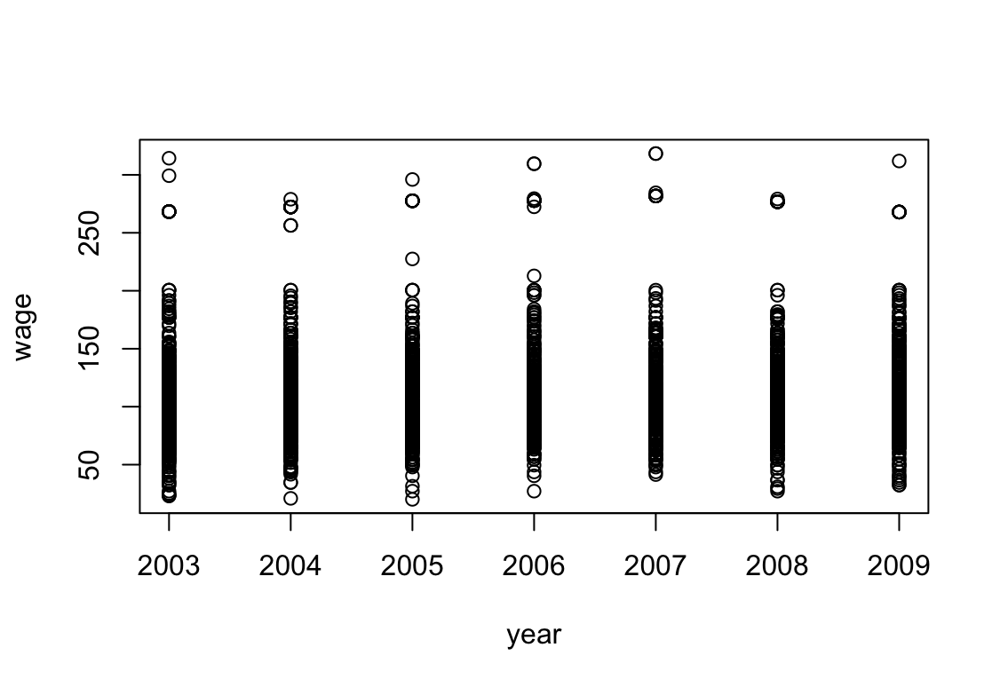
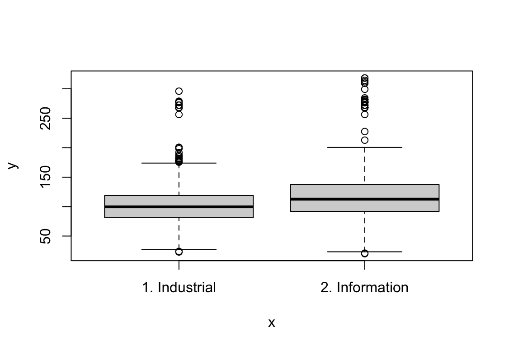
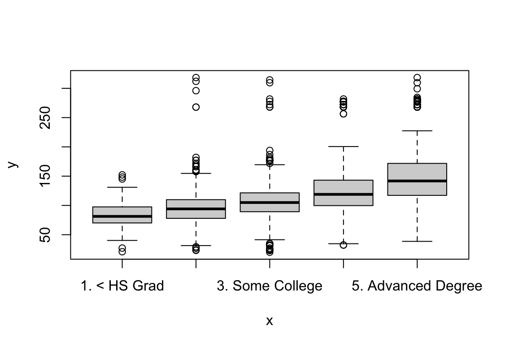

# Moving Beyond Linearity

1. It was mentioned in the chapter that a cubic regression spline with one knot at $\xi$ can be obtained using a basis of the form $x$, $x^2$, $x^3$, $(x − \xi)^3_+ = (x - \xi)^3$ if $x > \xi$ and equals 0 otherwise. We will now show that a function of the form 

    $$f(x) = \beta_0 + \beta_1x + \beta_2x^2 + \beta_3x^3 + \beta_4(x − \xi)^3_+$$

    is indeed a cubic regression spline, regardless of the values of $\beta_0$, $\beta_1$, $\beta_2$, $\beta_3$, $\beta_4$.

    _Hint: Parts (d) and (e) of this problem require knowledge of single-variable calculus. As a reminder, given a cubic polynomial_
    
    $$f_1(x) = a_1 + b_1x + c_1x^2 + d_1x^3$$

    _the first derivative takes the form_

    $$f'_1(x) = b_1 + 2c_1x + 3d_1x^2$$

    _and the second derivative takes the form_

    $$f''_1(x) = 2c_1 + 6d_1x.$$

    (a) Find a cubic polynomial 
    
    $$f_1(x) = a_1 + b_1x + c_1x^2 + d_1x^3$$
    
    such that $f(x) = f_1(x)$ for all $x \le \xi$. Express $a_1$, $b_1$, $c_1$, $d_1$ in terms of $\beta_0$, $\beta_1$, $\beta_2$, $\beta_3$, $\beta_4$.

    > Dla $x \le \xi$, wyraz $(x − \xi)^3_+$ jest równy $0$, stąd: 
    >
    > $$f(x) = \beta_0 + \beta_1x + \beta_2x^2 + \beta_3x^3$$
    > 
    > $$a_1 + b_1x + c_1x^2 + d_1x^3 = \beta_0 + \beta_1x + \beta_2x^2 + \beta_3x^3$$
    >
    > $$a_1 = \beta_0$$
    >
    > $$b_1 = \beta_1$$
    >
    > $$c_1 = \beta_2$$
    >
    > $$d_1 = \beta_3$$

    (b) Find a cubic polynomial 
    
    $$f_2(x) = a_2 + b_2x + c_2x^2 + d_2x^3$$

    such that $f(x) = f_2(x)$ for all $x > \xi$. Express $a_2$, $b_2$, $c_2$, $d_2$ in terms of $\beta_0$, $\beta_1$, $\beta_2$, $\beta_3$, $\beta_4$. We have now established that $f(x)$ is a piecewise polynomial.

    > Dla $x > \xi$, wyraz $(x − \xi)^3_+$ jest zdefiniowany jako $(x - \xi)^3$, stąd:
    >
    > $$f(x) = \beta_0 + \beta_1x + \beta_2x^2 + \beta_3x^3 + \beta_4(x - \xi)^3$$
    >
    > $$f(x) = \beta_0 + \beta_1x + \beta_2x^2 + \beta_3x^3 + \beta_4(x^3 - 3\xi x^2 + 3\xi^2 x - \xi^3)$$
    >
    > $$f(x) = \beta_0 + \beta_1x + \beta_2x^2 + \beta_3x^3 + \beta_4x^3 - 3\beta_4\xi x^2 + 3\beta_4\xi^2 x - \beta_4\xi^3$$
    >
    > $$f(x) = (\beta_0 - \beta_4\xi^3) + (\beta_1 + 3\beta_4\xi^2)x + (\beta_2 - 3\beta_4\xi)x^2 + (\beta_3 + \beta_4)x^3$$
    >
    > Porównując to z postacią $f_2(x) = a_2 + b_2x + c_2x^2 + d_2x^3$, dostajemy:
    >
    > $$a_2 = \beta_0 - \beta_4\xi^3$$
    >
    > $$b_2 = \beta_1 + 3\beta_4\xi^2$$
    >
    > $$c_2 = \beta_2 - 3\beta_4\xi$$
    >
    > $$d_2 = \beta_3 + \beta_4$$

    (c) Show that $f_1(\xi) = f_2(\xi)$. That is, $f(x)$ is continuous at $\xi$.

    > $$f_1(\xi) = \beta_0 + \beta_1\xi + \beta_2\xi^2 + \beta_3\xi^3$$
    > 
    > $$f_2(\xi) = (\beta_0 - \beta_4\xi^3) + (\beta_1 + 3\beta_4\xi^2)\xi + (\beta_2 - 3\beta_4\xi)\xi^2 + (\beta_3 + \beta_4)\xi^3$$
    >
    > $$f_2(\xi) = \beta_0 - \beta_4\xi^3 + \beta_1\xi + 3\beta_4\xi^3 + \beta_2\xi^2 - 3\beta_4\xi^3 + \beta_3\xi^3 + \beta_4\xi^3$$
    >
    > $$f_2(\xi) = \beta_0 + \beta_1\xi + \beta_2\xi^2 + \beta_3\xi^3 = f_1(\xi)$$

    (d) Show that $f'_1(\xi) = f'_2(\xi)$. That is, $f'(x)$ is continuous at $\xi$.

    > $$f'_1(x) = \beta_1 + 2\beta_2x + 3\beta_3x^2$$
    > 
    > $$f'_2(x) = b_2 + 2c_2x + 3d_2x^2$$
    >
    > $$f'_2(\xi) = (\beta_1 + 3\beta_4\xi^2) + 2(\beta_2 - 3\beta_4\xi)\xi + 3(\beta_3 + \beta_4)\xi^2$$
    > 
    > $$f'_2(\xi) = \beta_1 + 3\beta_4\xi^2 + 2\beta_2\xi - 6\beta_4\xi^2 + 3\beta_3\xi^2 + 3\beta_4\xi^2$$
    > 
    > $$f'_2(\xi) = \beta_1 + 2\beta_2\xi + 3\beta_3\xi^2 = f'_1(\xi)$$

    (e) Show that $f_1''(\xi) = f_2''(\xi)$. That is, $f\'\'(x)$ is continuous at $\xi$.

    > $$f''_1(x) = 2\beta_2 + 6\beta_3x$$
    > 
    > $$f''_2(x) = 2c_2 + 6d_2x$$
    > 
    > $$f''_2(\xi) = 2(\beta_2 - 3\beta_4\xi) + 6(\beta_3 + \beta_4)\xi$$
    > 
    > $$f''_2(\xi) = 2\beta_2 - 6\beta_4\xi + 6\beta_3\xi + 6\beta_4\xi$$
    > 
    > $$f''_2(\xi) = 2\beta_2 + 6\beta_3\xi = f''_1(\xi)$$

    Therefore, $f(x)$ is indeed a cubic spline.

3. Suppose that a curve $\hat{g}$ is computed to smoothly fit a set of $n$ points using the following formula:

    $$ \hat{g} = \arg\underset{g}{\min} \left( \sum_{i=1}^{n} (y_i - g(x_i))^2 + \lambda \int \left[g^{(m)}(x)\right]^2 dx \right), $$

    where $g^{(m)}$ represents the $m$th derivative of $g$ (and $g^{(0)} = g$). Provide example sketches of $\hat{g}$ in each of the following scenarios.

    > Celem jest znalezienie funkcji $g$, która minimalizuje:
    >
    > $$ \sum_{i=1}^{n} (y_i - g(x_i))^2 + \lambda \int [g^{(0)}(x)]^2 dx $$

    (a) $\lambda = \infty, m = 0$.

    > Ponieważ $\lambda = \infty$ musimy zająć się drugim członem w powyższym wyrażeniu.
    >
    > $m=0$, więc $g^{(0)}(x) = g(x)$. 
    >
    > Aby zminimalizować całe wyrażenie, całka z funkcji $[g(x)]^2$ musi być równa zero. Dla $g(x) = 0$ powyższy warunek jest spełniony stąd, $\hat{g} = 0$.

    (b) $\lambda = \infty, m = 1$.

    > Ponieważ $\lambda = \infty$ musimy zająć się drugim członem w powyższym wyrażeniu.
    >
    > Aby zminimalizować całe wyrażenie, całka z funkcji $[g^{(1)}(x)]^2$ musi być równa zero. Dla $g^{(1)}(x) = 0$ powyższy warunek jest spełniony, czyli funkcja $g$ musi mieć zerowe nachylenie stąd, $\hat{g}$ może być dowolną linią poziomą.

    (c) $\lambda = \infty, m = 2$.

    > Ponieważ $\lambda = \infty$ musimy zająć się drugim członem w powyższym wyrażeniu.
    >
    > Aby zminimalizować całe wyrażenie, całka z funkcji $[g^{(2)}(x)]^2$ musi być równa zero. Dla $g^{(2)}(x) = 0$ powyższy warunek jest spełniony, czyli funkcja $g^{(1)}(x)$ musi mieć zerowe nachylenie czyli może to być linia pozioma. Funkcja $g$ musi mieć więc jednostajne nachylenie stąd, $\hat{g}$ może być linią nachyloną pod dowolnym kątem.

    (d) $\lambda = \infty, m = 3$.

    > Ponieważ $\lambda = \infty$ musimy zająć się drugim członem w powyższym wyrażeniu.
    >
    > Aby zminimalizować całe wyrażenie, całka z funkcji $[g^{(3)}(x)]^2$ musi być równa zero. Dla $g^{(3)}(x) = 0$ powyższy warunek jest spełniony, czyli funkcja $g^{(2)}(x)$ musi mieć zerowe nachylenie czyli może to być linia pozioma. Funkcja $g^{(1)}(x)$ musi mieć więc jednostajne nachylenie, może być linią nachyloną pod dowolnym kątem. Funkcja $g$ musi mieć więc zmienne nachylenie stąd, $\hat{g}$ może być funkcją kwadratową.

    (e) $\lambda = 0, m = 3$.

    > Ponieważ $\lambda = 0$ to drugi człon znika.
    >
    > W tym przypadku trzeba zminimalizować pierwszy człon, w tym celu można użyć funkcji wielomianowej, stąd $\hat{g}$ jest funkcją wielomianową stopnia co najwyżej $n-1$, która będzie przechodzić przez wszystkie punkty.

3. Suppose we fit a curve with basis functions $b_1(X) = X$, $b_2(X) = (X-1)^2I(X \ge 1)$. (Note that $I(X \ge 1)$ equals 1 for $X \ge 1$ and 0 otherwise.) We fit the linear regression model

    $$ Y = \beta_0 + \beta_1 b_1(X) + \beta_2 b_2(X) + \epsilon, $$

    and obtain coefficient estimates $\hat{\beta}_0 = 1$, $\hat{\beta}_1 = 1$, $\hat{\beta}_2 = -2$. Sketch the estimated curve between $X = -2$ and $X = 2$. Note the intercepts, slopes, and other relevant information.

    ```R
    x <- seq(-2, 2, length.out = 1000)
    f <- function(x) 1 + x + -2 * (x - 1)^2 * I(x >= 1)
    plot(x, f(x), type = "l")
    grid()
    ```

    

4. Suppose we fit a curve with basis functions $b_1(X) = I(0 \le X \le 2) - (X-1)I(1 \le X \le 2)$, $b_2(X) = (X-3)I(3 \le X \le 4) + I(4 < X \le 5)$. We fit the linear regression model
    $$ Y = \beta_0 + \beta_1 b_1(X) + \beta_2 b_2(X) + \epsilon, $$

    and obtain coefficient estimates $\hat{\beta}_0 = 1$, $\hat{\beta}_1 = 1$, $\hat{\beta}_2 = 3$. Sketch the estimated curve between $X = -2$ and $X = 6$. Note the intercepts, slopes, and other relevant information.

    ```R
    x <- seq(-2, 6, length.out = 1000)
    b1 <- function(x) I(0 <= x & x <= 2) - (x - 1) * I(1 <= x & x <= 2)
    b2 <- function(x) (x - 3) * I(3 <= x & x <= 4) + I(4 < x & x <= 5)
    f <- function(x) 1 + 1 * b1(x) + 3 * b2(x)
    plot(x, f(x), type = "l")
    grid()
    ```

    

5. Consider two curves, $\hat{g}_1$ and $\hat{g}_2$, defined by

    $$ \hat{g}_1 = \arg\underset{g}{\min} \left( \sum_{i=1}^{n} (y_i - g(x_i))^2 + \lambda \int \left[g^{(3)}(x)\right]^2 dx \right), $$

    $$ \hat{g}_2 = \arg\underset{g}{\min} \left( \sum_{i=1}^{n} (y_i - g(x_i))^2 + \lambda \int \left[g^{(4)}(x)\right]^2 dx \right), $$
    
    where $g^{(m)}$ represents the $m$th derivative of $g$.

    (a) As $\lambda \to \infty$, will $\hat{g}_1$ or $\hat{g}_2$ have the smaller training RSS?

    > $\hat{g}_2$ jest bardziej elastyczne dlatego, że korzysta z pochodnej wyższego rzędu, dlatego będzie miało mniejsze RSS na zbiorze treningowym.

    (b) As $\lambda \to \infty$, will $\hat{g}_1$ or $\hat{g}_2$ have the smaller test RSS?

    > Nie można tego stwierdzić bez zbioru testowego.

    (c) For $\lambda = 0$, will $\hat{g}_1$ or $\hat{g}_2$ have the smaller training and test RSS?

    > RSS będzie taki sam dla obu funkcji, bo drugi człon wynosi 0.

6. In this exercise, you will further analyze the `Wage` data set considered throughout this chapter.

    (a) Perform polynomial regression to predict `wage` using `age`. Use cross-validation to select the optimal degree d for the polynomial. What degree was chosen, and how does this compare to the results of hypothesis testing using ANOVA? Make a plot of the resulting polynomial fit to the data.

    ```R
    library(ISLR2)
    library(boot)
    attach(Wage)

    cv.error <- rep(0, 10)
    for (i in 1:10) {
    glm.fit <- glm(wage ~ poly(age, i), data = Wage)
    cv.error[i] <- cv.glm(Wage, glm.fit, K = 10)$delta[1]
    }
    cv.error
    ```

    ```R
    [1] 1676.826 1600.763 1598.399 1595.651 1594.977 1596.061 1594.298
    [8] 1598.134 1593.913 1595.950
    ```

    ```R
    plot(cv.error, type="b", xlab="Degree", ylab="CV Error")
    ```

    

    > Nie widać poprawy modelu powyżej wielomianu 4 stopnia.

    ```R
    glm.fit = glm(wage ~ poly(age, 5), data = Wage)
    summary(glm.fit)
    ```

    ```R
    Call:
    glm(formula = wage ~ poly(age, 5), data = Wage)

    Coefficients:
                   Estimate Std. Error t value Pr(>|t|)    
    (Intercept)    111.7036     0.7288 153.278  < 2e-16 ***
    poly(age, 5)1  447.0679    39.9161  11.200  < 2e-16 ***
    poly(age, 5)2 -478.3158    39.9161 -11.983  < 2e-16 ***
    poly(age, 5)3  125.5217    39.9161   3.145  0.00168 ** 
    poly(age, 5)4  -77.9112    39.9161  -1.952  0.05105 .  
    poly(age, 5)5  -35.8129    39.9161  -0.897  0.36968    
    ---
    Signif. codes:  0 ‘***’ 0.001 ‘**’ 0.01 ‘*’ 0.05 ‘.’ 0.1 ‘ ’ 1

    (Dispersion parameter for gaussian family taken to be 1593.294)

        Null deviance: 5222086  on 2999  degrees of freedom
    Residual deviance: 4770322  on 2994  degrees of freedom
    AIC: 30642

    Number of Fisher Scoring iterations: 2
    ```

    > Na podstawie $p$-value 5 stopień wielomianu nie jest istotny statystycznie.

    ```R
    fit1 <- lm(wage ~ poly(age, 1), data = Wage)
    fit2 <- lm(wage ~ poly(age, 2), data = Wage)
    fit3 <- lm(wage ~ poly(age, 3), data = Wage)
    fit4 <- lm(wage ~ poly(age, 4), data = Wage)
    fit5 <- lm(wage ~ poly(age, 5), data = Wage)
    anova(fit1, fit2, fit3, fit4, fit5)
    ```

    ```R
    Analysis of Variance Table

    Model 1: wage ~ poly(age, 1)
    Model 2: wage ~ poly(age, 2)
    Model 3: wage ~ poly(age, 3)
    Model 4: wage ~ poly(age, 4)
    Model 5: wage ~ poly(age, 5)
      Res.Df     RSS Df Sum of Sq        F    Pr(>F)    
    1   2998 5022216                                    
    2   2997 4793430  1    228786 143.5931 < 2.2e-16 ***
    3   2996 4777674  1     15756   9.8888  0.001679 ** 
    4   2995 4771604  1      6070   3.8098  0.051046 .  
    5   2994 4770322  1      1283   0.8050  0.369682    
    ---
    Signif. codes:  0 ‘***’ 0.001 ‘**’ 0.01 ‘*’ 0.05 ‘.’ 0.1 ‘ ’ 1
    ```

    > Na podstawie $p$-value można stwierdzić, że model z wielomianem 5 stopnia nie jest istotny statystycznie. Ostatecznie trzeba wybrać model z wielomianem 4 stopnia.

    ```R
    agelims <- range(age)
    age.grid <- seq(from = agelims[1], to = agelims[2])
    preds <- predict(fit4, newdata = list(age = age.grid ), se = TRUE )
    se.bands <- cbind(preds$fit + 2 * preds$se.fit,
                      preds$fit - 2 * preds$se.fit)

    plot(age, wage, xlim = agelims, cex = .5, col = "darkgrey")
    title("Degree -4 Polynomial")
    lines(age.grid, preds$fit, lwd = 2, col = "blue")
    matlines(age.grid, se.bands, lwd = 1, col = "blue", lty = 3)
    ```

    

    (b) Fit a step function to predict `wage` using `age`, and perform cross-validation to choose the optimal number of cuts. Make a plot of the fit obtained.

    ```R
    Wage_2 <- Wage
    attach(Wage_2)

    set.seed(1)
    cv.error = rep(0,9)
    for (i in 2:10) {
      Wage_2$age.cut = cut(age, i)
      step.fit = glm(wage ~ age.cut, data = Wage_2)
      cv.error[i-1] = cv.glm(Wage_2, step.fit, K=10)$delta[1]
    }
    cv.error
    ```

    ```R
    [1] 1734.489 1684.271 1635.552 1632.080 1623.415 1614.996 1601.318
    [8] 1613.954 1606.331
    ```

    ```R
    plot(2:10, cv.error, type="b", xlab="Index", ylab="CV Error")
    ```

    

    > Najmniejszy błąd dla 8 podziałów.

    ```R
    attach(Wage)
    step.fit <- glm(wage ~ cut(age, 8), data = Wage)

    preds <- predict(step.fit, newdata = list(age = age.grid), se = TRUE)
    se.bands <- cbind(preds$fit + 2 * preds$se.fit,
                      preds$fit - 2 * preds$se.fit)

    plot(age, wage, xlim = agelims, cex = .5, col = "darkgrey")
    title("Step function using 8 cuts")
    lines(age.grid, preds$fit, lwd = 2, col = "blue")
    matlines(age.grid, se.bands, lwd = 1, col = "blue", lty = 3)
    ```

    

7. The `Wage` data set contains a number of other features not explored in this chapter, such as marital status (`maritl`), job class (`jobclass`), and others. Explore the relationships between some of these other predictors and `wage`, and use non-linear fitting techniques in order to fit flexible models to the data. Create plots of the results obtained, and write a summary of your findings.

    ```R
    library(ISLR2)
    attach(Wage)

    plot(year, wage)
    ```

    

    ```
    plot(age, wage)
    ```

    

    ```
    plot(maritl, wage)
    ```

    

    ```R
    plot(jobclass, wage)
    ```

    

    ```R
    plot(education, wage)
    ```

    

    > Jak widać zbiór danych `Wage` zawiera zmienne ilościowe i jakościowe. Ponadto zmienne ilościowe nie są liniowe, więc dobrym wyborem do modelowania są modele GAM.

    ```R
    library(gam)
    fit0 <- gam(wage ~ s(year, 4) + s(age, 5) + education, data = Wage)
    fit2 <- gam(wage ~ s(year, 4) + s(age, 5) + education + maritl, data = Wage)
    fit1 <- gam(wage ~ s(year, 4) + s(age, 5) + education + jobclass,
                data = Wage)
    fit3 <- gam(wage ~ s(year, 4) + s(age, 5) + education + jobclass + maritl, 
                data = Wage)
    anova(fit0, fit1, fit2, fit3)
    ```

    ```R
    Analysis of Deviance Table

    Model 1: wage ~ s(year, 4) + s(age, 5) + education
    Model 2: wage ~ s(year, 4) + s(age, 5) + education + jobclass
    Model 3: wage ~ s(year, 4) + s(age, 5) + education + maritl
    Model 4: wage ~ s(year, 4) + s(age, 5) + education + jobclass + maritl
      Resid. Df Resid. Dev Df Deviance  Pr(>Chi)    
    1      2986    3689770                          
    2      2985    3677553  1    12218 0.0014286 ** 
    3      2982    3595688  3    81865 1.071e-14 ***
    4      2981    3581781  1    13907 0.0006687 ***
    ---
    Signif. codes:  0 ‘***’ 0.001 ‘**’ 0.01 ‘*’ 0.05 ‘.’ 0.1 ‘ ’ 1
    ```

    > Model z największą liczbą zmiennych nadal jest istotny statystycznie.

    ```R
    par(mfrow = c(2, 3))
    plot(fit3, se = TRUE, col = "blue")
    ```

    

    > Wynik pokazuje, że pensja rośnie wraz z każdym kolejnym rokiem kiedy weźmiemy ustalone wartości pozostałych zmiennych. W przypadku wieku pensja jest najwyższa dla ludzi w wieku ok. 42 lat. Wyższa edukacja pozwala na uzyskanie wyższych zarobków. Praca w usługach jest lepiej płatna. Zarobki osób po ślubie są wyższe, dla wdowców i osób w separacji widzimy szeroki zakres błędu standardowego.

8. Fit some of the non-linear models investigated in this chapter to the `Auto` data set. Is there evidence for non-linear relationships in this data set? Create some informative plots to justify your answer.

    ```R
    library(ISLR2)
    attach(Auto)

    pairs(Auto[1:7])
    ```

    

    > Widać nieliniową zależność między zmiennymi `mpg`, `displacement`/`horsepower`/`weight`. Dopasuję model wielomianowy do zmiennych `mpg` i `horsepower`.

    ```R
    fit.1 = lm(mpg ~ poly(horsepower, 1), data = Auto)
    fit.2 = lm(mpg ~ poly(horsepower, 2), data = Auto)
    fit.3 = lm(mpg ~ poly(horsepower, 3), data = Auto)
    fit.4 = lm(mpg ~ poly(horsepower, 4), data = Auto)
    fit.5 = lm(mpg ~ poly(horsepower, 5), data = Auto)
    fit.6 = lm(mpg ~ poly(horsepower, 6), data = Auto)

    anova(fit.1, fit.2, fit.3, fit.4, fit.5, fit.6)
    ```

    ```R
    Analysis of Variance Table

    Model 1: mpg ~ poly(horsepower, 1)
    Model 2: mpg ~ poly(horsepower, 2)
    Model 3: mpg ~ poly(horsepower, 3)
    Model 4: mpg ~ poly(horsepower, 4)
    Model 5: mpg ~ poly(horsepower, 5)
    Model 6: mpg ~ poly(horsepower, 6)
      Res.Df    RSS Df Sum of Sq        F    Pr(>F)    
    1    390 9385.9                                    
    2    389 7442.0  1   1943.89 104.6659 < 2.2e-16 ***
    3    388 7426.4  1     15.59   0.8396  0.360083    
    4    387 7399.5  1     26.91   1.4491  0.229410    
    5    386 7223.4  1    176.15   9.4846  0.002221 ** 
    6    385 7150.3  1     73.04   3.9326  0.048068 *  
    ---
    Signif. codes:  0 ‘***’ 0.001 ‘**’ 0.01 ‘*’ 0.05 ‘.’ 0.1 ‘ ’ 1
    ```

    > Z ANOVY wynika, że odpowiedni będzie model kwadratowy.

    ```R
    summary(fit.2)
    ```

    ```R
    Call:
    lm(formula = mpg ~ poly(horsepower, 2), data = Auto)

    Residuals:
        Min       1Q   Median       3Q      Max 
    -14.7135  -2.5943  -0.0859   2.2868  15.8961 

    Coefficients:
                          Estimate Std. Error t value Pr(>|t|)    
    (Intercept)            23.4459     0.2209  106.13   <2e-16 ***
    poly(horsepower, 2)1 -120.1377     4.3739  -27.47   <2e-16 ***
    poly(horsepower, 2)2   44.0895     4.3739   10.08   <2e-16 ***
    ---
    Signif. codes:  0 ‘***’ 0.001 ‘**’ 0.01 ‘*’ 0.05 ‘.’ 0.1 ‘ ’ 1

    Residual standard error: 4.374 on 389 degrees of freedom
    Multiple R-squared:  0.6876,	Adjusted R-squared:  0.686 
    F-statistic:   428 on 2 and 389 DF,  p-value: < 2.2e-16
    ```

9. This question uses the variables `dis` (the weighted mean of distances to five Boston employment centers) and `nox` (nitrogen oxides concentration in parts per 10 million) from the `Boston` data. We will treat `dis` as the predictor and `nox` as the response.

    (a) Use the `poly()` function to fit a cubic polynomial regression to predict `nox` using `dis`. Report the regression output, and plot the resulting data and polynomial fits.

    ```R
    library(ISLR2)
    attach(Boston)

    fit <- glm(nox ~ poly(dis, 3), data = Boston)
    summary(fit)
    ```

    ```R
    Call:
    glm(formula = nox ~ poly(dis, 3), data = Boston)

    Coefficients:
                   Estimate Std. Error t value Pr(>|t|)    
    (Intercept)    0.554695   0.002759 201.021  < 2e-16 ***
    poly(dis, 3)1 -2.003096   0.062071 -32.271  < 2e-16 ***
    poly(dis, 3)2  0.856330   0.062071  13.796  < 2e-16 ***
    poly(dis, 3)3 -0.318049   0.062071  -5.124 4.27e-07 ***
    ---
    Signif. codes:  0 ‘***’ 0.001 ‘**’ 0.01 ‘*’ 0.05 ‘.’ 0.1 ‘ ’ 1

    (Dispersion parameter for gaussian family taken to be 0.003852802)

        Null deviance: 6.7810  on 505  degrees of freedom
    Residual deviance: 1.9341  on 502  degrees of freedom
    AIC: -1370.9

    Number of Fisher Scoring iterations: 2
    ```

    ```R
    lims <- range(dis)
    grid <- seq(from = lims[1], to = lims[2], 0.1)
    preds <- predict(fit, newdata = list(dis = grid), se = TRUE)
    se.bands <- cbind(preds$fit + 2 * preds$se.fit,
                      preds$fit - 2 * preds$se.fit)

    plot(dis, nox, xlim = lims, cex = .5, col = "darkgrey")
    title("Degree -3 Polynomial")
    lines(grid, preds$fit, lwd = 2, col = "blue")
    matlines(grid, se.bands, lwd = 1, col = "blue", lty = 3)
    ```

    
    
    (b) Plot the polynomial fits for a range of different polynomial degrees (say, from 1 to 10), and report the associated residual sum of squares.

    ```R
    plot(dis, nox, xlim = lims, cex = .5, col = "darkgrey")
    title("Polynomial fits from degree 1-10.")
    colours = rainbow(10)
    rss = rep(0,10)

    set.seed(1)
    for (i in 1:10){
      fit <- glm(nox ~ poly(dis, i), data = Boston)
      preds <- predict(fit, newdata = list(dis = grid), se = TRUE)
      lines(grid, preds$fit, lwd = 1.5, col = colours[i])
      rss[i] = sum((nox - predict(fit, newdata = list(dis = dis)))^2)
    }

    legend(x=10, y=0.85,legend=1:10, col= colours[1:10],lwd=2)

    rss
    ```

    ```R
    [1] 2.768563 2.035262 1.934107 1.932981 1.915290 1.878257 1.849484 1.835630
    [9] 1.833331 1.832171
    ```

    
    
    (c) Perform cross-validation or another approach to select the optimal degree for the polynomial, and explain your results.

    ```R
    library(boot)

    set.seed(1)
    cv.error <- rep(0, 10)
    for (i in 1:10) {
      fit <- glm(nox ~ poly(dis, i), data = Boston)
      cv.error[i] <- cv.glm(Boston, fit, K = 10)$delta[1]
    }

    which.min(cv.error)
    ```

    ```R
    [1] 4
    ```
    
    (d) Use the `bs()` function to fit a regression spline to predict `nox` using `dis`. Report the output for the fit using four degrees of freedom. How did you choose the knots? Plot the resulting fit.

    ```R
    library(splines)
    fit <- glm(nox ~ bs(dis, df = 4), data = Boston)
    summary(fit)
    ```

    ```R
    Call:
    glm(formula = nox ~ bs(dis, df = 4), data = Boston)

    Coefficients:
                     Estimate Std. Error t value Pr(>|t|)    
    (Intercept)       0.73447    0.01460  50.306  < 2e-16 ***
    bs(dis, df = 4)1 -0.05810    0.02186  -2.658  0.00812 ** 
    bs(dis, df = 4)2 -0.46356    0.02366 -19.596  < 2e-16 ***
    bs(dis, df = 4)3 -0.19979    0.04311  -4.634 4.58e-06 ***
    bs(dis, df = 4)4 -0.38881    0.04551  -8.544  < 2e-16 ***
    ---
    Signif. codes:  0 ‘***’ 0.001 ‘**’ 0.01 ‘*’ 0.05 ‘.’ 0.1 ‘ ’ 1

    (Dispersion parameter for gaussian family taken to be 0.003837874)

        Null deviance: 6.7810  on 505  degrees of freedom
    Residual deviance: 1.9228  on 501  degrees of freedom
    AIC: -1371.9

    Number of Fisher Scoring iterations: 2
    ```

    > Wszystkie stopnie swobody są istotne statystycznie na podstawie $p$-value.

    ```R
    attr(bs(Boston$dis, df = 4), "knots")
    ```
    
    ```R
    [1] 3.20745
    ```

    > Węzły wybierane są automatycznie na podstawie kwantyli.

    ```R
    preds <- predict(fit, newdata = list(dis = grid), se = TRUE)
    se.bands <- cbind(preds$fit + 2 * preds$se.fit,
                      preds$fit - 2 * preds$se.fit)

    plot(dis, nox, xlim = lims, cex = .5, col = "darkgrey")
    title("Regression spline")
    lines(grid, preds$fit, lwd = 2, col = "blue")
    matlines(grid, se.bands, lwd = 1, col = "blue", lty = 3)
    ```

    
    
    (e) Now fit a regression spline for a range of degrees of freedom, and plot the resulting fits and report the resulting RSS. Describe the results obtained.

    ```R
    plot(dis, nox, xlim = lims, cex = .5, col = "darkgrey")
    title("Splines fits from degree 1-10.")
    colours = rainbow(10)
    rss = rep(0,10)

    set.seed(1)
    for (i in 1:10){
      fit <- glm(nox ~ bs(dis, df = i), data = Boston)
      preds <- predict(fit, newdata = list(dis = grid), se = TRUE)
      lines(grid, preds$fit, lwd = 1.5, col = colours[i])
      rss[i] <- sum((nox - predict(fit, newdata = list(dis = dis)))^2)
    }

    legend(x = 10, y = 0.85, legend = 1:10, col = colours[1:10], lwd = 2)

    rss
    ```

    ```R
    [1] 1.934107 1.934107 1.934107 1.922775 1.840173 1.833966 1.829884 1.816995
    [9] 1.825653 1.792535
    ```

    

    > RSS są niższe niż w przypadku modeli wielomianowych. Widać, że modele z większą liczbą stopni swobody są przetrenowane.
    
    (f) Perform cross-validation or another approach in order to select the best degrees of freedom for a regression spline on this data. Describe your results.

    ```R
    set.seed(1)
    cv.error <- rep(0, 10)
    for (i in 1:10) {
      fit <- glm(nox ~ bs(dis, df = i), data = Boston)
      cv.error[i] <- cv.glm(Boston, fit, K = 10)$delta[1]
    }

    which.min(cv.error)
    ```

    ```R
    [1] 10
    ```

10. This question relates to the `College` data set.
    
    (a) Split the data into a training set and a test set. Using out-of-state tuition as the response and the other variables as the predictors, perform forward stepwise selection on the training set in order to identify a satisfactory model that uses just a subset of the predictors.

    ```R
    library(ISLR2)
    library(leaps)
    attach(College)

    train <- sample(nrow(College), nrow(College) * 4 / 5)

    fit.fwd <- regsubsets(Outstate~., data = College[train, ], nvmax=17,
                          method="forward")

    plot(summary(fit.fwd)$bic, type = "b")

    which.min(summary(fit.fwd)$bic)
    ```

    ```R
    [1] 12
    ```

    

    > Najlepszy jest model zawierający 12 zmiennych ale powyżejsz 6 nie ma już znaczącej poprawy. Dla ułatwienia wybieram model z 6 zmiennymi.

    ```R
    coef(fit.fwd, id = 6)
    ```

    ```R
      (Intercept)    PrivateYes    Room.Board           PhD   perc.alumni 
    -3423.9571808  2793.7915223     0.9366486    35.4629229    45.2581015 
       Expend     Grad.Rate 
    0.2148418    32.1605523 
    ```

    (b) Fit a GAM on the training data, using out-of-state tuition as the response and the features selected in the previous step as the predictors. Plot the results, and explain your findings.

    ```R
    library(gam)
    fit <- gam(Outstate ~ Private + s(Room.Board, 4) + s(PhD, 4) + 
               s(perc.alumni, 2) + s(Expend, 4) + s(Grad.Rate, 5),
               data=College[train, ])

    par(mfrow = c(2, 3))
    plot(fit, col = "blue", se = TRUE)
    ```

    
    
    (c) Evaluate the model obtained on the test set, and explain the results obtained.

    ```R
    preds = predict(fit, newdata = College[-train, ])
    # r suared
    1 - mean((College[-train, ]$Outstate - preds)^2) / 
      mean((College[-train, ]$Outstate - mean(College[-train, ]$Outstate))^2)
    ```

    ```R
    [1] 0.8057576
    ```

    > Na podstawie $R^2$ model jest dobry.
    
    (d) For which variables, if any, is there evidence of a non-linear relationship with the response?

    ```R
    summary(fit)
    ```

    ```R
    Call: gam(formula = Outstate ~ Private + s(Room.Board, 4) + s(PhD, 
        4) + s(perc.alumni, 2) + s(Expend, 4) + s(Grad.Rate, 5), 
        data = College[train, ])
    Deviance Residuals:
         Min       1Q   Median       3Q      Max 
    -7319.03 -1141.45    21.32  1274.46  7642.76 

    (Dispersion Parameter for gaussian family taken to be 3484410)

        Null Deviance: 9851839741 on 620 degrees of freedom
    Residual Deviance: 2090645450 on 599.9998 degrees of freedom
    AIC: 11139.58 

    Number of Local Scoring Iterations: NA 

    Anova for Parametric Effects
                       Df     Sum Sq    Mean Sq F value    Pr(>F)    
    Private             1 2490518062 2490518062 714.760 < 2.2e-16 ***
    s(Room.Board, 4)    1 1838285948 1838285948 527.574 < 2.2e-16 ***
    s(PhD, 4)           1  591148840  591148840 169.655 < 2.2e-16 ***
    s(perc.alumni, 2)   1  386891415  386891415 111.035 < 2.2e-16 ***
    s(Expend, 4)        1  855784793  855784793 245.604 < 2.2e-16 ***
    s(Grad.Rate, 5)     1  135641164  135641164  38.928  8.31e-10 ***
    Residuals         600 2090645450    3484410                      
    ---
    Signif. codes:  0 ‘***’ 0.001 ‘**’ 0.01 ‘*’ 0.05 ‘.’ 0.1 ‘ ’ 1

    Anova for Nonparametric Effects
                      Npar Df Npar F   Pr(F)    
    (Intercept)                                 
    Private                                     
    s(Room.Board, 4)        3  2.824 0.03806 *  
    s(PhD, 4)               3  1.900 0.12837    
    s(perc.alumni, 2)       1  0.831 0.36223    
    s(Expend, 4)            3 39.302 < 2e-16 ***
    s(Grad.Rate, 5)         4  2.130 0.07568 .  
    ---
    Signif. codes:  0 ‘***’ 0.001 ‘**’ 0.01 ‘*’ 0.05 ‘.’ 0.1 ‘ ’ 1
    ```

    > Nieliniowość jest istotna statystycznie dla zmiennych `Room.Board` i `Expend`.