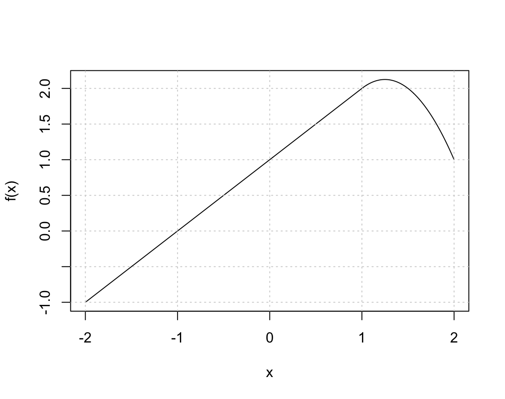

# Moving Beyond Linearity

1. It was mentioned in the chapter that a cubic regression spline with one knot at $\xi$ can be obtained using a basis of the form $x$, $x^2$, $x^3$, $(x − \xi)^3_+$, where $(x− \xi)^3_+ = (x - \xi)^3$ if $x > \xi$ and equals 0 otherwise.
We will now show that a function of the form 

    $$f(x) = \beta_0 + \beta_1x + \beta_2x^2 + \beta_3x^3 + \beta_4(x − \xi)^3_+$$

    is indeed a cubic regression spline, regardless of the values of $\beta_0$, $\beta_1$, $\beta_2$, $\beta_3$, $\beta_4$.

    _Hint: Parts (d) and (e) of this problem require knowledge of single-variable calculus. As a reminder, given a cubic polynomial_
    
    $$f_1(x) = a_1 + b_1x + c_1x^2 + d_1x^3$$

    _the first derivative takes the form_

    $$f'_1(x) = b_1 + 2c_1x + 3d_1x^2$$

    _and the second derivative takes the form_

    $$f''_1(x) = 2c_1 + 6d_1x.$$

    (a) Find a cubic polynomial 
    
    $$f_1(x) = a_1 + b_1x + c_1x^2 + d_1x^3$$
    
    such that $f(x) = f_1(x)$ for all $x \le \xi$. Express $a_1$, $b_1$, $c_1$, $d_1$ in terms of $\beta_0$, $\beta_1$, $\beta_2$, $\beta_3$, $\beta_4$.

    > Dla $x \le \xi$, wyraz $(x − \xi)^3_+$ jest równy $0$, stąd: 
    >
    > $$f(x) = \beta_0 + \beta_1x + \beta_2x^2 + \beta_3x^3$$
    > 
    > $$a_1 + b_1x + c_1x^2 + d_1x^3 = \beta_0 + \beta_1x + \beta_2x^2 + \beta_3x^3$$
    >
    > $$a_1 = \beta_0$$
    >
    > $$b_1 = \beta_1$$
    >
    > $$c_1 = \beta_2$$
    >
    > $$d_1 = \beta_3$$

    (b) Find a cubic polynomial 
    
    $$f_2(x) = a_2 + b_2x + c_2x^2 + d_2x^3$$

    such that $f(x) = f_2(x)$ for all $x > \xi$. Express $a_2$, $b_2$, $c_2$, $d_2$ in terms of $\beta_0$, $\beta_1$, $\beta_2$, $\beta_3$, $\beta_4$. We have now established that $f(x)$ is a piecewise polynomial.

    > Dla $x > \xi$, wyraz $(x − \xi)^3_+$ jest zdefiniowany jako $(x - \xi)^3$, stąd:
    >
    > $$f(x) = \beta_0 + \beta_1x + \beta_2x^2 + \beta_3x^3 + \beta_4(x - \xi)^3$$
    >
    > $$f(x) = \beta_0 + \beta_1x + \beta_2x^2 + \beta_3x^3 + \beta_4(x^3 - 3\xi x^2 + 3\xi^2 x - \xi^3)$$
    >
    > $$f(x) = \beta_0 + \beta_1x + \beta_2x^2 + \beta_3x^3 + \beta_4x^3 - 3\beta_4\xi x^2 + 3\beta_4\xi^2 x - \beta_4\xi^3$$
    > $$f(x) = (\beta_0 - \beta_4\xi^3) + (\beta_1 + 3\beta_4\xi^2)x + (\beta_2 - 3\beta_4\xi)x^2 + (\beta_3 + \beta_4)x^3$$
    >
    > Porównując to z postacią $f_2(x) = a_2 + b_2x + c_2x^2 + d_2x^3$, dostajemy:
    >
    > $$a_2 = \beta_0 - \beta_4\xi^3$$
    >
    > $$b_2 = \beta_1 + 3\beta_4\xi^2$$
    >
    > $$c_2 = \beta_2 - 3\beta_4\xi$$
    >
    > $$d_2 = \beta_3 + \beta_4$$

    (c) Show that $f_1(\xi) = f_2(\xi)$. That is, $f(x)$ is continuous at $\xi$.

    > $$f_1(\xi) = \beta_0 + \beta_1\xi + \beta_2\xi^2 + \beta_3\xi^3$$
    > 
    > $$f_2(\xi) = (\beta_0 - \beta_4\xi^3) + (\beta_1 + 3\beta_4\xi^2)\xi + (\beta_2 - 3\beta_4\xi)\xi^2 + (\beta_3 + \beta_4)\xi^3$$
    >
    > $$f_2(\xi) = \beta_0 - \beta_4\xi^3 + \beta_1\xi + 3\beta_4\xi^3 + \beta_2\xi^2 - 3\beta_4\xi^3 + \beta_3\xi^3 + \beta_4\xi^3$$
    >
    > $$f_2(\xi) = \beta_0 + \beta_1\xi + \beta_2\xi^2 + \beta_3\xi^3 = f_1(\xi)$$

    (d) Show that $f'_1(\xi) = f'_2(\xi)$. That is, $f'(x)$ is continuous at $\xi$.

    > $$f'_1(x) = \beta_1 + 2\beta_2x + 3\beta_3x^2$$
    > 
    > $$f'_2(x) = b_2 + 2c_2x + 3d_2x^2$$
    >
    > $$f'_2(\xi) = (\beta_1 + 3\beta_4\xi^2) + 2(\beta_2 - 3\beta_4\xi)\xi + 3(\beta_3 + \beta_4)\xi^2$$
    > 
    > $$f'_2(\xi) = \beta_1 + 3\beta_4\xi^2 + 2\beta_2\xi - 6\beta_4\xi^2 + 3\beta_3\xi^2 + 3\beta_4\xi^2$$
    > 
    > $$f'_2(\xi) = \beta_1 + 2\beta_2\xi + 3\beta_3\xi^2 = f'_1(\xi)$$

    (e) Show that $f''_1(\xi) = f''_2(\xi)$. That is, $f''(x)$ is continuous at $\xi$.

    > $$f''_1(x) = 2\beta_2 + 6\beta_3x$$
    > 
    > $$f''_2(x) = 2c_2 + 6d_2x$$
    > 
    > $$f''_2(\xi) = 2(\beta_2 - 3\beta_4\xi) + 6(\beta_3 + \beta_4)\xi$$
    > 
    > $$f''_2(\xi) = 2\beta_2 - 6\beta_4\xi + 6\beta_3\xi + 6\beta_4\xi$$
    > 
    > $$f''_2(\xi) = 2\beta_2 + 6\beta_3\xi = f''_1(\xi)$$

    Therefore, $f(x)$ is indeed a cubic spline.

3. Suppose that a curve $\hat{g}$ is computed to smoothly fit a set of $n$ points using the following formula:

    $$ \hat{g} = \arg\underset{g}{\min} \left( \sum_{i=1}^{n} (y_i - g(x_i))^2 + \lambda \int \left[g^{(m)}(x)\right]^2 dx \right), $$

    where $g^{(m)}$ represents the $m$th derivative of $g$ (and $g^{(0)} = g$). Provide example sketches of $\hat{g}$ in each of the following scenarios.

    > Celem jest znalezienie funkcji $g$, która minimalizuje:
    >
    > $$ \sum_{i=1}^{n} (y_i - g(x_i))^2 + \lambda \int [g^{(0)}(x)]^2 dx $$

    (a) $\lambda = \infty, m = 0$.

    > Ponieważ $\lambda = \infty$ musimy zająć się drugim członem w powyższym wyrażeniu.
    >
    > $m=0$, więc $g^{(0)}(x) = g(x)$. 
    >
    > Aby zminimalizować całe wyrażenie, całka z funkcji $[g(x)]^2$ musi być równa zero. Dla $g(x) = 0$ powyższy warunek jest spełniony stąd, $\hat{g} = 0$.

    (b) $\lambda = \infty, m = 1$.

    > Ponieważ $\lambda = \infty$ musimy zająć się drugim członem w powyższym wyrażeniu.
    >
    > Aby zminimalizować całe wyrażenie, całka z funkcji $[g^{(1)}(x)]^2$ musi być równa zero. Dla $g^{(1)}(x) = 0$ powyższy warunek jest spełniony, czyli funkcja $g$ musi mieć zerowe nachylenie stąd, $\hat{g}$ może być dowolną linią poziomą.

    (c) $\lambda = \infty, m = 2$.

    > Ponieważ $\lambda = \infty$ musimy zająć się drugim członem w powyższym wyrażeniu.
    >
    > Aby zminimalizować całe wyrażenie, całka z funkcji $[g^{(2)}(x)]^2$ musi być równa zero. Dla $g^{(2)}(x) = 0$ powyższy warunek jest spełniony, czyli funkcja $g^{(1)}(x)$ musi mieć zerowe nachylenie czyli może to być linia pozioma. Funkcja $g$ musi mieć więc jednostajne nachylenie stąd, $\hat{g}$ może być linią nachyloną pod dowolnym kątem.

    (d) $\lambda = \infty, m = 3$.

    > Ponieważ $\lambda = \infty$ musimy zająć się drugim członem w powyższym wyrażeniu.
    >
    > Aby zminimalizować całe wyrażenie, całka z funkcji $[g^{(3)}(x)]^2$ musi być równa zero. Dla $g^{(3)}(x) = 0$ powyższy warunek jest spełniony, czyli funkcja $g^{(2)}(x)$ musi mieć zerowe nachylenie czyli może to być linia pozioma. Funkcja $g^{(1)}(x)$ musi mieć więc jednostajne nachylenie, może być linią nachyloną pod dowolnym kątem. Funkcja $g$ musi mieć więc zmienne nachylenie stąd, $\hat{g}$ może być funkcją kwadratową.

    (e) $\lambda = 0, m = 3$.

    > Ponieważ $\lambda = 0$ to drugi człon znika.
    >
    > W tym przypadku trzeba zminimalizować pierwszy człon, w tym celu można użyć funkcji wielomianowej, stąd $\hat{g}$ jest funkcją wielomianową stopnia co najwyżej $n-1$, która będzie przechodzić przez wszystkie punkty.

3. Suppose we fit a curve with basis functions $b_1(X) = X$, $b_2(X) = (X-1)^2I(X \ge 1)$. (Note that $I(X \ge 1)$ equals 1 for $X \ge 1$ and 0 otherwise.) We fit the linear regression model

    $$ Y = \beta_0 + \beta_1 b_1(X) + \beta_2 b_2(X) + \epsilon, $$

    and obtain coefficient estimates $\hat{\beta}_0 = 1$, $\hat{\beta}_1 = 1$, $\hat{\beta}_2 = -2$. Sketch the estimated curve between $X = -2$ and $X = 2$. Note the intercepts, slopes, and other relevant information.

    ```R
    x <- seq(-2, 2, length.out = 1000)
    f <- function(x) 1 + x + -2 * (x - 1)^2 * I(x >= 1)
    plot(x, f(x), type = "l")
    grid()
    ```

    

4. Suppose we fit a curve with basis functions $b_1(X) = I(0 \le X \le 2) - (X-1)I(1 \le X \le 2)$, $b_2(X) = (X-3)I(3 \le X \le 4) + I(4 < X \le 5)$. We fit the linear regression model
    $$ Y = \beta_0 + \beta_1 b_1(X) + \beta_2 b_2(X) + \epsilon, $$

    and obtain coefficient estimates $\hat{\beta}_0 = 1$, $\hat{\beta}_1 = 1$, $\hat{\beta}_2 = 3$. Sketch the estimated curve between $X = -2$ and $X = 6$. Note the intercepts, slopes, and other relevant information.

    ```R
    x <- seq(-2, 6, length.out = 1000)
    b1 <- function(x) I(0 <= x & x <= 2) - (x - 1) * I(1 <= x & x <= 2)
    b2 <- function(x) (x - 3) * I(3 <= x & x <= 4) + I(4 < x & x <= 5)
    f <- function(x) 1 + 1 * b1(x) + 3 * b2(x)
    plot(x, f(x), type = "l")
    grid()
    ```

    

5. Consider two curves, $\hat{g}_1$ and $\hat{g}_2$, defined by

    $$ \hat{g}_1 = \arg\underset{g}{\min} \left( \sum_{i=1}^{n} (y_i - g(x_i))^2 + \lambda \int \left[g^{(3)}(x)\right]^2 dx \right), $$

    $$ \hat{g}_2 = \arg\underset{g}{\min} \left( \sum_{i=1}^{n} (y_i - g(x_i))^2 + \lambda \int \left[g^{(4)}(x)\right]^2 dx \right), $$
    
    where $g^{(m)}$ represents the $m$th derivative of $g$.


    (a) As $\lambda \to \infty$, will $\hat{g}_1$ or $\hat{g}_2$ have the smaller training RSS?

    (b) As $\lambda \to \infty$, will $\hat{g}_1$ or $\hat{g}_2$ have the smaller test RSS?

    (c) For $\lambda = 0$, will $\hat{g}_1$ or $\hat{g}_2$ have the smaller training and test RSS?

    > RSS będzie taki sam dla obu funkcji, bo drugi człon wynosi 0.