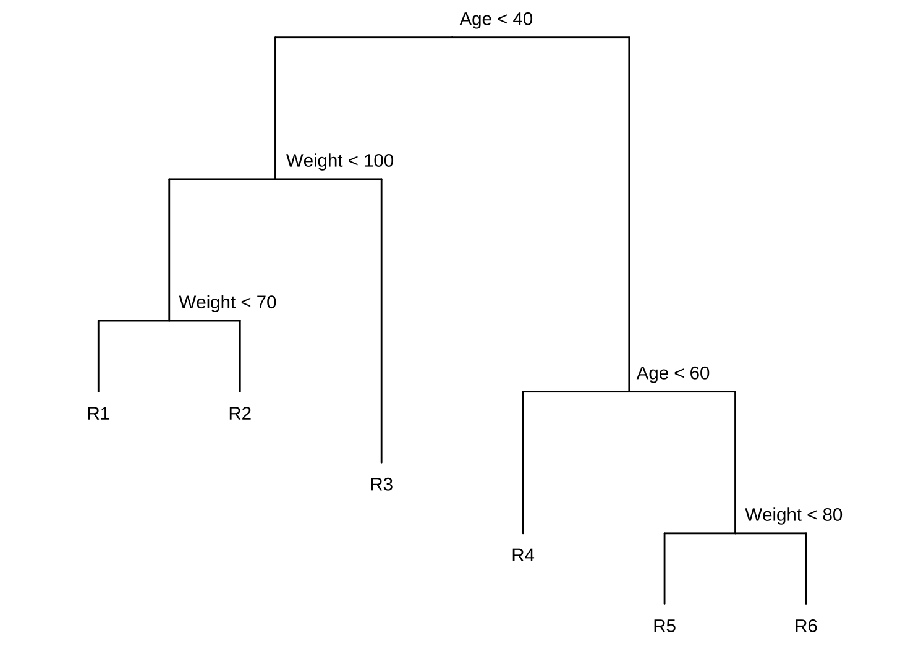
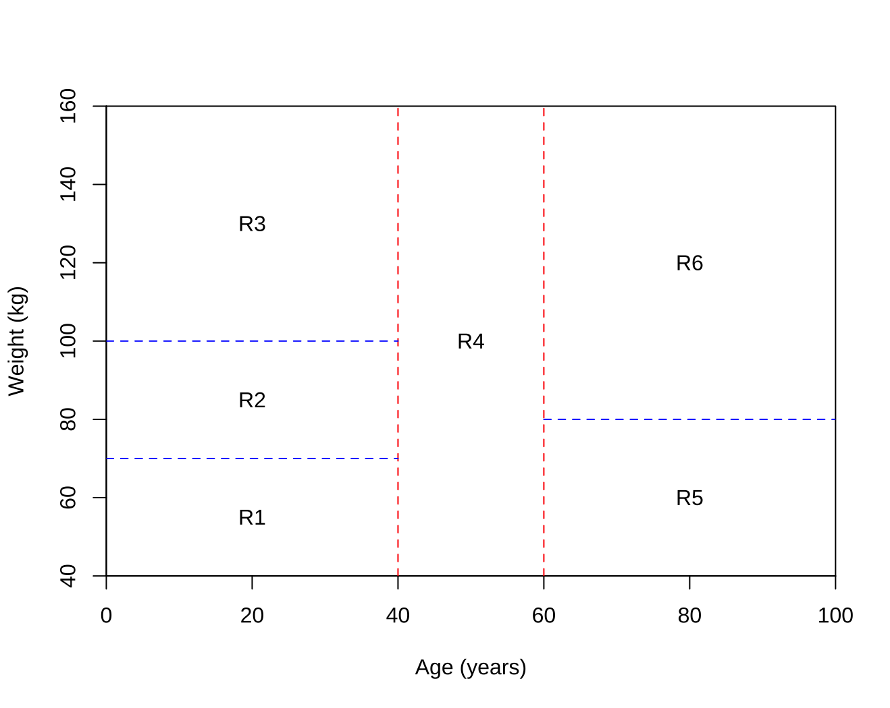
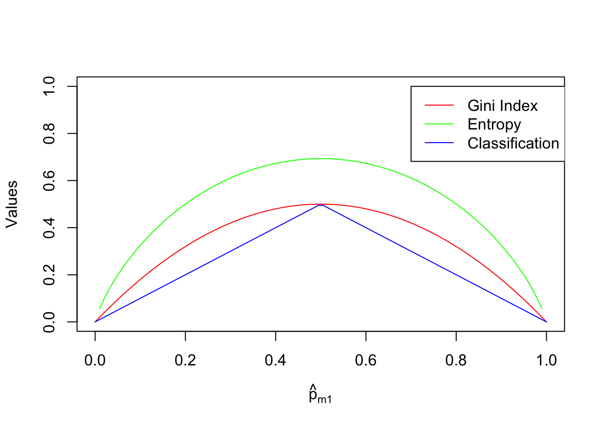
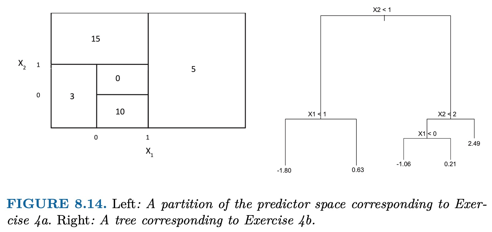
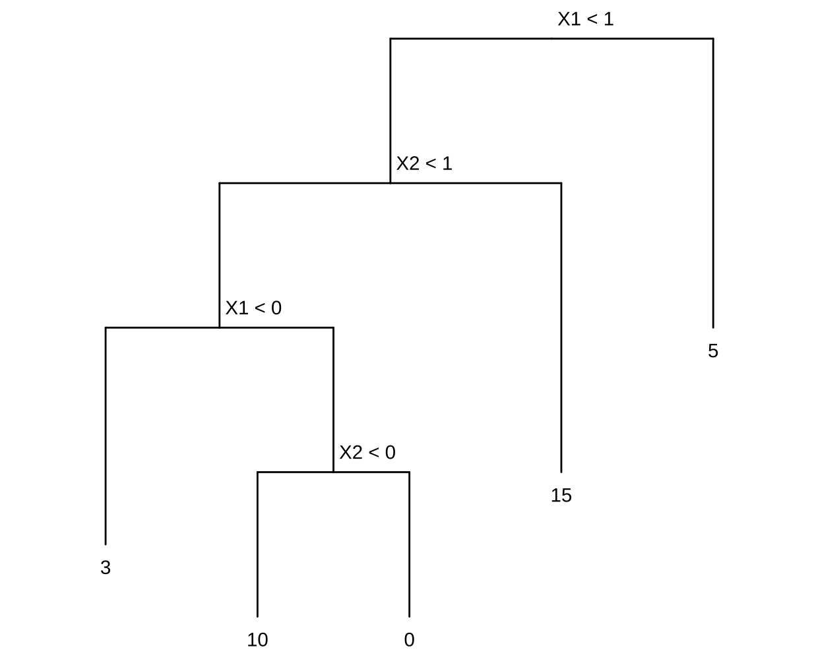
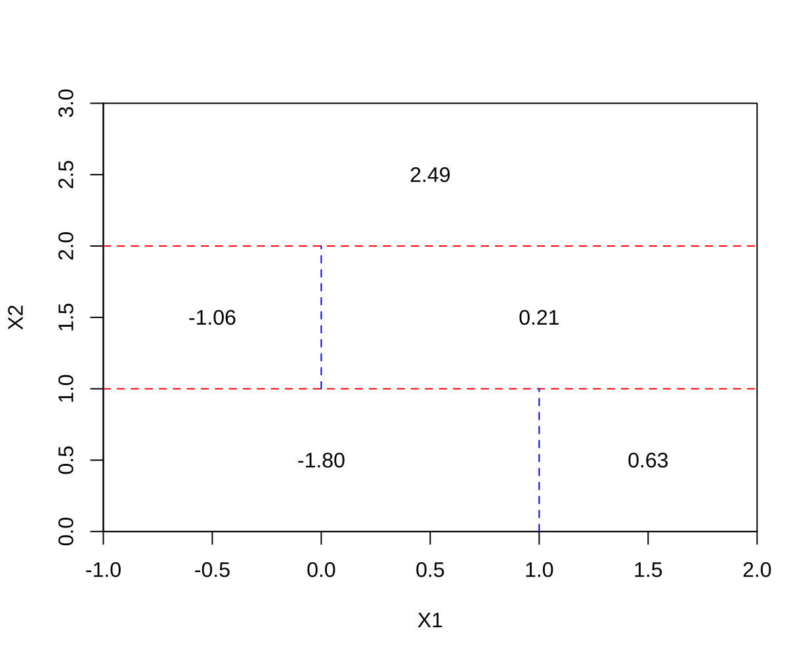

# Tree-Based Methods

1. Draw an example (of your own invention) of a partition of two-dimensional feature space that could result from recursive binary splitting. Your example should contain at least six regions. Draw a decision tree corresponding to this partition. Be sure to label all aspects of your figures, including the regions $R_1$, $R_2$, . . ., the cutpoints $t_1$, $t_2$, . . ., and so forth.

    _Hint: Your result should look something like Figures 8.1. and 8.2._

    

    

2. It is mentioned in Section 8.2.3 that boosting using depth-one trees (or stumps) leads to an additive model: that is, a model of the form
    
    $$f(X) = \sum\limits_{j=1}^p f_j (X_j).$$

    Explain why this is the case. You can begin with (8.12) in Algorithm 8.2.

    Model addytywny ma postać $f(X) = \sum\limits_{j=1}^p f_j (X_j)$, gdzie ostateczna prognoza jest sumą funkcji, z których każda zależy tylko od jednego predyktora.
    
    W przypadku boostingu z pniami (drzewami o głębokości 1), każde indywidualne drzewo $f^b(x)$ jest funkcją tylko jednej zmiennej (tej, która została użyta do podziału). Ostateczny model jest sumą wielu takich prostych drzew. Sumę tę można przegrupować tak, aby zsumować wszystkie funkcje zależne od $X_1$, wszystkie funkcje zależne od $X_2$ itd., co prowadzi bezpośrednio do addytywnej formy modelu.

3. Consider the Gini index, classification error, and entropy in a simple classification setting with two classes. Create a single plot that displays each of these quantities as a function of $\hat{p}_{m1}$. The $x$-axis should display $\hat{p}_{m1}$, ranging from 0 to 1, and the $y$-axis should display the value of the Gini index, classification error, and entropy.

    _Hint: In a setting with two classes, $\hat{p}_{m1} = 1 - \hat{p}_{m2}$. You could make this plot by hand, but it will be much easier to make in `R`._

    Gini index:

    $$G = \sum\limits_{k=1}^K \hat{p}_{mk} (1 - \hat{p}_{mk})$$

    Entropy:

    $$D = -\sum\limits_{k=1}^K \hat{p}_{mk} \log\hat{p}_{mk}$$
 

    Classification error:

    $$E = 1 - \sum\limits_{k=1}^K \max_k (\hat{p}_{mk})$$

    ```R
    p <- seq(0, 1, length.out = 100)
    data <- data.frame(
      x = p,
      "G" = p * (1 - p) * 2,
      "D" = -(p * log(p) + (1 - p) * log(1 - p)),
      "E" = 1 - pmax(p, 1 - p),
      check.names = FALSE
    )

    plot(data$x, data$G, type = "l", col = "red", xlab = expression(hat(p)[m1]),
         ylab = "Values", ylim=c(0, 1))
    lines(data$x, data$D, type = "l", col = "green")
    lines(data$x, data$E, type = "l", col = "blue")

    legend(0.7,1,legend=c("Gini Index", "Entropy", "Classification Error"),
           col=c("red", "green", "blue"), lwd=c(1,1,1))
    ```

    

4. This question relates to the plots in Figure 8.14.

    

    (a) Sketch the tree corresponding to the partition of the predictor space illustrated in the left-hand panel of Figure 8 14. The numbers inside the boxes indicate the mean of $Y$ within each region.

    
    
    (b) Create a diagram similar to the left-hand panel of Figure 8.14, using the tree illustrated in the right-hand panel of the same figure. You should divide up the predictor space into the correct regions, and indicate the mean for each region.

    

5. Suppose we produce ten bootstrapped samples from a data set containing red and green classes. We then apply a classification tree to each bootstrapped sample and, for a specific value of $X$, produce 10 estimates of $P(\text{Class is Red} \mid X)$:

    $$0.1, 0.15, 0.2, 0.2, 0.55, 0.6, 0.6, 0.65, 0.7, \text{ and } 0.75.$$

    There are two common ways to combine these results together into a single class prediction. One is the majority vote approach discussed in this chapter. The second approach is to classify based on the average probability. In this example, what is the final classification under each of these two approaches?

    * Majority vote:
        
        Zliczenia $P(\text{Class is Red} \mid X) < 0.5 = 4$.
    
        Zliczenia $P(\text{Class is Red} \mid X) \ge 0.5 = 6$.

        Klasyfikacja jako `Red`.

    * Average probability:

        $4.5 / 10 = 0.45$

        Klasyfikacja jako `Green`.
