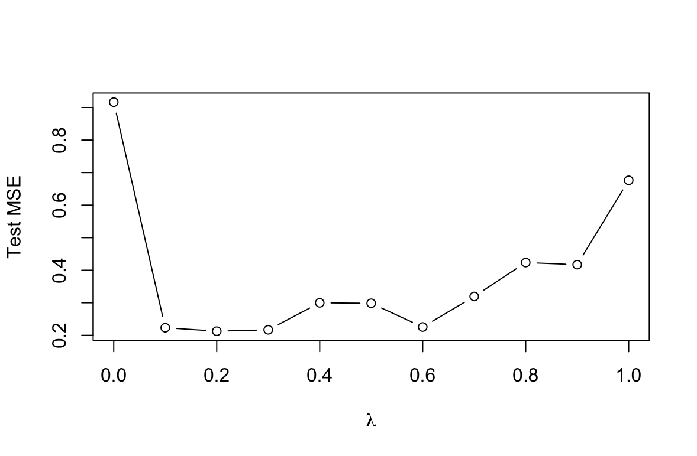

# Tree-Based Methods

1. Draw an example (of your own invention) of a partition of two-dimensional feature space that could result from recursive binary splitting. Your example should contain at least six regions. Draw a decision tree corresponding to this partition. Be sure to label all aspects of your figures, including the regions $R_1$, $R_2$, . . ., the cutpoints $t_1$, $t_2$, . . ., and so forth.

    _Hint: Your result should look something like Figures 8.1. and 8.2._

    

    

2. It is mentioned in Section 8.2.3 that boosting using depth-one trees (or stumps) leads to an additive model: that is, a model of the form
    
    $$f(X) = \sum\limits_{j=1}^p f_j (X_j).$$

    Explain why this is the case. You can begin with (8.12) in Algorithm 8.2.

    Model addytywny ma postać $f(X) = \sum\limits_{j=1}^p f_j (X_j)$, gdzie ostateczna prognoza jest sumą funkcji, z których każda zależy tylko od jednego predyktora.
    
    W przypadku boostingu z pniami (drzewami o głębokości 1), każde indywidualne drzewo $f^b(x)$ jest funkcją tylko jednej zmiennej (tej, która została użyta do podziału). Ostateczny model jest sumą wielu takich prostych drzew. Sumę tę można przegrupować tak, aby zsumować wszystkie funkcje zależne od $X_1$, wszystkie funkcje zależne od $X_2$ itd., co prowadzi bezpośrednio do addytywnej formy modelu.

3. Consider the Gini index, classification error, and entropy in a simple classification setting with two classes. Create a single plot that displays each of these quantities as a function of $\hat{p}_{m1}$. 

    The $x$-axis should display $\hat{p}_{m1}$, ranging from 0 to 1, and the $y$-axis should display the value of the Gini index, classification error, and entropy.

    _Hint: In a setting with two classes, $\hat{p}_{m1} = 1 - \hat{p}_{m2}$ You could make this plot by hand, but it will be much easier to make in `R`._

    Gini index:

    $$G = \sum\limits_{k=1}^K \hat{p}_{mk} (1 - \hat{p}_{mk})$$

    Entropy:

    $$D = -\sum\limits_{k=1}^K \hat{p}_{mk} \log\hat{p}_{mk}$$
 

    Classification error:

    $$E = 1 - \sum\limits_{k=1}^K \max_k (\hat{p}_{mk})$$

    ```R
    p <- seq(0, 1, length.out = 100)
    data <- data.frame(
      x = p,
      "G" = p * (1 - p) * 2,
      "D" = -(p * log(p) + (1 - p) * log(1 - p)),
      "E" = 1 - pmax(p, 1 - p),
      check.names = FALSE
    )

    plot(data$x, data$G, type = "l", col = "red", xlab = expression(hat(p)[m1]),
         ylab = "Values", ylim=c(0, 1))
    lines(data$x, data$D, type = "l", col = "green")
    lines(data$x, data$E, type = "l", col = "blue")

    legend(0.7,1,legend=c("Gini Index", "Entropy", "Classification Error"),
           col=c("red", "green", "blue"), lwd=c(1,1,1))
    ```

    

4. This question relates to the plots in Figure 8.14.

    

    (a) Sketch the tree corresponding to the partition of the predictor space illustrated in the left-hand panel of Figure 8 14. The numbers inside the boxes indicate the mean of $Y$ within each region.

    
    
    (b) Create a diagram similar to the left-hand panel of Figure 8.14, using the tree illustrated in the right-hand panel of the same figure. You should divide up the predictor space into the correct regions, and indicate the mean for each region.

    

5. Suppose we produce ten bootstrapped samples from a data set containing red and green classes. We then apply a classification tree to each bootstrapped sample and, for a specific value of $X$, produce 10 estimates of $P(\text{Class is Red} \mid X)$:

    $$0.1, 0.15, 0.2, 0.2, 0.55, 0.6, 0.6, 0.65, 0.7, \text{ and } 0.75.$$

    There are two common ways to combine these results together into a single class prediction. One is the majority vote approach discussed in this chapter. The second approach is to classify based on the average probability. In this example, what is the final classification under each of these two approaches?

    * Majority vote:
        
        Zliczenia $P(\text{Class is Red} \mid X) < 0.5 = 4$.
    
        Zliczenia $P(\text{Class is Red} \mid X) \ge 0.5 = 6$.

        Klasyfikacja jako `Red`.

    * Average probability:

        $4.5 / 10 = 0.45$

        Klasyfikacja jako `Green`.

6. Provide a detailed explanation of the algorithm that is used to fit a regression tree.

    **I: Budowa drzewa za pomocą rekurencyjnego podziału binarnego**

    Celem tego kroku jest podzielenie przestrzeni predyktorów na zbiór odrębnych, niepokrywających się regionów o prostokątnym kształcie. Algorytm jest "odgórny" i "zachłanny" (top-down, greedy), co oznacza, że zaczyna od wszystkich danych w jednym regionie i na każdym kroku dokonuje najlepszego możliwego podziału.

    **1. Kryterium podziału:**
    
    Głównym celem jest znalezienie regionów $R_1, R_2, ..., R_J$, które minimalizują sumę kwadratów reszt (RSS):
        
    $$RSS = \sum_{j=1}^{J} \sum_{i \in R_j} (y_i - \hat{y}_{R_j})^2$$

    gdzie $\hat{y}_{R_j}$ to średnia wartość zmiennej odpowiedzi dla obserwacji treningowych w regionie $R_j$.

    **2. Proces podziału:**
    
    * **Krok 1:** Algorytm zaczyna z wszystkimi obserwacjami w jednym regionie.
    * **Krok 2:** Następnie rozważa wszystkie predyktory $X_1, X_2, ..., X_p$ i wszystkie możliwe punkty cięcia $s$ dla każdego z predyktorów. Wybierany jest ten predyktor $X_j$ i ten punkt cięcia $s$, które dzielą przestrzeń na dwa nowe regiony ($\{X\mid X_j < s\}$ i $\{X\mid X_j \ge s\}$) tak, aby uzyskać największą możliwą redukcję RSS.
    * **Krok 3:** Proces jest powtarzany dla każdego z nowo utworzonych regionów.
    * **Krok 4:** Działania te kontynuuje się do momentu spełnienia kryterium stopu, na przykład, gdy każdy region końcowy (liść) zawiera mniej niż pewną minimalną liczbę obserwacji.

    W wyniku tego procesu powstaje duże, często przetrenowane (overfitted) drzewo, które dobrze radzi sobie z danymi treningowymi, ale prawdopodobnie słabo z danymi testowymi.

    **II: Przycinanie drzewa (pruning)**

    Aby uniknąć nadmiernego dopasowania, duże drzewo uzyskane w punkcie I jest przycinane w celu znalezienia mniejszego poddrzewa, które ma niższy błąd na danych testowych.

    **1. Metoda: przycinanie według złożoności kosztu (cost complexity pruning)**
    
    Zamiast rozważać każde możliwe poddrzewo, metoda ta generuje sekwencję poddrzew w funkcji nieujemnego parametru dostrajania $\alpha$. Dla każdej wartości $\alpha$ znajduje się poddrzewo $T$, które minimalizuje następujące wyrażenie:

    $$\sum_{m=1}^{\mid T \mid} \sum_{i: x_i \in R_m} (y_i - \hat{y}_{R_m})^2 + \alpha\mid T \mid$$

    * Pierwszy człon to suma kwadratów reszt (RSS), która mierzy dopasowanie do danych treningowych.
    * Drugi człon, $\alpha\mid T \mid$, to **kara za złożoność**, gdzie $\mid T \mid$ jest liczbą liści (węzłów końcowych) w drzewie.
    * Parametr $\alpha$ kontroluje kompromis między dopasowaniem a złożonością. Gdy $\alpha = 0$, otrzymujemy oryginalne, duże drzewo. W miarę wzrostu $\alpha$, preferowane są mniejsze poddrzewa.

    **2. Wybór optymalnego parametru $\alpha$:**
    
    Optymalna wartość parametru $\alpha$ jest wybierana za pomocą K-krotnej walidacji krzyżowej (K-fold cross-validation). Dla różnych wartości $\alpha$ obliczany jest średni błąd na zbiorach walidacyjnych, a następnie wybierane jest to $\alpha$, które minimalizuje ten błąd.

7. In the lab, we applied random forests to the `Boston` data using `mtry = 6` and using `ntree = 25` and `ntree = 500`. Create a plot displaying the test error resulting from random forests on this data set for a more comprehensive range of values for `mtry` and `ntree`. You can model your plot after Figure 8.10. Describe the results obtained.

    ```R
    library(ISLR2)
    library(randomForest)
    attach(Boston)

    set.seed(1)
    train <- sample(nrow(Boston), nrow(Boston) * 2 / 3)

    p = 12
    n = 700
    fit_1 <- randomForest(x = Boston[train, -13], y = Boston[train, 13],
                          xtest = Boston[-train, -13], ytest = Boston[-train, 13],
                          mtry = p, ntree = n)

    fit_2 <- randomForest(x = Boston[train, -13], y = Boston[train, 13],
                          xtest = Boston[-train, -13], ytest = Boston[-train, 13],
                          mtry = p / 2, ntree = n)

    fit_3 <- randomForest(x = Boston[train, -13], y = Boston[train, 13],
                          xtest = Boston[-train, -13], ytest = Boston[-train, 13],
                          mtry = sqrt(p), ntree = n)

    plot(1:n, fit_1$test$mse, type = "l", ylim = c(13, 30), col = "red", 
         xlab = "Number of trees", ylab = "Test error")
    lines(1:n, fit_2$test$mse, type = "l", col = "green")
    lines(1:n, fit_3$test$mse, type = "l", col = "blue")

    legend(450, 30, legend=c("m = p", "m = p/2", "m = sqrt(p)"), 
           col=c("red", "green", "blue"), lwd=c(1,1,1))
    ```

    

    > Błąd dąży do pewnej w miarę stabilnej wartości wraz ze wzrostem liczby drzew.
    >
    > Błąd jest mniejszy jeżeli zmniejszymy $m$.

8. In the lab, a classification tree was applied to the `Carseats` data set after converting `Sales` into a qualitative response variable. Now we will seek to predict `Sales` using regression trees and related approaches, treating the response as a quantitative variable.
    
    (a) Split the data set into a training set and a test set.

    ```R
    library(ISLR2)
    library(randomForest)
    library(tree)
    attach(Carseats)

    set.seed(42)
    train <- sample(nrow(Carseats), nrow(Carseats) * 2 / 3)
    ```
    
    (b) Fit a regression tree to the training set. Plot the tree, and interpret the results. What test MSE do you obtain?

    ```R
    fit <- tree(Sales ~ ., data = Carseats[train, ])

    plot(fit)
    text(fit, pretty = 0, cex = 0.5)

    yhat <- predict(fit, newdata = Carseats[-train, ])
    test <- Carseats[-train, "Sales"]
    mean((yhat - test)^2)
    ```

    ```R
    [1] 4.945247
    ```

    

    > Najważniejsze zmienne to `ShelveLoc` i `Price`.

    (c) Use cross-validation in order to determine the optimal level of tree complexity. Does pruning the tree improve the test MSE?

    ```R
    cv <- cv.tree(fit)
    plot(cv$size, cv$dev, type = "b")

    prune <- prune.tree(fit, best = 4)

    yhat <- predict(prune, newdata = Carseats[-train, ])
    test <- Carseats[-train, "Sales"]

    mean((yhat - test)^2)
    ```

    ```R
    [1] 4.476256
    ```

    

    > Z wykresu widać, że należy przyciąć drzewo do rozmiaru 12, nieznacznie polepsza to MSE.
    
    (d) Use the bagging approach in order to analyze this data. What test MSE do you obtain? Use the `importance()` function to determine which variables are most important.

    ```R
    bag.fit = randomForest(Sales ~ ., data = Carseats[train, ], mtry = 10,
                           importance = T)
    importance(bag.fit)
    ```

    ```R
                  %IncMSE IncNodePurity
    CompPrice   34.442203    275.877646
    Income      10.594604    118.555454
    Advertising 21.112431    166.883279
    Population   1.691055     84.322807
    Price       67.336617    616.752513
    ShelveLoc   72.275993    574.237721
    Age         17.055485    178.235283
    Education    4.934414     56.817835
    Urban        2.294690      9.594651
    US           2.908003      8.278551
    ```

    ```R
    yhat <- predict(bag.fit, newdata = Carseats[-train, ])
    test <- Carseats[-train, "Sales"]
    mean((yhat - test)^2)
    ```

    ```R
    [1] 2.098377
    ```

    > Najważniejsza jest zmienna `Price`. Bagging poprawił też poziom błędu MSE.
    
    (e) Use random forests to analyze this data. What test MSE do you obtain? Use the `importance()` function to determine which variables are most important. Describe the effect of $m$, the number of variables considered at each split, on the error rate obtained.
    
    ```R
    bag.fit = randomForest(Sales ~ ., data = Carseats[train, ], mtry = 3,
                           importance = T)
    importance(bag.fit)
    ```

    ```R
                  %IncMSE IncNodePurity
    CompPrice   16.389686     206.08152
    Income       5.675147     163.24324
    Advertising 16.345509     208.15730
    Population   2.711832     137.71273
    Price       43.225770     467.82974
    ShelveLoc   47.486572     459.10402
    Age         13.857215     214.79994
    Education    1.932250     102.18150
    Urban        2.561229      20.06366
    US           3.667538      30.08216
    ```

    ```R
    yhat <- predict(bag.fit, newdata = Carseats[-train, ])
    test <- Carseats[-train, "Sales"]
    mean((yhat - test)^2)
    ```

    ```R
    [1] 2.741097
    ```

    > Najważniejsza jest zmienna `Price`. Zmiana parametru $m$ pogarsza wartość błędu MSE.

    (f) Now analyze the data using BART, and report your results.

    ```R
    bart.fit <- gbart(Carseats[train, 2:11], Carseats[train, 1], 
                      x.test = Carseats[-train, 2:11])

    yhat <- bart.fit$yhat.test.mean
    test <- Carseats[-train, 1]
    mean((test - yhat)^2)
    ```

    ```R
    [1] 1.360843
    ```

    > Model BART pozwolił jeszcze bardziej zmniejszyć błąd MSE.

9. This problem involves the `OJ` data set which is part of the `ISLR2` package.
    
    (a) Create a training set containing a random sample of 800 observations, and a test set containing the remaining observations.
    
    ```R
    library(ISLR2)
    library(randomForest)
    library(tree)
    library(BART)
    attach(OJ)

    set.seed(42)
    train <- sample(nrow(OJ), 800)
    ```

    (b) Fit a tree to the training data, with `Purchase` as the response and the other variables as predictors. Use the `summary()` function to produce summary statistics about the tree, and describe the results obtained. What is the training error rate? How many terminal nodes does the tree have?

    ```R
    fit <- tree(Purchase ~ ., data = OJ[train, ])
    summary(fit)
    ```

    ```R
    Classification tree:
    tree(formula = Purchase ~ ., data = OJ[train, ])
    Variables actually used in tree construction:
    [1] "LoyalCH"       "PriceDiff"     "ListPriceDiff"
    Number of terminal nodes:  7 
    Residual mean deviance:  0.7598 = 602.5 / 793 
    Misclassification error rate: 0.155 = 124 / 800 
    ```

    > Błąd treningowy wynosi 0.155. Drzewo ma 7 węzłów końcowych. Dewiancja jest wysoka więc model nie jest dobry jakościowo.
    
    (c) Type in the name of the tree object in order to get a detailed text output. Pick one of the terminal nodes, and interpret the information displayed.

    ```R
    fit
    ```

    ```R
    node), split, n, deviance, yval, (yprob)
        * denotes terminal node

    1) root 800 1081.00 CH ( 0.59250 0.40750 )  
      2) LoyalCH < 0.445362 279  277.00 MM ( 0.19713 0.80287 )  
        4) LoyalCH < 0.051325 64   10.30 MM ( 0.01562 0.98438 ) *
        5) LoyalCH > 0.051325 215  242.40 MM ( 0.25116 0.74884 ) *
      3) LoyalCH > 0.445362 521  515.30 CH ( 0.80422 0.19578 )  
        6) LoyalCH < 0.740621 249  324.70 CH ( 0.64257 0.35743 )  
          12) PriceDiff < -0.165 39   36.71 MM ( 0.17949 0.82051 ) *
          13) PriceDiff > -0.165 210  245.60 CH ( 0.72857 0.27143 )  
            26) ListPriceDiff < 0.135 34   45.23 MM ( 0.38235 0.61765 ) *
            27) ListPriceDiff > 0.135 176  178.30 CH ( 0.79545 0.20455 ) *
        7) LoyalCH > 0.740621 272  104.40 CH ( 0.95221 0.04779 )  
          14) PriceDiff < -0.39 8   11.09 MM ( 0.50000 0.50000 ) *
          15) PriceDiff > -0.39 264   78.51 CH ( 0.96591 0.03409 ) *
    ```

    > Węzeł nr 15 jest jednym z węzłów ostatnich, jest w nim 264 obserwacje. Jeżeli `LPriceDiff > -0.39` to ostateczna wartość w tym węźle jest klasyfikowana jako `CH`.
    
    (d) Create a plot of the tree, and interpret the results.

    

    > Najważniejsza jest zmienna `LoyalCH`.
    
    (e) Predict the response on the test data, and produce a confusion matrix comparing the test labels to the predicted test labels. What is the test error rate?

    ```R
    pred <- predict(fit, OJ[-train, ], type = "class")
    t <- table(pred, OJ[-train, ]$Purchase)
    1 - sum(diag(t)) / sum(t)
    ```

    ```R
    [1] 0.2222222
    ```

    > Błąd jest większy niż na danych treningowych czyli zgodnie z oczekiwaniem

    (f) Apply the `cv.tree()` function to the training set in order to determine the optimal tree size.

    ```R
    cv <- cv.tree(fit)
    ```
    
    (g) Produce a plot with tree size on the $x$-axis and cross-validated classification error rate on the $y$-axis.

    ```R
    plot(cv$size, cv$dev, type = "b")
    ```

    
    
    (h) Which tree size corresponds to the lowest cross-validated classification error rate?

    > Najmniejszy błąd jest dla drzewa o rozmiarze 5.
    
    (i) Produce a pruned tree corresponding to the optimal tree size obtained using cross-validation. If cross-validation does not lead to selection of a pruned tree, then create a pruned tree with five terminal nodes.

    ```R
    prune <- prune.tree(fit, best = 5)
    ```
    
    (j) Compare the training error rates between the pruned and unpruned trees. Which is higher?

    ```R
    summary(prune)
    ```

    ```R
    Classification tree:
    snip.tree(tree = fit, nodes = c(5L, 12L))
    Variables actually used in tree construction:
    [1] "LoyalCH"   "PriceDiff"
    Number of terminal nodes:  5 
    Residual mean deviance:  0.7833 = 622.7 / 795 
    Misclassification error rate: 0.1812 = 145 / 800
    ```

    > Błąd 0.1812 jest wyższy niż na danych nie przyciętych.
    
    (k) Compare the test error rates between the pruned and unpruned trees. Which is higher?

    ```R
    pred <- predict(prune, OJ[-train, ], type = "class")
    t <- table(pred, OJ[-train, ]$Purchase)
    1 - sum(diag(t)) / sum(t)
    ```

    ```R
    [1] 0.2185185
    ```

    > Błąd na danych testowy jest nieznacznie niższy niż w przypadku modelu nie przyciętego.

10. We now use boosting to predict `Salary` in the `Hitters` data set.

    (a) Remove the observations for whom the salary information is unknown, and then log-transform the salaries.

    ```R
    library(ISLR2)
    Hitters_2 <- Hitters
    Hitters_2 <- Hitters_2[!is.na(Hitters_2$Salary), ]
    Hitters_2$Salary <- log(Hitters_2$Salary)
    attach(Hitters_2)
    ```
    
    (b) Create a training set consisting of the first 200 observations, and a test set consisting of the remaining observations.

    ```R
    set.seed(2)
    train <- sample(nrow(Hitters_2), 200)
    ```
    
    (c) Perform boosting on the training set with 1,000 trees for a range of values of the shrinkage parameter $\lambda$. Produce a plot with different shrinkage values on the $x$-axis and the corresponding training set MSE on the $y$-axis.

    ```R
    library(gbm)

    lambdas <- seq(0, 1, 0.1)
    means <- c()

    for (i in lambdas){
      boost <- gbm(Salary ~ ., data = Hitters_2[train, ], distribution = "gaussian",
                   n.trees = 1000, shrinkage = i)
      yhat <- predict(boost, newdata = Hitters_2[train, ], n.trees = 1000)
      means <- c(means, mean((yhat - Hitters_2[train, ]$Salary)^2))
    }

    plot(lambdas, means, type="b", xlab = expression(lambda), ylab = "Train MSE")
    ```

    
    
    (d) Produce a plot with different shrinkage values on the $x$-axis and the corresponding test set MSE on the $y$-axis.

    ```R
    lambdas <- seq(0, 1, 0.1)
    means <- c()

    for (i in lambdas){
      boost <- gbm(Salary ~ ., data = Hitters_2[train, ], distribution = "gaussian",
                  n.trees = 1000, shrinkage = i)
      yhat <- predict(boost, newdata = Hitters_2[-train, ], n.trees = 1000)
      means <- c(means, mean((yhat - Hitters_2[-train, ]$Salary)^2))
    }

    min(means)
    lambdas[which.min(means)]

    plot(lambdas, means, type="b", xlab=expression(lambda), ylab="Test MSE")
    ```

    ```R
    [1] 0.2127571
    [1] 0.2
    ```

    
    
    (e) Compare the test MSE of boosting to the test MSE that results from applying two of the regression approaches seen in Chapters 3 and 6.

    ```R
    # Multiple Linear Regression (Chapter 3)
    lm.fit = lm(Salary ~ ., data = Hitters_2[train, ])
    lm.preds = predict(lm.fit, newdata = Hitters_2[-train, ])
    lm.mse = mean((lm.preds - Hitters_2[-train, ]$Salary)^2)
    lm.mse
    ```

    ```R
    [1] 0.5143062
    ```

    ```R
    # Lasso model (Chapter 6)
    library(glmnet)
    x = model.matrix(Salary ~ ., data = Hitters_2[train, ])
    test = model.matrix(Salary ~ ., data = Hitters_2[-train, ])
    y = Hitters_2[train, ]$Salary
    lasso.mod = glmnet(x, y, alpha = 1)

    cv.out = cv.glmnet(x, y, alpha=1)
    bestlam = cv.out$lambda.min
    lasso.pred = predict(lasso.mod, s=bestlam, newx = test)
    mean((lasso.pred - Hitters_2[-train, ]$Salary)^2)
    ```

    ```R
    [1] 0.4742347
    ```
    
    > Drzewo zbudowane metodą boosting ma w tym przypadku mniejszy błąd niż regresja liniowa i lasso.

    (f) Which variables appear to be the most important predictors in the boosted model?

    ```R
    boost = gbm(Salary ~ ., data= Hitters_2[train, ], distribution = "gaussian",
                n.trees = 1000, shrinkage = 0.2)
    summary(boost)
    ```

    ```R
                    var    rel.inf
    CWalks       CWalks 11.5228111
    CRuns         CRuns  9.2845927
    CRBI           CRBI  9.1029165
    PutOuts     PutOuts  7.2472499
    CHits         CHits  6.6068264
    HmRun         HmRun  5.8016634
    Walks         Walks  5.7280674
    AtBat         AtBat  5.6755620
    Hits           Hits  5.6323046
    Assists     Assists  5.4405301
    CAtBat       CAtBat  4.9387237
    Years         Years  4.8418310
    CHmRun       CHmRun  4.7014300
    Runs           Runs  4.5384478
    RBI             RBI  4.5292375
    Errors       Errors  2.6463223
    Division   Division  0.8631037
    NewLeague NewLeague  0.5374887
    League       League  0.3608911
    ```

    > Najważniejsze zmienne w tym modelu to: `CWalks`, `CRuns`, `CRBI`.
    
    (g) Now apply bagging to the training set. What is the test set MSE for this approach?

    ```R
    library(randomForest)
    bag = randomForest(Salary ~ ., data = Hitters_2[train, ], mtry = 19,
                    importance = T)
    pred = predict(bag, newdata = Hitters_2[-train, ])
    mean((pred - Hitters_2[-train, ]$Salary)^2)
    ```

    ```R
    [1] 0.1913495
    ```

    > Błąd mniejszy niż w przypadku boostingu.

11. This question uses the `Caravan` data set.

    (a) Create a training set consisting of the first 1,000 observations, and a test set consisting of the remaining observations.

    ```R
    library(ISLR2)
    library(gbm)

    # funkcja gbm nie przyjmuje zmiennych w postaci no/yes
    Caravan_2 <- Caravan
    Caravan_2$Purchase_2 <- as.numeric(Caravan$Purchase == "Yes")

    train.set <- Caravan_2[1:1000, ]
    test.set <- Caravan_2[1001:5822, ]
    ```
    
    (b) Fit a boosting model to the training set with `Purchase` as the response and the other variables as predictors. Use 1,000 trees, and a shrinkage value of 0.01. Which predictors appear to be the most important?

    ```R
    set.seed(5)
    fit <- gbm(Purchase_2 ~ . - Purchase, data = train.set, n.trees = 1000,
               shrinkage = 0.01)

    head(summary(fit))
    ```

    ```R
                  var   rel.inf
    PPERSAUT PPERSAUT 14.635194
    MKOOPKLA MKOOPKLA 10.807759
    MOPLHOOG MOPLHOOG  6.462813
    MBERMIDD MBERMIDD  6.361418
    PBRAND     PBRAND  5.348285
    MGODGE     MGODGE  4.148591
    ```
    
    (c) Use the boosting model to predict the response on the test data. Predict that a person will make a purchase if the estimated probability of purchase is greater than 20%. Form a confusion matrix. What fraction of the people predicted to make a purchase do in fact make one? How does this compare with the results obtained from applying KNN or logistic regression to this data set?

    ```R
    p <- predict(fit, test.set, n.trees = 1000, type = "response")
    preds <- rep("No", 4822)
    preds[p > 0.20] = "Yes"
    actual <- test.set$Purchase
    table(actual, preds)

    35 / (123+35)
    ```

    ```R
          preds
    actual   No  Yes
       No  4410  123
       Yes  254   35

    [1] 0.221519
    ```

    ```R
    # logistic regression
    train.set <- Caravan[1:1000, ]
    test.set <- Caravan[1001:5822, ]

    fit <- glm(Purchase ~ ., data = train.set,
              family = "binomial")

    p <- predict(fit, test.set, type = "response")
    preds <- rep("No", 4822)
    preds[p > 0.20] = "Yes"
    actual <- test.set$Purchase
    table(actual, preds)

    58 / (350 + 58)
    ```

    ```R
          preds
    actual   No  Yes
       No  4183  350
       Yes  231   58

    [1] 0.1421569
    ```

    ```R
    # KNN
    library(class)
    fit <- knn(train.set[, -86], test.set[, -86], train.set$Purchase)
    table(actual, fit)

    23 / (273 + 23)
    ```

    ```R
            fit
    actual   No  Yes
       No  4260  273
       Yes  266   23

    [1] 0.0777027
    ```

    > Ostatecznie boosting model najlepiej przewiduje odpowiedź `Yes` ze wszystkich dopasowanych modeli.


